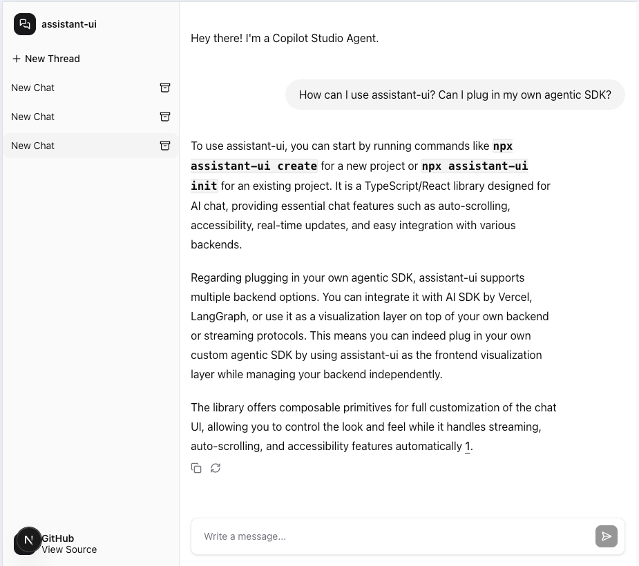

# Copilot Studio + Assistant UI Integration Sample

This project demonstrates how to integrate Copilot Studio with Assistant UI to create a modern, responsive chat interface with AI capabilities.

## Overview

This sample showcases:
- Integration between Copilot Studio and the Assistant UI framework
- Single sign-on authentication using Microsoft Authentication Library (MSAL)
- Multiple conversation threads

<p align="center">
  
</p>

## Prerequisites

- A Copilot Studio agent with "Authenticate with Microsoft" enabled
- Microsoft Entra ID app registration with appropriate permissions
- Node.js (v18 or later)
- npm, yarn, pnpm, or bun package manager

## Setup Instructions

### 1. Microsoft Entra ID App Registration

1. Create an App Registration in the Microsoft Entra admin center
2. Configure authentication:
   - Click on **Add a platform**
   - Select **Single-page application (SPA)**
   - Enter the redirect URI where your application will be hosted (e.g., `http://localhost:3000` for local testing)
   - Click **Configure**
3. Configure API permissions:
   - Navigate to **API permission** > **Add permissions**
   - Select **APIs my organization uses**, and search for **Power Platform API**
   - Select **Delegated permissions** > **Copilot Studio** > **Copilot Studio.Copilots.Invoke** permission
   - Click **Add Permissions**
   - Grant admin consent for your directory
4. Navigate to **Overview** and record your app registration's **client ID** and **tenant ID**

### 2. Get Copilot Studio Agent Metadata

1. In Copilot Studio, select your agent
2. Navigate to **Settings** > **Advanced**
3. Under **Metadata**, locate the **Schema name** and **Environment ID**
4. Record these values for configuration

### 3. Configure the React Application

1. Clone this repository and navigate to the project directory:
   ```bash
   git clone https://github.com/microsoft/CopilotStudioSamples
   cd CopilotStudioSamples/AssistantUICopilotStudioClient/assistant-ui-mcs
   ```

2. Install dependencies:
   ```bash
   npm install
   # or
   yarn install
   # or
   pnpm install
   # or
   bun install
   ```
3. Create a `.env.local` file in the root of the project and add the following environment variables:
   ```env
   NEXT_PUBLIC_CLIENT_ID=<your-client-id-from-app-registration>
   NEXT_PUBLIC_TENANT_ID=<your-tenant-id-from-app-registration>
   NEXT_PUBLIC_AGENT_SCHEMA=<your-schema-name-from-copilot-studio>
   NEXT_PUBLIC_ENVIRONMENT_ID=<your-environment-id-from-copilot-studio>
   NEXT_PUBLIC_CLOUD_ENVIRONMENT=<optional-cloud-environment>
   ```
   Replace the placeholders with the values obtained from the previous steps.
4. Start the development server:
   ```bash
   npm run dev
   # or
   yarn dev
   # or
   pnpm dev
   # or
   bun dev
   ```
5. Open your browser and navigate to `http://localhost:3000` to see the application in action.
6. You will be prompted to sign in with Microsoft credentials
7. After successful authentication, the chat interface will connect to your Copilot Studio agent
8. Start chatting with your agent!

## Project Structure

- **/app** - Next.js application routes
- **/components** - React components including:
  - **/components/assistant-ui** - Assistant UI integration components
  - **/components/copilot-studio-runtime-provider.tsx** - Core integration logic between Copilot Studio and Assistant UI
  - **/components/citation-link-handler.tsx** - Handler for citation links to open in new tabs
- **/lib** - Utility functions for authentication and settings
- **/public** - Static assets

## Troubleshooting

- **Authentication issues**: Ensure your app registration has the correct permissions and admin consent
  - Check browser developer tools (F12) for specific error messages - most Azure authentication errors will appear here
  - Look for environment variable loading issues in the console logs, which will show the exact values being used
- **Connection issues**: Verify your environment ID and agent schema values are correct in your .env.local file
- **Silent authentication failures**: If you encounter iframe-related errors in the console, check that third-party cookies are not being blocked by your browser

## Additional Resources

- [Assistant UI Documentation](https://github.com/assistant-ui/assistant-ui)
- [Copilot Studio Documentation](https://learn.microsoft.com/en-us/microsoft-copilot-studio/)
- [Microsoft 365 Agents SDK - NodeJS /TypeScript](https://github.com/Microsoft/Agents-for-js)
- [Microsoft Authentication Library (MSAL)](https://learn.microsoft.com/en-us/entra/identity-platform/msal-overview)

## License

This project is licensed under the MIT License - see the LICENSE file for details.
