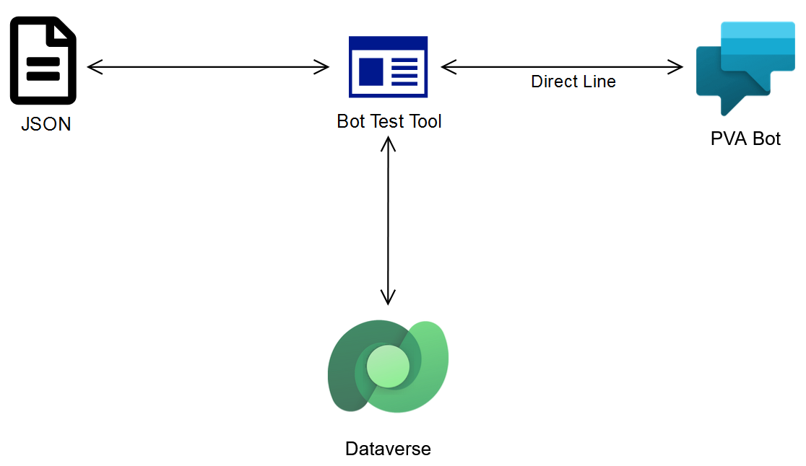

# Bot Test Framework

## Overview
This solution will be able to run tests against a PVA Bot using Direct Line channel and validate that the bot works as expected for the following scenarios:
- Scale testing
- DYM responses
- The Bot structure or chat flow was modified
- The trigger phrases were updated
- An adaptive card was added or modified

## Prerequisites

- A PVA bot
- .NET 6

## Architecture diagram

## Platform
The application was developed using .NET 6 as a console application and it supports the following platforms:
- Windows
- Linux
- MacOS

## Dataverse connection
The application can connect directly to a Dataverse environment to get information on previous chat transcripts to use as input for testing the Bot. These chat sessions are downloaded and saved locally as JSON files, to be used in a later stage. 

Supported scenarios:
- Classic: The Bot and chat transcripts are on the same DV environment
- Special: The Bot and chat transcripts are on different DV environments

## Input files
Files with different formats can be used to test the bot trigger phrases, the chat flow, and adaptive cards. These are the input files that the application supports:

- JSON: these files will be used to test the bot conversation flow (from one or more topics), trigger phrases and adaptive cards. The structure will be the same as the Dataverse one or a subset of it. Files can be created manually by the user using a specific command, these files are reduced in amount of fields, but preserve the same structure for consistency.
- CHAT: a simple text file with .chat extension can be used to mock a conversation between the user and the bot, and then convert it to a valid .json with a command.

# Extended documentation

Here you can find the links to the extended documentation divided by topics:

1. [How to use the tool](./TOOL_USAGE.MD)

2. [How to publish the tool](./PUBLISH.MD)

3. [How to setup a Pipeline using the tool](./SETUP_PIPELINE.MD)
