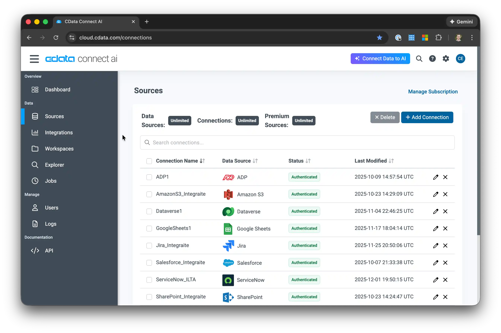
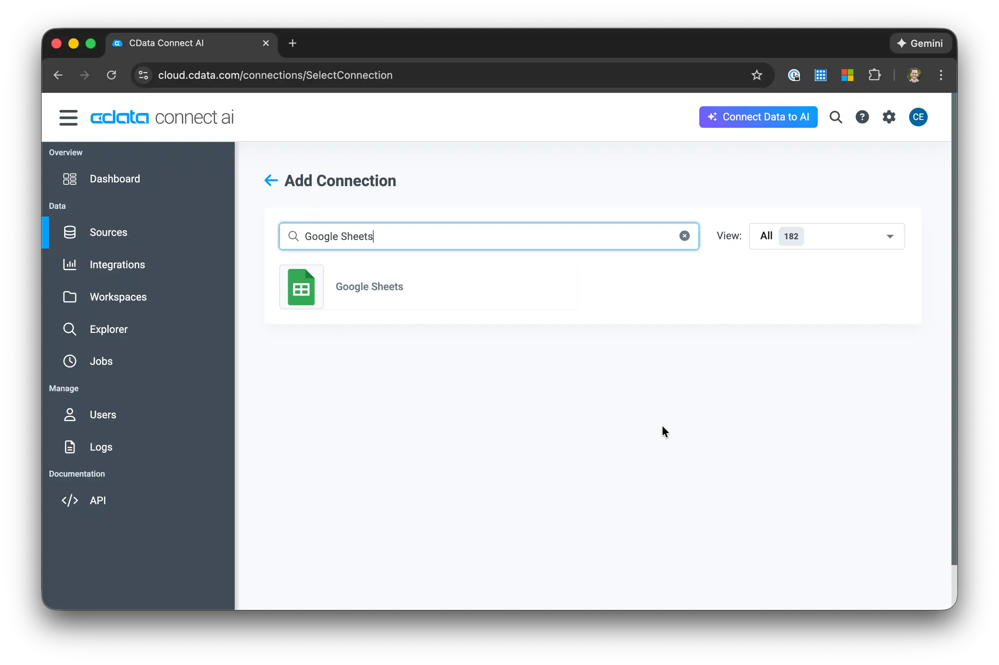
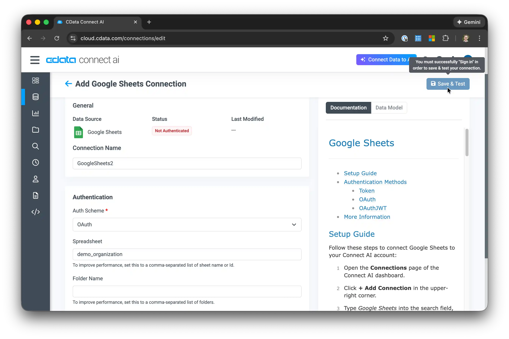
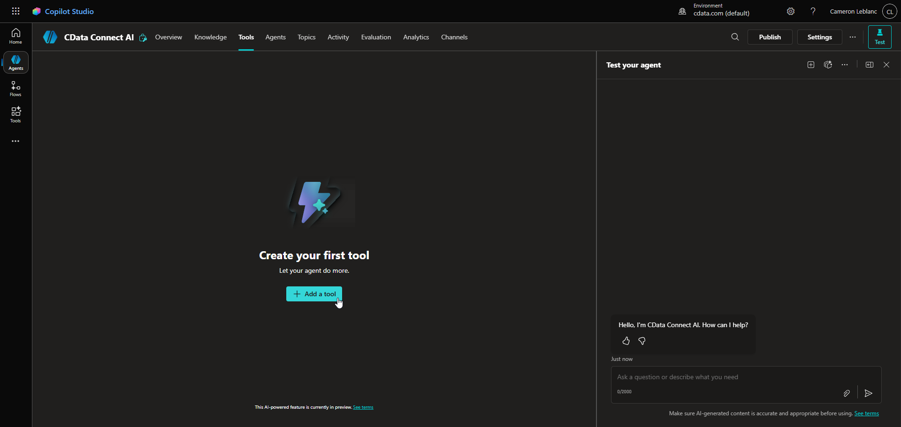
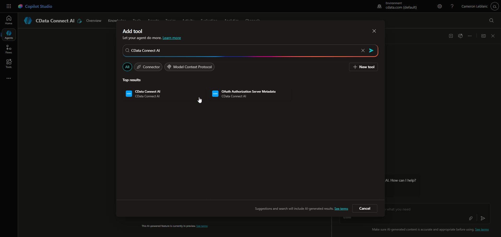
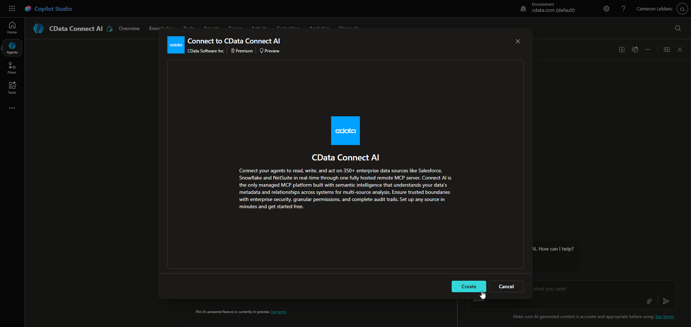
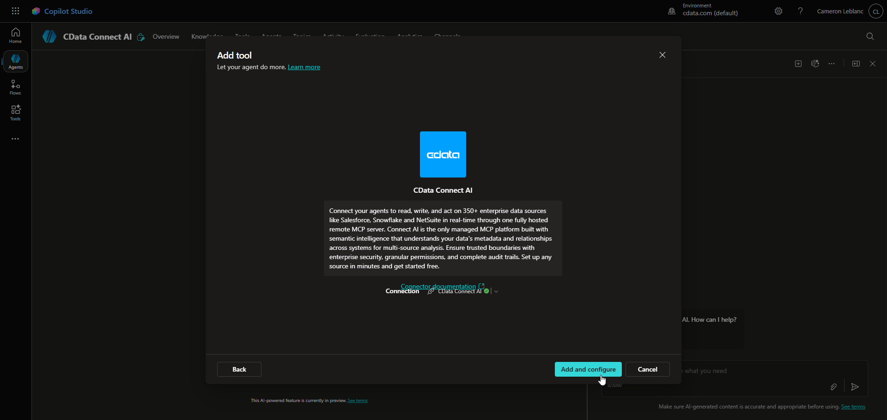

# CData Connect AI 

## Overview
This sample demonstrates how to integrate [Microsoft Copilot Studio](https://copilotstudio.microsoft.com/) with [CData Connect AI](https://www.cdata.com/ai/signup/) by configuring Connect AI as a **Tool** for agents built in Copilot Studio. Connect AI brings connectivity, context, and control to Copilot Studio agents, enabling them to securely read, write, and act on real-time data across **350+ enterprise systems** through a single MCP endpoint.

In this sample, you will create a Copilot Studio agent that uses CData Connect AI as a Tool to dynamically discover, query, and act on data from connected enterprise systems. The agent can reason over structured data exposed by CData Connect AI without requiring separate connectors for each underlying system.

---

## About CData Connect AI
Connect AI is a managed **Model Context Protocol (MCP)** platform that enables AI agents to securely discover, query, and act on real-time data across hundreds of enterprise systems through a single, governed MCP endpoint.

Instead of exposing hundreds of source-specific tools, CData Connect AI exposes a small, efficient set of MCP tools that allow agents to understand data structure, construct multi-source queries, execute actions, and follow source-specific guidance.

### Available MCP Tools

#### Data Discovery and Querying
- **getCatalogs**  
  Returns the list of available data connections configured in CData Connect AI. This is the agent’s starting point for understanding the available data landscape.

- **getSchemas**  
  Retrieves schemas within a selected catalog, allowing the agent to understand how a connected system organizes its data.

- **getTables**  
  Lists tables within a schema and supports filtering by name. All supported data sources are normalized to a tabular representation, enabling consistent discovery across systems.

- **getColumns**  
  Returns column definitions, data types, and metadata for a selected table so the agent can construct valid SQL queries.

- **queryData**  
  Executes SQL queries using standard SQL-92 syntax with parameter binding, enabling safe and consistent querying across data sources.

#### Action Execution
- **getProcedures**  
  Lists available actions (stored procedures) for a given connection and schema.

- **getProcedureParameters**  
  Retrieves parameter definitions for a selected action, including required inputs and data types.

- **executeProcedure**  
  Executes a stored procedure using validated parameters and bindings.

#### Guidance and Best Practices
- **getInstructions**  
  Returns source-specific usage guidance, performance recommendations, query syntax notes, and examples to help the agent use each connector correctly.

Together, these tools allow Copilot Studio agents to reason over data structure, execute queries, take actions, and apply source-specific best practices.

---

## Setup

### Prerequisites
Before starting, ensure you have access to the following:

- [Microsoft Copilot Studio](https://copilotstudio.microsoft.com/):  To create and manage Copilot agents  
- [CData Connect AI](https://www.cdata.com/ai/signup/): To expose SaaS and data sources through a single MCP endpoint  
- (Optional)[Sample Google Sheet Data](https://docs.google.com/spreadsheets/d/1JpzuvwOlGp0FKDBxNgj6XgTDL2awuiZ3Ycs4_SnjJT8/edit?usp=sharing): A sample Google Sheet containing customer data

---

### 1) Configure connectivity in CData Connect AI
First, configure CData Connect AI to access your data.

1. Log in to [CData Connect AI](https://cloud.cdata.com/).
2. Once logged in to Connect AI, click **Sources** in the left navigation menu and click **+ Add Connection**.

   

3. Search for and select your data source(s) from the Add Connection panel.

   

4. In the connection configuration, set the relevant connection properties and click **Save & Test** to save the connection configuration.

   

---

### 2) Create the Copilot Studio agent and add the CData Connect AI Tool
Now you will create the Copilot agent and connect it to CData Connect AI.

1. In **Copilot Studio**, click **Agents**, then click **+ New agent** to create a new agent.
2. Toggle the **Configure** button and set the following values, then click **Create**:
   - **Name:** Name your Copilot Studio Agent 
   - **Description:** Give your agent a short description of what it will do.  

3. Navigate to **Tools**, and click **+ Add a tool**.

    

4. In the Add Tool window, search for and click **CData Connect AI**.

    

5. In the Connect to CData Connect AI window, click **Create** to authenticate your connection CData Connect AI using OAuth authentication.

    

6. Click **Add and configure** to add the CData Connect AI Tool.

    

Once added, the agent can dynamically invoke CData Connect AI to retrieve structured data at runtime.

---

### Optional: Enhance the Agent with detailed instructions
To improve the agent's effectiveness, you can add more detailed instructions about its role and the available tools:

1. In your agent settings, navigate to the **Instructions** section.
2. Replace or extend the existing instructions with the following:

   > You are a helpful assistant and an expert at using the **CData Connect AI MCP Server**, which provides the following tools:
   >
   > - **getCatalogs**: Retrieve available data sources and connections  
   > - **getSchemas**: Get database schemas for a specific catalog  
   > - **getTables**: List available tables (accounts, opportunities, tickets, usage data) for a specfic schema
   > - **getColumns**: View table structure and column details  
   > - **queryData**: Execute SQL queries to analyze customer data  
   > - **getProcedures**: Lists available actions (stored procedures) for a given connection and schema
   > - **getProcedureParameters**: Retrieves parameters for a selected action
   > - **executeProcedure**: Executes a stored procedure 
   > - **getInstructions**: Returns source-specific usage guidance to help the agent use each connector correctly.
   >
   > Always use fully qualified table names in queries (`catalog.schema.table`).  
   > Provide specific, actionable recommendations based on the data.

This enhanced instruction set helps guide the agent to consistently leverage the CData Connect AI MCP tools and produce better insights.

---

### 3) Test the agent
With the Agent set up, run sample prompts to validate that the agent can correctly discover data, reason over schemas, and retrieve live results through CData Connect AI.

Find examples of prompts for various data sources here: [CData Prompt Library](https://www.cdata.com/ai/prompt-library/)

---

## Next Steps
Now that you have a working Copilot Studio AI agent, you can:

- Connect additional data sources (Salesforce, Zendesk, Snowflake, etc.)
- Create more sophisticated queries and derived views that join data across multiple tables
- Export insights to other systems using Connect AI's integration capabilities
- Refine the agent's instructions to align with your specific business processes

## Resources
The following resources may be helpful for understanding and extending this sample:

- [CData Connect AI + Copilot Studio Getting Started Guide (Real agent example)](https://www.cdata.com/kb/articles/connect-ai-copilot-start-guide.rst)
- [CData Connect AI documentation](https://www.cdata.com/connect/ai/)
- [Microsoft Copilot Studio documentation](https://learn.microsoft.com/microsoft-copilot-studio/)
- [Microsoft - CData Connect AI Tool documentation](https://learn.microsoft.com/en-us/connectors/cdataconnectai/)
- [Copilot Studio Tools and actions](https://learn.microsoft.com/microsoft-copilot-studio/library-add-actions)

