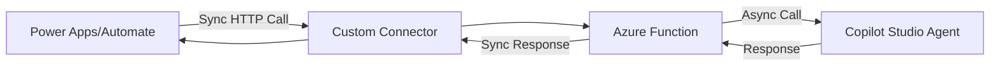
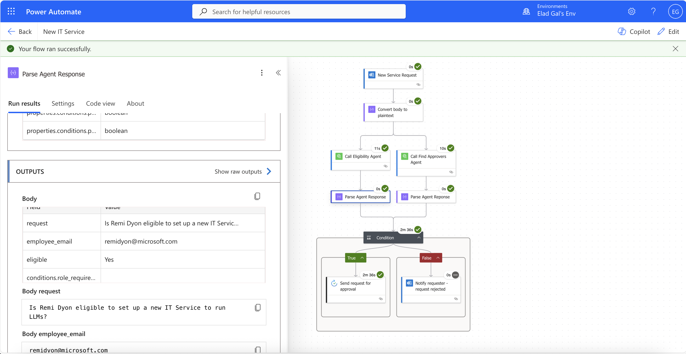

# Copilot Studio Call Agent Connector

A solution that enables synchronous, deterministic orchestration of Microsoft Copilot Studio agents from Power Platform applications.

## Overview

This solution addresses a current gap in the native Copilot Studio connector: **the inability to wait for agent responses**. The built-in connector initiates conversations asynchronously, making it impossible to orchestrate multiple agents in a deterministic workflow where each step depends on the previous agent's response.

The solution bridges the gap by:
1. **Custom Connector** accepts synchronous HTTP requests from Power Automate/Apps
2. **Azure Function** acts as a middleware that:
   - Receives the synchronous request
   - Makes an asynchronous call to the Copilot Studio agent using the Agents SDK
   - Waits for the agent's complete response
   - Returns the response synchronously to the caller
3. **Result**: Your Power Automate flow can now wait for and use agent responses in subsequent steps

## Example Use Case: IT Service Request Workflow

This workflow shows why synchronous agent responses are important for some automation scenarios:

**What Happens**:
1. **Employee Request** - An employee sends a request to set up a new IT service
2. **Eligibility Agent** evaluates the request and returns structured data, including the eligibility status
3. **Find Approvers Agent** identifies who needs to approve this request, if eligible
4. **Conditional Logic** evaluates BOTH:
   - Is the user eligible?
   - Was an approver found?
5. **If Both True**: Send approval request to the identified approvers
6. **If Either False**: Notify requester with specific rejection reason (not eligible OR no approver found)

## Setup Guide

Follow these steps in order:

| Component | Description | Setup Guide | Order |
|-----------|-------------|-------------|-------|
| **Azure Function** | SyncToAsyncService that bridges synchronous and asynchronous calls | [SyncToAsyncService/README.md](SyncToAsyncService/README.md) | 1️⃣ |
| **Custom Connector** | Power Platform connector that calls the Azure Function | [Connector/README.md](Connector/README.md) | 2️⃣ |

