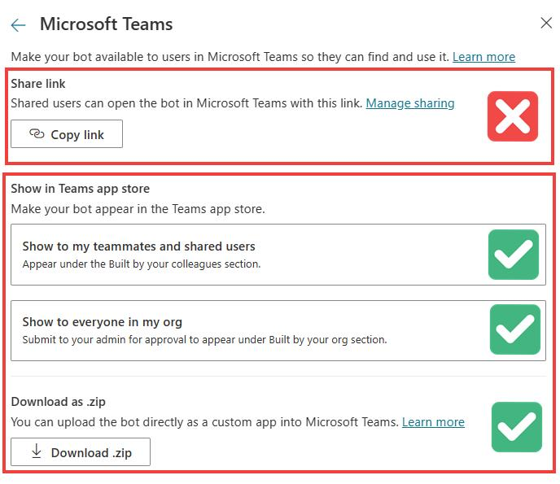

# Generate an at-risk copilot report ahead of MC699716

Microsoft Copilot Studio allows [adding copilots to Teams](https://learn.microsoft.com/en-us/microsoft-copilot-studio/publication-add-bot-to-microsoft-teams) using two ways: by sharing a direct link to the copilot and by publishing the copilot to the Teams app catalog. Copilots are published to the Teams app catalog when they are shared with specific users, the entire organization or uploaded manually as an app to Teams. 

As per [MC699716](https://admin.microsoft.com/Adminportal/Home?#/MessageCenter/:/messages/MC699716), on January 31st, 2024, the ability to chat via the Teams channel with bots/copilots that are shared via like but **not published to the Teams app catalog**, will be blocked for users who are not under a policy that allows uploading custom apps.

## Impact for Copilot Studio customers

Following the breaking change, copilots/bots that have the Teams channel "Turned on", and are only shared via link (option marked in red), will no longer be accessible to users. Bots/copilots that have been published to the Teams app catalog using one of the methods marked in green will continue to work as expected. To avoid disruption to users, Copilot Studio makers should select one of the options marked in green, and work with their organization's Teams admins to make sure the copilot is approved and published in Teams.

  
   
  <em>Sharing a copilot in Teams</em>

## Detect at risk copilots

To provide Copilot Studio admins with tenant-wide visibillity into the potential impact of this change, we are sharing a template for a Power Automate Cloud flow that will generate a list of all the at-risk copilots in a given tenant. 

The cloud flow retrieves all the copilots in a tenant that have the Teams channel "Turned on", and then compares the output with the list of applications in the Teams app catalog. Each copilot that is missing from the Teams app catalog will be flagged as at-risk, and added to a CSV report. 

The CSV report will be sent by mail to the user that initiated the flow run, and include the following details:

- Copilot name
- Copilot ID
- Environment ID
- Copilot owner name
- Copilot owner email

## Setting up the neccesary permissions, importing the cloud flow and generating the report

Before importing the solution, make sure the following prerequisits are satisfied:

- The user importing and later running the solution should have the Power Platform administrator role assigned
- Before importing the solution, an app registration should be created to allow reading from the Teams app catalog. Make sure you have the neccessary permissions to create an app registration
- Verify the target tenant has sufficient licensing that allows using premium connectors in a standalone Power Automate flow

Follow the steps below to set up the app registration and import the solution

### Step 1 - Create an app registration

1. Login to Azure Portal. Create an app registation with the AppCatalog.Read.All permission, and grant admin consent for this app.

  
   
  <em>API Premissions</em>

2. Create a secret for the app

3. Save your registered app's Application (client) ID & secret value for later

4. Still in Azure Portal, navigate to the [tenant properties page](https://portal.azure.com/#view/Microsoft_AAD_IAM/TenantProperties.ReactView) and copy your tenant ID.

### Step 2 - Import the solution

1. Download the [solution file](./CompromisedBotReport_1_0_0_5.zip) 
2. Sign in to [Power Automate](https://make.powerautomate.com/), and navigate to the solutions page
3. Select the Power Platform environment where the solution should be installed. A good choice would be the same environment where the CoE Starter Kit is installed. 
4. Click on "Import solution" and select the solution file that was downloaded in (1)
5. Create the nessecary connectios for: Office 365, Power Platform for Admins and Microsoft Dataverse
6. When asked to populate the environment variables, provide the values documented in (step 1): Tenant ID, Application (Client) ID & Secret
7. Complete importing the solution

### Step 3 - Run the report

1. Once the solution has been succesfully imported, you should see a flow called "Generate Compromised Bot Report" in your environment

  
   
  <em>The Cloud FLow</em>

2. Run the flow, and wait for it to complete. On a succesful run, you should recieve an email message with the list of compromised copilots attached. 

## Questions and issues
In case of questions and feedback regarding the cloud flow template, open an issue in this reporsitory 
