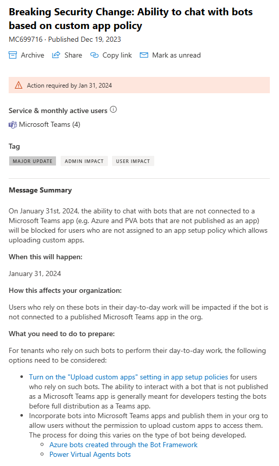
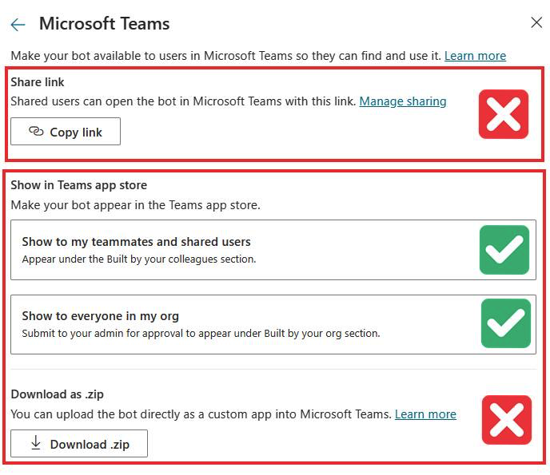
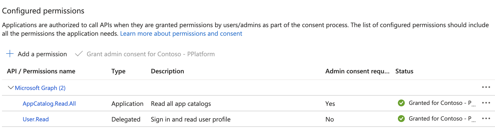
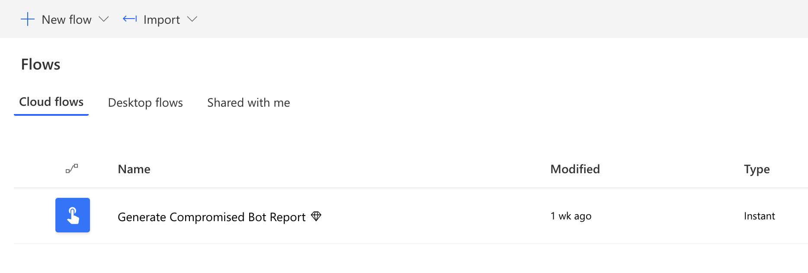

# Generate an at-risk copilot report ahead of MC699716

Microsoft Copilot Studio allows [adding copilots to Teams](https://learn.microsoft.com/en-us/microsoft-copilot-studio/publication-add-bot-to-microsoft-teams) using a number of methods: by sharing a direct link to the copilot, sharing the copilot with specific users or by sharing the copilot with the user's organization.

Makers and users sometimes also "sideload" copilots in Teams, by uploading the copilot's manifest as a custom app.

As per [MC699716](https://admin.microsoft.com/Adminportal/Home?#/MessageCenter/:/messages/MC699716), on January 31st, 2024, the ability to chat on Teams with copilots that are either shared via link or sideloaded, will be blocked for users who are not under a policy that allows uploading custom apps.

  
   
  <em>Message MC699716</em>

## Impact for Copilot Studio customers

Following the breaking change, copilots that have the Teams channel "Turned on", and are only shared via link will no longer be accessible to users. Moreover, users will no longer be able to chat with copilots that have been sideloaded (uploaded as a custom app by a non-admin user).

Copilots that have been shared with specific users or submitted and published to the organization's Teams app catalog, will continue to work as expected.

  
   
  <em>Safe and unsafe methods</em>

## What do you need to do to prepare

To provide Power Platform admins with tenant-wide visibility into the potential impact of this change, we are sharing a template for a Power Automate Cloud flow that will generate a list of all the at-risk copilots in a customer's tenant.

We encourage Power Platform admins to use this automated report to identify copilots that are at a risk of breaking and then work with copilot makers to publish copilots using one of the safe methods specified above.

When published using one of the "safe methods", copilots will appear in Teams either under "Built with Power Platform" (when shared with specific users) or under "Built for your org" (when shared with the entire organization).

**Please note:** the copilot app manifest which can be downloaded as a zip file, can be shared with a Teams admin and safely published to the Teams app catalog ("Built for your org"). The "Download as .zip" option is marked as unsafe, as it is also used for sideloading.

## Import the cloud flow and generate a list of at-risk copilots

After successfully importing and running the cloud flow, it will generate a list of at-risk copilots. The cloud flow retrieves all the copilots in a tenant that have the Teams channel "Turned on", and then performs two checks: whether the copilot is available in the Power Platform store ("Built with Power Platform") and whether it has been published to the Teams app catalog ("Built for your org"). If the copilot is missing from both catalogs, it is marked as at-risk, as it is expected to break with the upcoming change. 

A CSV file with the list of at-risk copilots will be generated by the cloud flow and shared with the user who initiated the flow run. The CSV includes the following fields: 

- Copilot name
- Copilot ID
- Environment ID
- Copilot owner name
- Copilot owner email

## Setting up the necessary permissions, importing the cloud flow and generating the report

Before importing the solution, make sure the following prerequisites are satisfied:

- The user importing and later running the solution should have the Power Platform administrator role assigned
- Before importing the solution, an app registration should be created to allow reading from the Teams app catalog. Make sure you have the necessary permissions to create an app registration
- Verify the target tenant has sufficient licensing that allows using premium connectors in a standalone Power Automate flow

Follow the steps below to set up the app registration and import the solution

### Step 1 - Create an app registration

1. Login to Azure Portal. Create an app registration with the AppCatalog.Read.All permission, and grant admin consent for this app.

  
   
  <em>API Permissions</em>

2. Create a secret for the app

3. Save your registered app's Application (client) ID & secret value for later

4. Still in Azure Portal, navigate to the [tenant properties page](https://portal.azure.com/#view/Microsoft_AAD_IAM/TenantProperties.ReactView) and copy your tenant ID.

### Step 2 - Import the solution

1. Download the [solution file](./CompromisedBotReport_1_0_0_6.zip) 
2. Sign in to [Power Automate](https://make.powerautomate.com/), and navigate to the solutions page
3. Select the Power Platform environment where the solution should be installed. A good choice would be the same environment where the CoE Starter Kit is installed. 
4. Click on "Import solution" and select the solution file that was downloaded in (1)
5. Create the necessary connections for: Office 365, Power Platform for Admins and Microsoft Dataverse
6. When asked to populate the environment variables, provide the values documented in (step 1): Tenant ID, Application (Client) ID & Secret
7. Complete importing the solution

### Step 3 - Run the report

1. Once the solution has been successfully imported, you should see a flow called "Generate Compromised Bot Report" in your environment

  
   
  <em>The Cloud Flow</em>

2. Run the flow, and wait for it to complete. On a successful run, you should receive an email message with the list of compromised copilots attached. 

## Questions and issues
In case of questions and feedback regarding the cloud flow template, open an issue in this repository 
