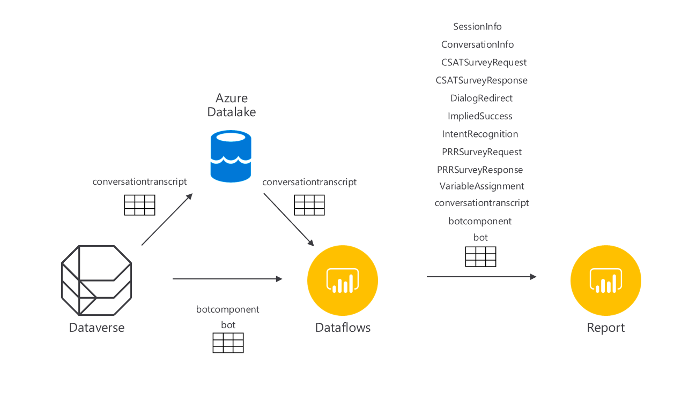

# Custom analytics solution for Power Virtual Agents - DataFlows version for higher scale bots

If your Bot has significant numbers of monthly sessions, using this version of the report provides improved scalibility. This version does require additional setup, management and a Power BI Premium license <https://powerbi.microsoft.com/en-us/pricing/>. The report uses Power BI DataFlows to connect to DataVerse and pre-process some of the compute-intensive transformations of the data. Egress from Dataverse is done using Azure Synapse Link and Azure Data Lake Storage v2.

## Solution components

- Microsoft Dataverse
- Microsoft Power BI DataFlows
- Microsoft Power BI Desktop
- Chat Transcripts control for Power BI - available at <https://github.com/iMicknl/powerbi-botframework-chat-transcripts> - many thanks to Mick Vleeshouwer
- Azure Data Lake Storage v2

## Solution description

This solution is based on 3 key Dataverse tables associate with Power Virtual Agents:

- bot - a list of PVA bots in your environment (small data size)
- botcomponent - the components making up each bot (e.g. topics) (small data size)
- conversationtranscript - the log of conversation activity on all your bots (potentially very large data size)

Data in the conversationtranscript table is streamed using Azure Synapse Link from a Dataverse environment to Azure Data Lake Storage v2, stored in the Common Data Model format. A Power BI Dataflow (Dataflow 1) connects to ADLS to retrieve the conversation transcript records. A second Dataflow (Dataflow 2), pre-processes the data, transforming the values stored in the conversationtranscript table into trace data for consumption in the Power BI report.

## Solution files

- PVA_Analytics_Export_Transform.json - this is the template for a PowerBI DataFlow - provided with an Azure SQL connection for used to retrieve bot info from Dataverse.
- PVA_Dashboard_DataFlow.pbit - Power BI template file

## Installation

### Installation requirements

- One or more Power Virtual Agents bots
- A [Power BI Premium Workspace](https://docs.microsoft.com/en-us/power-bi/admin/service-premium-what-is)
- [Power BI Desktop](https://powerbi.microsoft.com/en-us/downloads/)

### Installation steps

#### Connecting Azure Data Lake Storage for data archival

Required - using Azure Synapse Link allows us to export significant telemetry from Dataverse, and has the additional benefit of allowing storage of telemetry longer than it is stored in your Dataverse instance (default 30 days). Steps for configuring this are as follows:

> Important - always test this process on a development environment before applying to your production system.

1. [Set up an Azure Data Lake, and connect to it using Azure Synapse Link](https://docs.microsoft.com/en-us/powerapps/maker/data-platform/azure-synapse-link-data-lake).

2. Configure the conversationtranscript table for export using Azure Synapse Link
   1. In the Power Apps portal, select Azure Synapse Link - select the link you created in step 1 - Manage tables
   2. Search for 'conversationtranscript' - Save.
   3. Transcipts will now be exported to your Azure Data Lake

#### Set up Dataflows

1. Create a new Power BI Dataflow exposing the data stored in Data Lake (we will call this **Dataflow 1**)
   1. Open your Power BI Workspace - New - Dataflow
   2. Select 'Attach a Common Data Model' folder
   3. Browse you Azure Data Lake container, and paste the URL of your 'model.json' file that describes your data.
   4. At present - there is a bug in Dataflows that causes the error "The credentials provided for the PowerBI source are invalid". The PBI team is aware of this and working on a fix, but in the interim, we need to apply a small workaround, which involves creating another Dataflow - we will call this **Dataflow 1a** that sits in between 1 & 2 (these steps will be removed when the bug is fixed):
      1. Open your Power BI Workspace - New - Dataflow
      2. Select 'Link tables from other dataflows'
      3. Log in and select Dataflow 1 - conversationtranscript
      4. In the PowerQuery editor, select the conversationtranscript table, and de-select 'Enable Load'
      5. Rename the conversationtranscript table to conversationtranscript_adls
      6. Create a new blank query, name it conversationtranscript, and in the source action for the query, set it to conversationtranscript_adls

2. Edit the DataFlow template
   1. [Find your Dataverse environment URL](https://docs.microsoft.com/en-us/powerapps/maker/data-platform/data-platform-powerbi-connector#find-your-dataverse-environment-url), the URL will be in the format: https://yourenvironmentid.crm.dynamics.com/. You will just need the 'yourenvironmentid' part of the URL
   2. Download the file [PVA Analytics_Export_Transform.json](PVA_Analytics_Export_Transform.json?plain=1) and open it in a text editor, e.g. Visual Studio Code.
   3. Perform a find and replace on the file - swapping the placeholder `yourdataverse` with your Dataverse environment URL.

3. Create the DataFlow from the template (**Dataflow 2**)
   1. Log in to Power BI at <http://powerbi.com>
   2. Select the Workspace you wish to deploy the DataFlow to or create a new workspace. Please note that you cannot use 'My Workspace' for this purpose. 
   3. Select New > DataFlow
   4. Select Import Model
   5. Select the edited file 'PVA Analytics_Export_Transform.json'. Your DataFlow job should now be ready - test refreshing the data.
   6. You should be prompted for credentials, if not go to Settings -> Data source credentials and select organizational account. You can now login with an Azure Active Directory account that has access to the Dataverse environment.

4. Add the Dataflow 1a version of conversationtranscript to Dataflow 2 (chaining them together)
   1. Edit Dataflow 2 - select 'Edit tables'.
   2. You should now be in the Power Query editor. Select Get data - more... - Power Platform - Power BI Dataflows.
   3. Sign in, and then select the conversationtranscript table from Dataflow 1a.
   4. You should now return to the Power Query editor. We need to change each reference to conversationtranscript to point to the new table we just imported. Select the original conversationtranscript table - and then look at the Applied Steps window on the right of the screen. Delete any steps after 'Source'. Select the source step, and replace any value with the name of the conversationtranscript table from Dataflow 1a. This effectively makes the source of conversationtranscript in Dataflow 2 to be conversationtranscript from Dataflow 1a.

5. Note that managing the data in your DataLake will require additional attention, outside the scope of these steps.
6. You will likely want to refresh the content periodically, go to Settings -> Scheduled refresh and select the preferred period - you should ensure that the 2 dataflows that need refesh (1a and 2) refesh in that order.

#### Set up the report

1. Create your Power BI report
   1. Download the file [PVA_Dashboard_DataFlow.pbit](PVA_Dashboard_DataFlow.pbit?plain=1)
   2. Enter the parameters you are prompted for. These are:
      1. The name of the Power BI workspace
      2. The name of DataFlow 2
   3. The report should pull in the data and render it
   4. You can now [publish the report from Power BI Desktop](https://docs.microsoft.com/en-us/power-bi/create-reports/desktop-upload-desktop-files) so that other users can access it.

## Troubleshooting

There are a few places where the pipeline may break - troublshooting can normally isolate the problem using these steps:

1. The Common Data Model Dataflow option is only available on V2 Power BI workspaces. Please upgrade your workspace if you do not see this option.
2. Ensure that data is being pulled in to your DataFlow correctly. Open the DataFlow for editing (select 'edit entities'), and on each of the tables, select refresh to ensure that data is being populated.
3. Ensure that your Power BI report is connecting to DataFlows. If an error happens when you first pull in data, select 'Transform data' in the navigation menu to open Power Query
   1. Refresh each table in the 'Raw Data' folder - these correspond to the data in the DataFlow.
   2. If this fails also, test you have permissions to the DataFlow. An easy way to do this is to open the 'bot' query at the top of the query list, and select 'Source' at the top of the 'Applied steps' control. This lists all the DataFlows you have access to.
4. If both of the steps above succeed, but you still have errors, please raise an issue in this repo.
