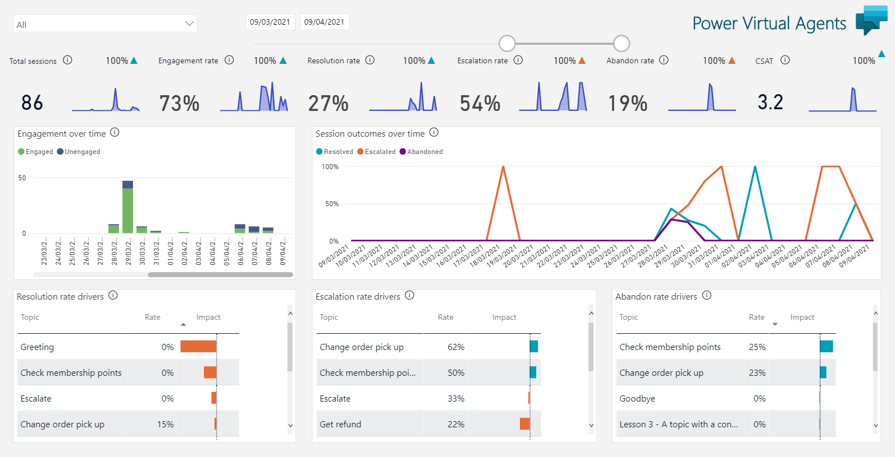

# Custom analytics solution for Microsoft Copilot Studio

This solution allows customers to create a Power BI dashboard for their copilots built with Microsoft Copilot Studio (previously Power Virtual Agents), and includes pre-created screens to show all-up performance, customer satisfaction, topics and transcripts. There are two versions of the solution, the base report found here (most users should start with this), and a [high scale version](DataFlowVersion/readme.md), using Power BI Dataflows, for large bots.

## Solution components

- Microsoft Dataverse
- Microsoft Power BI Desktop
- [Chat Transcripts visual for Power BI](https://github.com/iMicknl/powerbi-botframework-chat-transcripts) - many thanks to Mick Vleeshouwer

## Solution files

- [PVA_Dashboard.pbit](https://github.com/microsoft/CopilotStudioSamples/raw/master/CustomAnalytics/PVA_Dashboard.pbit) - Power BI template file

## Installation

### Installation requirements

- One or more copilots created in Microsoft Copilot Studio
- A Power BI account
- [Power BI Desktop](https://powerbi.microsoft.com/en-us/downloads/)
- [TDS endpoint in Dataverse enabled](https://learn.microsoft.com/en-us/power-query/connectors/dataverse#prerequisites)

### Installation steps

1. Create your PowerBI report
   1. Download and open the file [PVA_Dashboard.pbit](https://github.com/microsoft/CopilotStudioSamples/raw/master/CustomAnalytics/PVA_Dashboard.pbit)
   2. Enter the parameters you are prompted for.
      1. The URI of you Dataverse instance (e.g. mydataverse.crm.dynamics.com - note the removal of 'https://' and the trailing slash). _[Finding your Dataverse environment URL](https://learn.microsoft.com/en-us/power-query/connectors/dataverse#finding-your-dataverse-environment-url)_.
   3. The report should pull through the data and render it. If you see an error, please check the troubleshooting section below.
   4. You can now publish the report to Power BI Service, and share it with your users.

## Using the report

The report is based on what is shared on the analytics pane in Microsoft Copilot Studio, but with some important differences:

- The report includes all bots in your environment
- The report includes a date filter - and can support a range of dates greater than the 30 days supported natively in Dataverse
- The report includes all trace data emitted with the bot, allowing users to build reports on data import to them
- The report includes all transcripts, with a transcript viewer, to learn from your customer conversations
- The report can be shared with users and business decision makers without access to Power Virtual Agents

## Troubleshooting

1. Ensure the TDS endpoint in Dataverse is enabled and you have permission to access data within tables. Empty data tables may indicate a permissions problem. See [Dataverse Prerequisites](https://learn.microsoft.com/en-us/power-query/connectors/dataverse#prerequisites).
1. When using the Dataverse connector, if you experience an "Unable to connect" error due to a network or instance-specific issue, it may be because TCP ports 1433 or 5558 are blocked, see [SQL Server connection issue due to closed ports](https://learn.microsoft.com/en-us/power-query/connectors/dataverse#sql-server-connection-issue-due-to-closed-ports).
1. Please raise [a new issue](https://github.com/microsoft/CopilotStudioSamples/issues/new/choose) in this repository for other problems.
