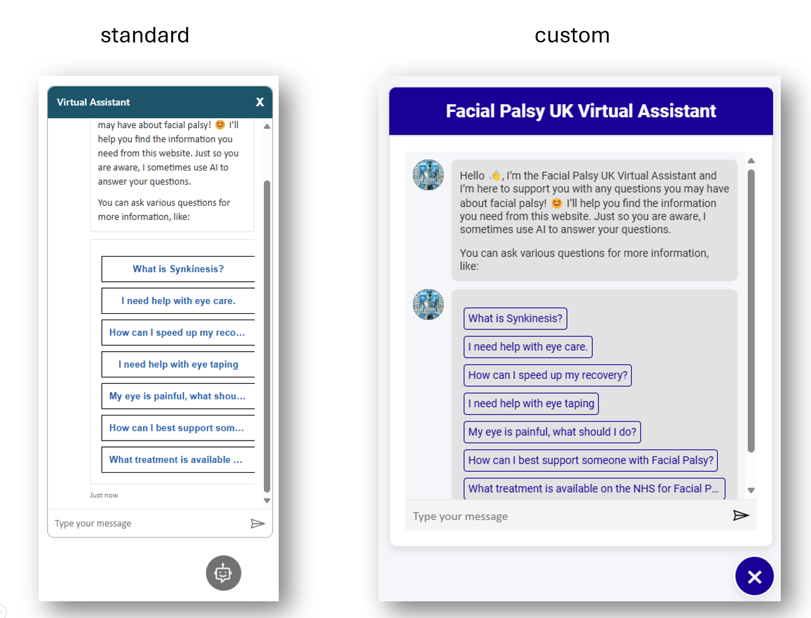

# Custom External UI

The provided html-file can be integrated in your external website or published in a Power Pages website.
The solution uses the Customization Options from the Azure AI Bot Services as well as some CSS to drastically change the look of your Copilot agent.

## Example

This is an example for a bot before and after using the provided sample

## Instructions

Create your Copilot agent and publish it.
Download the sample html and open it in a code editor.
Replace the following values with values of your choice.

| Old Value | Replace with |
|-|-|
| CustomTitle | The name of your bot |
| CustomFont | Your font family (can provide backups like: Helvetica, Arial, ...) |
| CustomAccentColor | Accent Color in Hex Code, pick a dark color with enough contrast to white (example: #000099) |
| CustomFontSize | Your preferred font-size for the chat (example: 14px) |
| CustomBotAvatar | Link to avatar image for bot (example: https://i.imgur.com/v0pQRJe.jpeg) |
| CustomUserAvatar | Link to avatar image for user (example: https://i.imgur.com/Vd2rwWx.jpeg) |
| YourTokenURL | Token Endpoint, can be obtained from the mobile Channel in Copilot Studio |

Please play around yourself! Feel free to change the size of your containers, colors and much more in the html!
Also take a look at the documentation for the Web Chat customiation - there are more options available! https://learn.microsoft.com/en-us/azure/bot-service/bot-builder-webchat-customization?view=azure-bot-service-4.0

## Downsides

This is only configured for certain aspects of adaptive cards. Feel free to expand it and add it in the file.
There is also no guarantee for this to work with older or future versions of adaptive cards.
