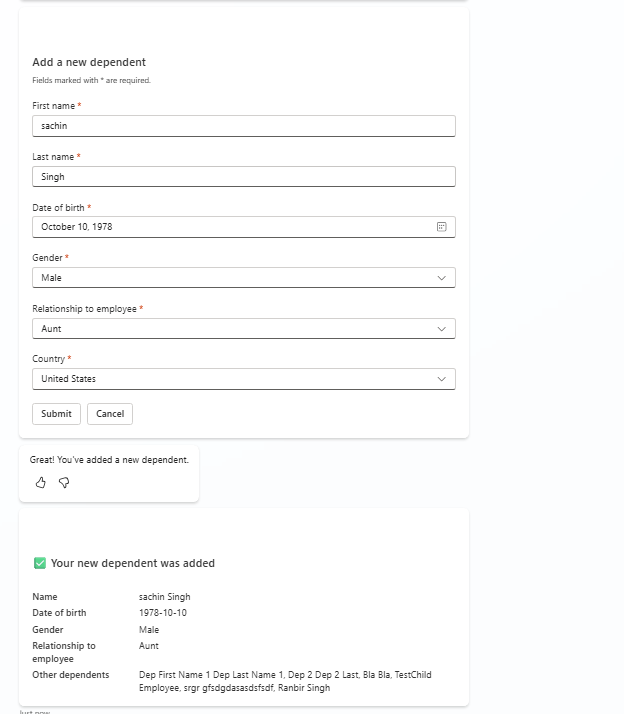

# Workday Employee Add Dependents

## Overview

This topic enables employees to view their existing dependents and add new dependents to their Workday profile through a conversational interface. Dependents include spouses, domestic partners, children, and other family members who may be covered under employee benefits.

## Features

- View existing dependents with their relationship and date of birth
- Add new dependents (spouse, child, domestic partner, etc.)
- Dynamic relationship type dropdown populated from Workday reference data
- Confirmation flow showing summary of dependent details before submission
- Form validation for required fields

## Snapshots



## Trigger Phrases

- "Add a dependent"
- "I want to add my child as a dependent"
- "Add my spouse to my benefits"
- "Register a new dependent"
- "I need to add a family member"
- "Show my dependents"

## Files

| File | Description |
|------|-------------|
| `topic.yaml` | Copilot Studio topic definition with conversation flow |
| `msdyn_HRWorkdayHCMEmployeeGetDependents.xml` | XML template for fetching existing dependents |
| `msdyn_HRWorkdayHCMEmployeeAddDependent.xml` | XML template for adding a new dependent |

## Workday APIs Used

| API | Purpose |
|-----|---------|
| `Human_Resources v45.0` | Fetch existing dependents |
| `Benefits_Administration v45.1` | Add new dependent |

## Flow Overview

```
┌─────────────────────────────────────────────────────────────┐
│                    User Triggers Topic                       │
└─────────────────────────────────────────────────────────────┘
                              │
                              ▼
┌─────────────────────────────────────────────────────────────┐
│        Fetch Reference Data (Relationship Types)             │
└─────────────────────────────────────────────────────────────┘
                              │
                              ▼
┌─────────────────────────────────────────────────────────────┐
│              Fetch Existing Dependents                       │
└─────────────────────────────────────────────────────────────┘
                              │
                              ▼
┌─────────────────────────────────────────────────────────────┐
│     Display Existing Dependents (or "No dependents")         │
└─────────────────────────────────────────────────────────────┘
                              │
                              ▼
┌─────────────────────────────────────────────────────────────┐
│          Show Add Dependent Form (Adaptive Card)             │
└─────────────────────────────────────────────────────────────┘
                              │
                              ▼
┌─────────────────────────────────────────────────────────────┐
│              Show Confirmation Card                          │
└─────────────────────────────────────────────────────────────┘
                              │
                              ▼
┌─────────────────────────────────────────────────────────────┐
│              Submit to Workday                               │
└─────────────────────────────────────────────────────────────┘
                              │
                              ▼
┌─────────────────────────────────────────────────────────────┐
│           Show Success/Error Message                         │
└─────────────────────────────────────────────────────────────┘
```

## Configurations

Environment makers need to configure the following in the topic:

| Configuration | Description | Location in Topic |
|---------------|-------------|-------------------|
| **Gender Options** | Configure available gender options (Male, Female, Not_Declared) | Adaptive card dropdown |
| **Country Codes** | Define available country codes (USA, CAN, GBR, etc.) | Adaptive card dropdown |
| **Workday Icon** | Update the icon URL to match your organization's branding | Topic properties > Icon |
| **Workday URL** | Set your organization's Workday tenant URL | HTTP action or connector configuration |

## Dependencies

- **msdyn_HRWorkdayHCMEmployeeGetDependents template**: Required for fetching existing dependents
- **Employee Context**: Worker ID must be available in the conversation context
