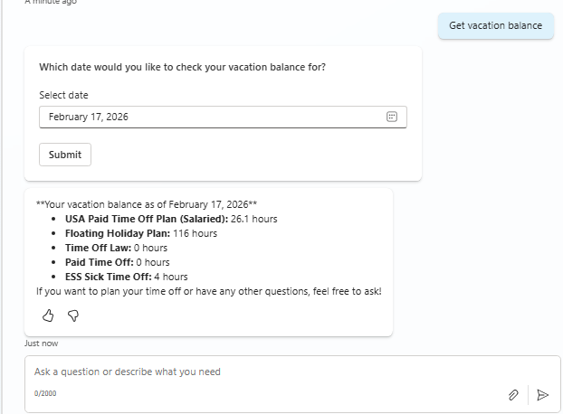

# Workday Get Vacation Balance

## Overview

This scenario allows employees to check their time off balances from Workday. It retrieves vacation, sick leave, floating holiday, and other plan balances for the requesting user.

The `EmployeeGetVacationBalance` topic allows employees to:
- **View** their current time off balances across all plans
- **Select** a specific as-of date to check historical or future balances
- **Receive** AI-formatted responses with balance details

## Features

- **Date Selection**: Prompts user to select an as-of date via Adaptive Card, defaults to today
- **Multiple Plan Support**: Returns balances for all time off plans (vacation, sick, floating holiday, etc.)
- **AI-Formatted Response**: Uses generative AI to format the balance response in a friendly, conversational way
- **Automatic Date Extraction**: If user includes a date in their request, it's automatically extracted

## Snapshots

### Date Selection Card


## Trigger Phrases

- "What is my vacation balance?"
- "How much time off can I take?"
- "What is my Workday vacation balance?"
- "Check my PTO balance"
- "How many sick days do I have left?"
- "Show me my time off balance as of January 1st"

## Files

| File | Description |
|------|-------------|
| `topic.yaml` | Main topic definition with conversation flow and Adaptive Card |
| `msdyn_HRWorkdayHCMEmployeeGetVacationBalance.xml` | XML template for the Get_Time_Off_Plan_Balances API request |

## Workday APIs Used

| API | Service | Version | Purpose |
|-----|---------|---------|---------|
| `Get_Time_Off_Plan_Balances` | Absence_Management | v42.0 | Retrieve employee's time off plan balances |

## Flow Overview

```
┌─────────────────────────────────────────────────────────────┐
│                    User Triggers Topic                       │
│        "What is my vacation balance?"                        │
└─────────────────────────────────────────────────────────────┘
                              │
                              ▼
              ┌───────────────┴───────────────┐
              │   Date provided in request?    │
              └───────────────┬───────────────┘
                    │                   │
                   Yes                  No
                    │                   │
                    ▼                   ▼
    ┌───────────────────────┐   ┌─────────────────────┐
    │  Use extracted date   │   │  Show Date Picker   │
    │                       │   │  Adaptive Card      │
    └───────────────────────┘   │  (defaults to today)│
              │                 └──────────┬──────────┘
              │                            │
              └────────────┬───────────────┘
                           │
                           ▼
┌─────────────────────────────────────────────────────────────┐
│            Call Workday API                                  │
│    (Get_Time_Off_Plan_Balances)                             │
└─────────────────────────────────────────────────────────────┘
                              │
                              ▼
┌─────────────────────────────────────────────────────────────┐
│            AI Formats Response                               │
│    (Friendly message with balances by plan)                 │
└─────────────────────────────────────────────────────────────┘
                              │
                              ▼
┌─────────────────────────────────────────────────────────────┐
│            Display to User                                   │
│    "As of [date], here are your balances:                   │
│     • Vacation: X hours                                      │
│     • Sick Leave: Y hours"                                  │
└─────────────────────────────────────────────────────────────┘
```

## Dependencies

- `msdyn_copilotforemployeeselfservicehr.topic.WorkdaySystemGetCommonExecution` - For API execution
- `Global.ESS_UserContext_Employee_Id` - Current user's employee ID
