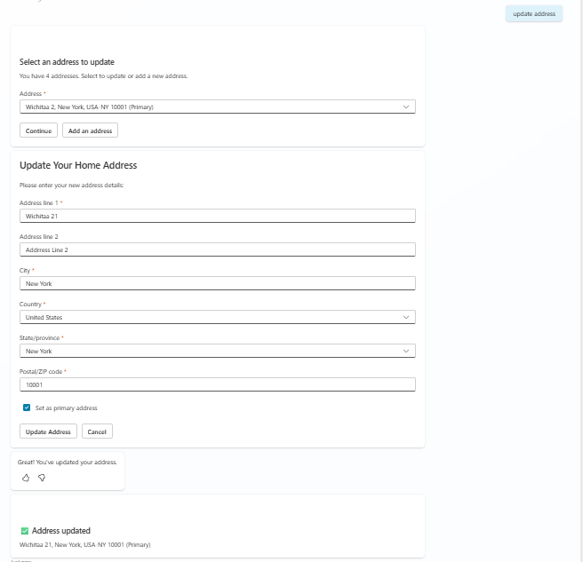

# Workday Employee Update Residential Address

## Overview

This topic enables employees to manage their home/residential address in Workday through the Copilot agent. It retrieves the employee's current home addresses, allows them to select which one to update, add a new address, or modify an existing one, and submits the changes via the Workday Change Home Contact Information API.

## Features

- View current home addresses with primary address marked
- Update any field of an existing home address
- Add a new home address when no addresses exist or user wants to add another
- Set or change which address is the primary home address
- Form pre-population with current address values

## Snapshots



## Trigger Phrases

- "Update my home address"
- "I want to update my residential address"
- "Change my address"
- "Update my street address"
- "I moved to a new address"

## Files

| File | Description |
|------|-------------|
| `topic.yaml` | Copilot Studio topic definition with conversation flow |
| `msdyn_GetResidentialAddress_Template.xml` | XML template to retrieve current home addresses |
| `msdyn_UpdateResidentialAddress_Template.xml` | XML template to update an existing home address |
| `msdyn_AddResidentialAddress_Template.xml` | XML template to add a new home address |

## Workday APIs Used

| API | Purpose |
|-----|---------|
| `Get_Workers` | Retrieve current home address information |
| `Change_Home_Contact_Information` | Add or update home address |

## Flow Overview

```
┌─────────────────────────────────────────────────────────────┐
│                    User Triggers Topic                       │
└─────────────────────────────────────────────────────────────┘
                              │
                              ▼
┌─────────────────────────────────────────────────────────────┐
│           Fetch Current Home Addresses                       │
└─────────────────────────────────────────────────────────────┘
                              │
                              ▼
┌─────────────────────────────────────────────────────────────┐
│     Show Selection (Multiple) or Auto-Select (Single)       │
└─────────────────────────────────────────────────────────────┘
                              │
                              ▼
┌─────────────────────────────────────────────────────────────┐
│        Collect New Address via Adaptive Card Form            │
└─────────────────────────────────────────────────────────────┘
                              │
                              ▼
┌─────────────────────────────────────────────────────────────┐
│              Submit to Workday                               │
└─────────────────────────────────────────────────────────────┘
                              │
                              ▼
┌─────────────────────────────────────────────────────────────┐
│           Show Success/Error Message                         │
└─────────────────────────────────────────────────────────────┘
```

## Configurations

Environment makers need to configure the following in the topic:

| Configuration | Description | Location in Topic |
|---------------|-------------|-------------------|
| **Countries** | Available country options (USA, CAN, GBR, etc.) | Adaptive card dropdown |
| **States/Provinces** | Available state/province codes per country | Adaptive card dropdown |
| **Workday Icon** | Update the icon URL to match your organization's branding | Topic properties > Icon |
| **Workday URL** | Set your organization's Workday tenant URL | HTTP action or connector configuration |

## Dependencies

- **Employee Context**: Worker ID must be available in the conversation context
