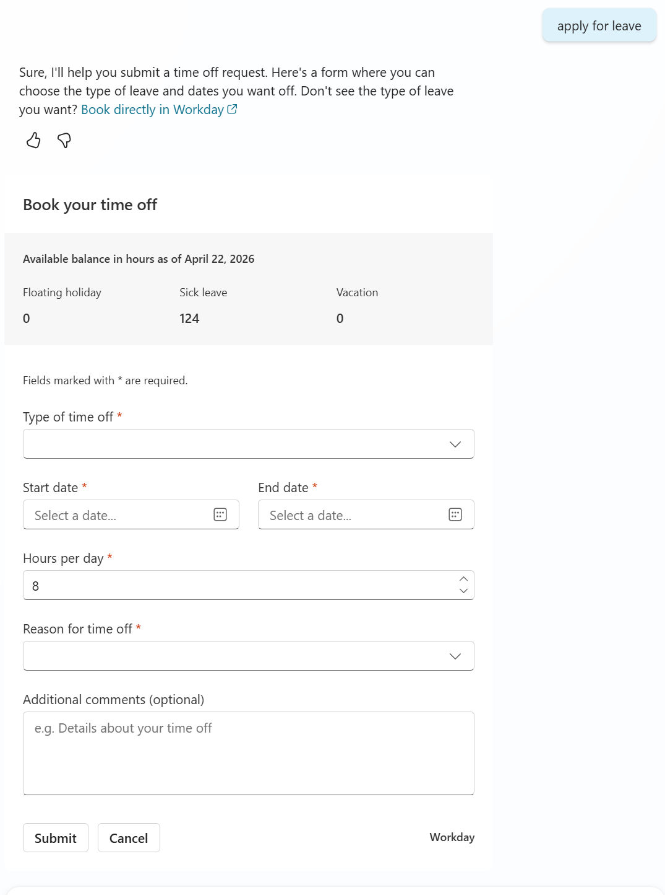
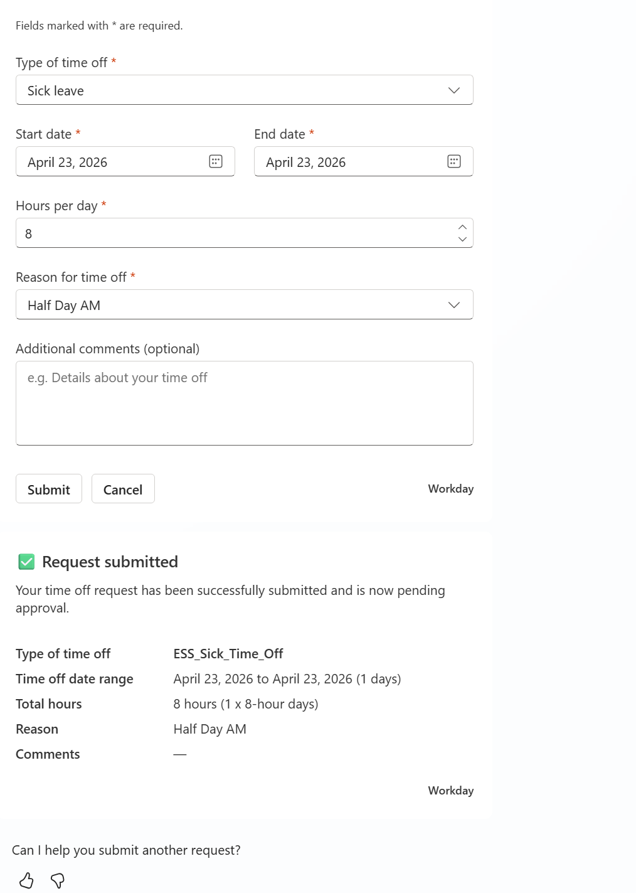

# Workday Employee Request Time Off

This topic lets employees submit single-day or multi-day time off requests to Workday directly from a Copilot Studio agent.

When an employee triggers this topic, the agent:

1. Fetches current leave balances from Workday
2. Shows an Adaptive Card form with leave type, dates, hours, and reason
3. Submits the request to the Workday `Enter_Time_Off` API
4. Displays a confirmation card or a friendly error with retry options

**Example trigger phrases:** "Request time off" · "Request vacation from January 5th to January 10th" · "Submit sick leave for next week"




{: .important }
> This topic ships with sample values from a reference Workday tenant. Every Workday tenant is configured differently — you must replace the Plan IDs, Reason IDs, leave types, and tenant URL with values from your own Workday setup before importing. See [Configure the topic](#configure-the-topic) for details.

## Prerequisites

Before you start, make sure you have:

- The **msdyn_copilotforemployeeselfservicehr** managed solution installed in your agent
- A Workday tenant with the **Absence_Management** module enabled
- A Workday connector configured with **User**-level authentication in your Power Platform environment
- The global variable **`Global.ESS_UserContext_Employee_Id`** populated at session start with the logged-in employee's Workday Employee ID
- The **`msdyn_HRWorkdayHCMEmployeeGetVacationBalance`** template already imported (from the [EmployeeGetVacationBalance](../EmployeeGetVacationBalance/) folder)
- Your organization's Workday Absence Plan IDs, Time Off Type IDs, and Reason IDs

## What's in this folder

| File | Description | Do you need to edit it? |
|------|-------------|------------------------|
| `topic.yaml` | Conversation flow, Adaptive Card form, configuration tables, error handling | Yes — update tenant URL, Plan IDs, Reason IDs |
| `msdyn_HRWorkdayAbsenceEnterTimeOff_MultiDay.xml` | SOAP template for the Workday `Enter_Time_Off` API | Usually no |
| `requestTimeOffAdapativeCard.png` | Screenshot of the Adaptive Card form | No |
| `requestTimeOffSubmitted.png` | Screenshot of the confirmation card | No |
| `README.md` | This file | No |

## Import the templates

Before configuring the topic, import the XML templates into your agent.

1. Add `msdyn_HRWorkdayAbsenceEnterTimeOff_MultiDay.xml` to your agent's ESS Template Configuration.

2. If you haven't already, import the balance template `msdyn_HRWorkdayHCMEmployeeGetVacationBalance` from the [EmployeeGetVacationBalance](../EmployeeGetVacationBalance/) folder. This topic calls it to display leave balances.

## Configure the topic

Open `topic.yaml` and update the following values to match your Workday tenant. All sample values shown below come from a reference tenant and **must** be replaced.

### Step 1: Set your Workday tenant URL

Find the `set_workday_url` node and replace `<TENANT_NAME>` with your tenant name:

```yaml
# Before
value: https://impl.workday.com/<TENANT_NAME>/home.htmld

# After — replace contoso_corp with your tenant
value: https://impl.workday.com/contoso_corp/home.htmld
```

Your Workday URL typically follows the pattern `https://<host>.workday.com/<tenant_name>/home.htmld`. Check your browser address bar when logged into Workday.

### Step 2: Update Plan IDs

Find the `set_plan_config` node. Replace each `PlanID` with the corresponding ID from your Workday tenant:

```
=Table(
  {PlanID: "ABSENCE_PLAN-6-139", DisplayName: "Floating holiday"},
  {PlanID: "ABSENCE_PLAN-6-159", DisplayName: "Sick leave"},
  {PlanID: "ABSENCE_PLAN-6-158", DisplayName: "Vacation"}
)
```

You can find your Plan IDs in Workday under **Setup > Absence Plans > Plan ID**. Only plans listed here **and** returned by the Workday API will appear in the balance header.

### Step 3: Update Reason IDs

Find the **second** `set_time_off_reason_config` node. Replace each `ReasonID` with your tenant's value:

| ReasonKey | TimeOffTypeID | ReasonID ← replace this |
|-----------|---------------|------------------------|
| `full_day` | `ESS_Vacation_Hours` | `Full Day_Vac` |
| `half_day_am` | `ESS_Vacation_Hours` | `Half Day_AM_Vac` |
| `half_day_pm` | `ESS_Vacation_Hours` | `Half Day_PM_Vac` |
| `full_day` | `ESS_Floating_Holiday_Hours` | `full_day_floating` |
| `half_day_am` | `ESS_Floating_Holiday_Hours` | `half_day_am_floating` |
| `half_day_pm` | `ESS_Floating_Holiday_Hours` | `half_day_pm_floating` |
| `full_day` | `ESS_Comp_Off` | `Full day-COI` |
| `half_day_am` | `ESS_Comp_Off` | `Half day AM-COI` |
| `half_day_pm` | `ESS_Comp_Off` | `Half day PM-COI` |
| `full_day` | `ESS_Sick_Time_Off` | `Full day_Sick_IN` |
| `half_day_am` | `ESS_Sick_Time_Off` | `Half day AM_Sick_IN` |
| `half_day_pm` | `ESS_Sick_Time_Off` | `Half day PM_Sick_IN` |

Don't rename the `ReasonKey` values — they're bound to the Adaptive Card "Reason for time off" dropdown.

### Step 4 (optional): Update leave-type choices

If your organization uses different leave types than Vacation, Floating holiday, Sick leave, and Comp off, update two places:

**The Adaptive Card dropdown** — in the `collect_time_off` node, edit the `choices` array. For example, to add Bereavement:

```json
{ "title": "Bereavement", "value": "ESS_Bereavement" }
```

**The keyword mapping** — in the `set_leave_type_config` node, add a row so the agent can pre-select the type from the user's utterance:

| Keywords (comma-separated) | LeaveTypeValue |
|---------------------------|----------------|
| `vacation,annual,pto,holiday pay` | `Vacation_Hours` |
| `floating,floater,float day` | `Floating_Holiday_Hours` |
| `sick,illness,medical,unwell,not feeling well` | `ESS_Sick_Time_Off` |

If you add a new leave type, also add matching rows to `TimeOffReasonConfig` (one per ReasonKey).

### Step 5 (optional): Update the Workday icon

Find the `set_workday_icon_url` node and replace the 1×1 pixel placeholder with your organization's Workday icon URL.

## Import and test the topic

1. In Copilot Studio, go to **Topics > + Add a topic > From file**.
2. Select `topic.yaml` and import.
3. Open **Test your agent** and try these:

| What to test | What to expect |
|-------------|---------------|
| Say "I want to request time off" | Balance header appears, then the Adaptive Card form |
| Say "Request vacation from September 15 to September 19" and submit | Success card with date range, type, hours, and reason |
| Submit with end date before start date | Error: "The end date can't be earlier than the start date" with retry |
| Select "I don't see my leave type listed" and submit | Redirect message with a link to Workday |
| Click **Cancel** | "Leave request was cancelled - nothing was submitted" |
| Submit dates that overlap an existing request | Friendly AI-rewritten error with retry |

If balances show as empty but the form appears, your `PlanConfig` Plan IDs likely don't match your Workday tenant.

## XML template reference

The `msdyn_HRWorkdayAbsenceEnterTimeOff_MultiDay.xml` file is a SOAP template for the Workday `Enter_Time_Off_Request` operation. You usually don't need to edit it — placeholder tokens like `{Employee_ID}` and `{timeoff_Dates}` are filled at runtime.

Two settings you might want to change:

| Setting | Default | Change if… |
|---------|---------|------------|
| `<wd:Auto_Complete>` | `false` (requires manager approval) | Your process skips approval — set to `true` |
| `<version>` and `wd:version` | `v42.0` | Your tenant uses a different API version |

{: .important }
> If you change the API version, update it in **both** the `<version>` element and the `wd:version` attribute. Mismatched versions cause API errors.

## What you can safely edit in the YAML

| What | Where in `topic.yaml` |
|------|----------------------|
| Workday tenant URL | `set_workday_url` node |
| Plan IDs | `set_plan_config` node |
| Reason IDs | Second `set_time_off_reason_config` node |
| Leave-type keywords | `set_leave_type_config` node |
| Adaptive Card dropdown choices | `collect_time_off` node → `choices` array |
| Trigger phrases | `modelDescription` block |
| Workday icon | `set_workday_icon_url` node |
| Balance effective date | `set_as_of_effective_date` node (defaults to `Today()`) |

**Don't** change these — they'll break the topic:

- Node `id` values (`id: main`, `id: collect_time_off`, etc.) — referenced by `GotoAction` jumps
- `kind:` values — Copilot Studio node types
- `dialog:` references — point to the shared solution
- `output: binding:` mappings — must match shared dialog outputs
- XML placeholder tokens (`{Employee_ID}`, `{timeoff_Dates}`, etc.) — filled at runtime
- The `EmployeeName` input — the model uses it to validate the request is for the logged-in user

## Dependencies

This topic depends on three external components:

- **Workday `Get_Time_Off_Plan_Balances`** — Absence_Management service, User-level auth. Uses the `msdyn_HRWorkdayHCMEmployeeGetVacationBalance` template from [EmployeeGetVacationBalance](../EmployeeGetVacationBalance/). Called at topic start to show balances.

- **Workday `Enter_Time_Off`** — Absence_Management v42.0, User-level auth. Uses the `msdyn_HRWorkdayAbsenceEnterTimeOff_MultiDay` template in this folder. Called after form submission.

- **`WorkdaySystemGetCommonExecution` dialog** — from the `msdyn_copilotforemployeeselfservicehr` solution. Executes XML templates against the Workday connector. Must be pre-installed.

## Troubleshooting

**Balance header is empty or shows all zeros**
Your `PlanConfig` Plan IDs don't match your Workday tenant, or the balance template isn't imported. Verify the IDs and confirm `msdyn_HRWorkdayHCMEmployeeGetVacationBalance` is in your ESS Template Configuration.

**"Something went wrong" when submitting**
The `ReasonID` values in `TimeOffReasonConfig` don't match your Workday tenant. Check your IDs in Workday under **Setup > Time Off Reasons**.

**Authentication error**
`Global.ESS_UserContext_Employee_Id` is empty or the Workday connector isn't configured. Verify both.

**Vacation isn't pre-selected when the user says "request vacation"**
The keyword mapping uses `Vacation_Hours` but the dropdown value is `ESS_Vacation_Hours`. Update `LeaveTypeConfig` to use `ESS_Vacation_Hours`. See [Open Questions](#open-questions).

**Success card shows a raw ID like `ESS_Vacation_Hours`**
The `Switch()` expression in the success card doesn't match the dropdown values. See [Open Questions](#open-questions).

## Tips

- Import the balance template **before** this topic — the balance lookup runs at topic start and fails silently if the template is missing.
- Update `PlanConfig`, `TimeOffReasonConfig`, **and** the Adaptive Card `choices` together — they're interconnected but maintained separately.
- Test with a real Workday employee ID that has leave balances.
- Keep `ReasonKey` values as `full_day`, `half_day_am`, `half_day_pm` — they're bound to the Adaptive Card dropdown.

## Handle repo updates

When this repo publishes a new version of the topic:

1. **Diff first.** Your customized tenant URL, Plan IDs, Reason IDs, and leave-type keywords will be overwritten if you re-import `topic.yaml`.
2. **Merge.** Copy your config values from the current topic, pull the updated file, paste your values back, then import.
3. The XML template is safe to overwrite — unless you changed `Auto_Complete` or the API version.

## Open questions

1. **Duplicate `TimeOffReasonConfig`.** The topic sets this variable twice. The first table is immediately overwritten by the second. The first appears to be dead code.

2. **`{timeoff_Reason}` parameter unused.** The API call passes `{timeoff_Reason}` but the XML template has no matching placeholder. It may be handled by the shared dialog or silently ignored.

3. **LeaveTypeConfig mismatch.** `LeaveTypeConfig` maps vacation to `Vacation_Hours` but the dropdown uses `ESS_Vacation_Hours`. Pre-selection for Vacation and Floating Holiday may not work out of the box.

4. **Success card Switch() mismatch.** The confirmation card checks for `"Vacation_Hours"` but the dropdown submits `"ESS_Vacation_Hours"`. The raw ID may display instead of the friendly name.

5. **Auto_Complete default.** Set to `false`, meaning all requests require manager approval. This may need to be a documented configuration choice.
