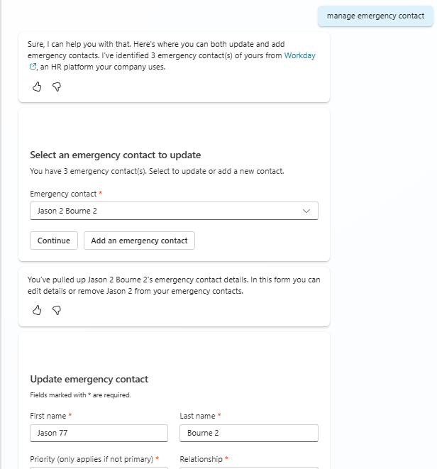
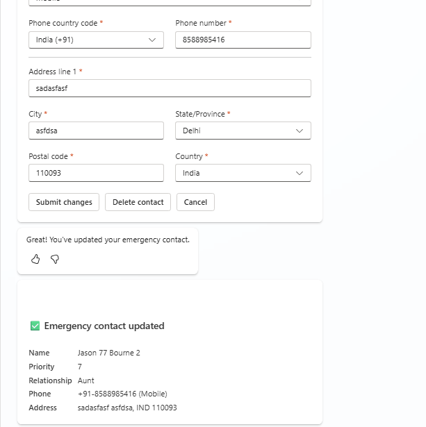

# Workday Manage Emergency Contact

## Overview

This topic enables employees to manage their emergency contacts in Workday through a conversational interface. Employees can view existing contacts, add new emergency contacts, update existing ones, and delete contacts they no longer need.

## Features

- View existing emergency contacts with primary contact highlighted
- Add new emergency contacts with full details
- Update details of existing emergency contacts
- Delete non-primary emergency contacts
- Set or change the primary emergency contact
- Assign priority levels (2-10) to contacts

## Snapshots





## Trigger Phrases

- "Manage my emergency contacts"
- "Update my emergency contact"
- "Add emergency contact"
- "Change my emergency contact information"
- "Delete my emergency contact"
- "Show my emergency contacts"

## Files

| File | Description |
|------|-------------|
| `topic.yaml` | Copilot Studio topic definition with conversation flow |
| `msdyn_HRWorkdayHCMEmployeeGetEmergencyContactInfo.xml` | XML template to fetch existing emergency contacts |
| `msdyn_HRWorkdayHCMEmployeeAddEmergencyContact.xml` | XML template to add a new emergency contact |
| `msdyn_HRWorkdayHCMEmployeeUpdateEmergencyContact.xml` | XML template to update an existing emergency contact |
| `msdyn_HRWorkdayDeleteEmergencyContact.xml` | XML template to delete an emergency contact |

## Workday APIs Used

| API | Purpose |
|-----|---------|
| `Get_Workers` | Retrieve employee's existing emergency contacts |
| `Change_Emergency_Contacts` | Add, update, or delete emergency contact information |

## Flow Overview

```
┌─────────────────────────────────────────────────────────────┐
│                    User Triggers Topic                       │
└─────────────────────────────────────────────────────────────┘
                              │
                              ▼
┌─────────────────────────────────────────────────────────────┐
│      Fetch Reference Data (Country Codes, Relationships)    │
└─────────────────────────────────────────────────────────────┘
                              │
                              ▼
┌─────────────────────────────────────────────────────────────┐
│              Fetch Existing Emergency Contacts               │
└─────────────────────────────────────────────────────────────┘
                              │
                              ▼
┌─────────────────────────────────────────────────────────────┐
│     Show Selection Card (or Go to Add if no contacts)        │
└─────────────────────────────────────────────────────────────┘
                              │
                              ▼
┌─────────────────────────────────────────────────────────────┐
│          Show Add/Update Form (Adaptive Card)                │
└─────────────────────────────────────────────────────────────┘
                              │
                              ▼
┌─────────────────────────────────────────────────────────────┐
│              Submit to Workday                               │
└─────────────────────────────────────────────────────────────┘
                              │
                              ▼
┌─────────────────────────────────────────────────────────────┐
│           Show Success/Error Message                         │
└─────────────────────────────────────────────────────────────┘
```

## Configurations

Environment makers need to configure the following in the topic:

| Configuration | Description | Location in Topic |
|---------------|-------------|-------------------|
| **Relationship Types** | Available relationship options from Workday reference data | Dynamic from GetReferenceData |
| **Country Codes** | Phone country codes from Workday reference data | Dynamic from GetReferenceData |
| **States/Provinces** | Available state/province codes per country | Adaptive card dropdown |
| **Workday Icon** | Update the icon URL to match your organization's branding | Topic properties > Icon |
| **Workday URL** | Set your organization's Workday tenant URL | HTTP action or connector configuration |

## Dependencies

- **Employee Context**: Worker ID must be available in the conversation context
