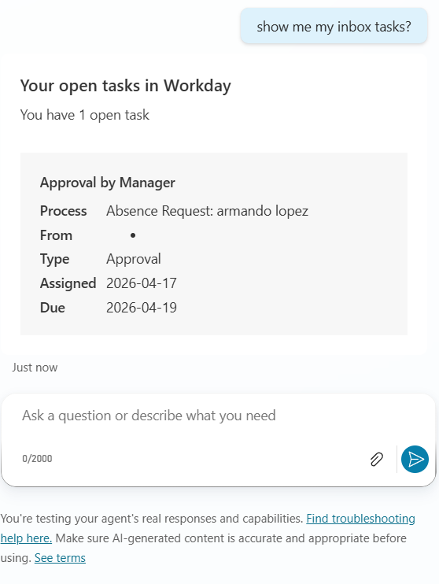
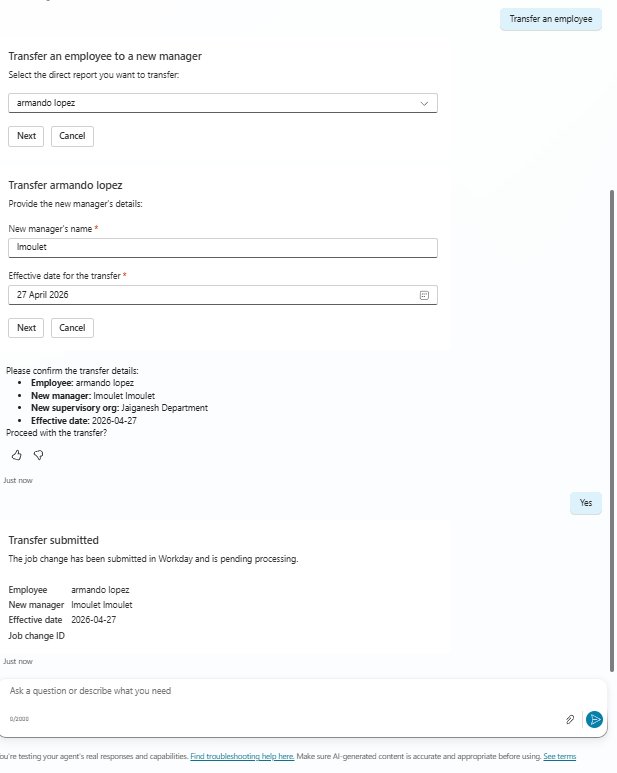
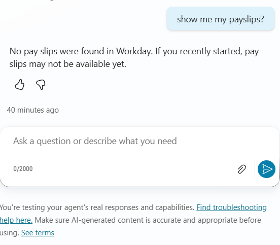

# Workday Extended Topics

These topics extend the base ESS agent with additional Workday scenarios. They use the Workday REST API via the WorkdayRESTExecution flow and WorkdaySystemGetRESTExecution system topic included in the base solution. Add only the topics relevant to your organization and also ensure that the OAuth Client in Workday has needed scopes to access the data.

| File | Who uses it | What it does |
| --- | --- | --- |
| `GetInboxTasks.yaml` | All employees | Shows open Workday inbox tasks |
| `GetPaySlips.yaml` | All employees | Shows recent pay slips with pay date, gross, net, and status |
| `RequestFeedback.yaml` | All employees | Requests feedback from a coworker |
| `TransferEmployee.yaml` | Managers | Transfers a direct report to a new manager |

## Before you start

The following are included in the **EssITWorkdayHCM** and **EssHRWorkdayHCM** base solutions. Confirm they are active before adding any topic here.

1. In Copilot Studio, go to **Topics** and confirm **WorkdaySystemGetRESTExecution** is present and turned on.

2. In this topic, go to the node where the flow is configured as **WorkdayRESTExecution** and navigate to this flow (Power Automate page) and confirm its status is **On**. If it is off, open it and turn it on. You may be asked to authorize the Workday connection.

If either is missing, import the latest EssITWorkdayHCM or EssHRWorkdayHCM solution first.

## Namespace check

Each topic references other topics by their full namespace. Copilot Studio resolves these automatically based on which solution you have deployed. After saving a topic, verify in the code editor that all `dialog:` references match your solution's namespace.

**EssITWorkdayHCM** — references should use `msdyn_copilotforemployeeselfserviceit.topic.`

**EssHRWorkdayHCM** — references should use `msdyn_copilotforemployeeselfservicehr.topic.`

If any reference does not match, update it manually in the code editor before publishing.

## How to add a topic

Copilot Studio does not support file upload for topics. Add each one using the code editor:

1. Open your ESS agent in Copilot Studio.
2. Go to **Topics** and click **Add a topic** then **From blank**.
3. Give the topic a name (see the suggested names in the table below).
4. Click the **...** menu on the topic and select **Open code editor**.
5. Select all the existing content, paste in the contents of the `.yaml` file, and save.
6. Repeat for any other topics you want to add.
7. Publish the agent when done.

Suggested topic names to use in step 3:

| File | Suggested topic name |
| --- | --- |
| `GetInboxTasks.yaml` | Get Employee Inbox Tasks |
| `GetPaySlips.yaml` | Get Pay Slips |
| `RequestFeedback.yaml` | Request Feedback on Worker |
| `TransferEmployee.yaml` | Transfer Employee |

## Configuration

Most topics work without any changes after pasting. The exception is `TransferEmployee.yaml`.

**TransferEmployee.yaml** has one optional setting near the top of the file:

```yaml
- kind: SetVariable
  id: set_reason_id
  variable: Topic.TransferReasonId
  value: ""
```

If your Workday tenant requires a job change reason for transfers, replace `""` with your tenant's transfer reason ID (for example `"JOB_CHANGE_REASON-6-5"`). Find this in Workday under **Maintain Job Change Reasons**. If your tenant does not require it, leave the value as `""`.

**RequestFeedback.yaml** requires at least one feedback template to be configured in your Workday tenant. The template list is fetched dynamically at runtime. No changes to the topic file are needed once templates are set up in Workday.

## Adjustable limits

Both `GetInboxTasks.yaml` and `GetPaySlips.yaml` have a variable at the top that controls how many records are fetched. Change the value in the code editor after pasting if needed.

| Topic | Variable | Default | Maximum |
| --- | --- | --- | --- |
| GetInboxTasks | `Topic.MaxTasks` | 20 | 100 |
| GetPaySlips | `Topic.MaxSlips` | 10 | 100 |

## Previews

**Get Inbox Tasks**



**Request Feedback**


**Transfer Employee**



**Get Pay Slips**

