# Feedback Analyzer

This project attempts to provide a mechanism to collect the reactions (thumbs up/down and comments) from users interacting with Copilot Studio agents as noted [**here**](https://learn.microsoft.com/en-us/microsoft-copilot-studio/analytics-improve-agent-effectiveness#reactions). Currently, the feedback is surfaced through the agent's 'analytics' tab in Copilot Studio. Makers can see feedback provided but some limitations currently exist:

- Cannot see the answer and original user query that generated the feedback
- Cannot see who provided the feedback
- Cannot export the feedback
- Cannot work with the feedback to process.

## Known Issue
Currently M365 copilot channel does not capture feedback the same way as other channels. This project includes an alternative to capture feedback from M365 copilot channel.

## Solution
What the solution does:

- Automation that processes the feedback and stores it into a Dataverse table
- A Model driven application to view and interact with the feedback
- Extend the functionality to collect the user who submitted the feedback
- Provide a mechanism to capture feedback from M365 Copilot channel.


## Installation
Base install (without additional configuration) can be installed in any environment (development, test/uat, production). For additional configuration that leverages component collections, it is reccomended to only use them in uat/test/production as to avoid adding additional dependencies in development environments.

1. Install the solution from the provided .zip file.
2. Configure the dataverse connection reference.
3. Configure environment variables
```json
   {
       "captureUserActivity": false,
       "globalVariableIdentifierName":"GlobalUserName",
       "m365Copilot_showCardAfterEveryResponse":false,
       "extendsOnGeneratedResponse":false
    }
```

## Configuration
With just the base installation the following functionality is achieved:
- OOB Feedback captured from all channels except M365 Copilot channel
- Agent response and user query related to feedback captured
- Model Driven app to view and interact with feedback

## Optional Configuration - User Identity Capture
By default, user identity is not captured on a conversation transcript. If you want to extend the functionality to capture user identity, this project includes a helper topic to capture this. This topic is included in a component collection.

1. Navigate to the agent that you want to enable user identity capture for.
2. Navigate to Settings -> Component collections -> Available -> Select 'Feedback_Core' -> Add to the agent's component collection.

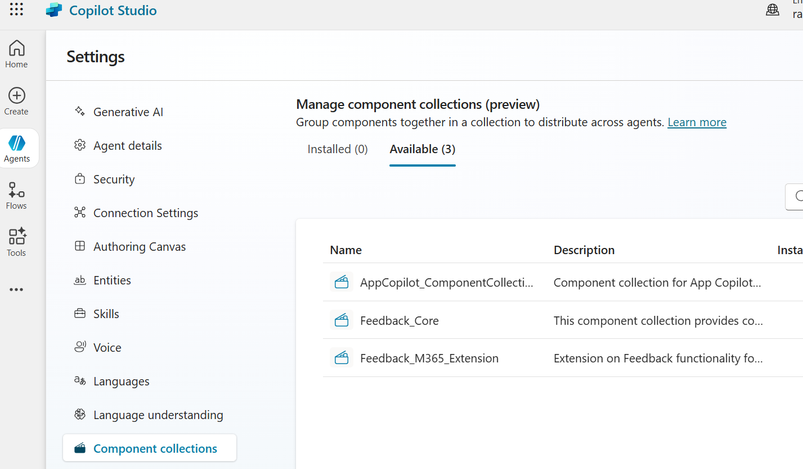

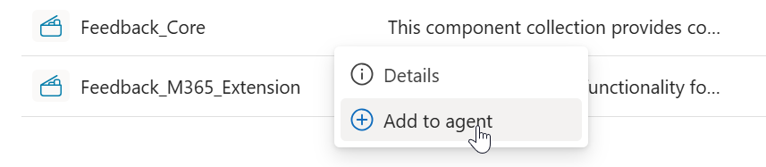

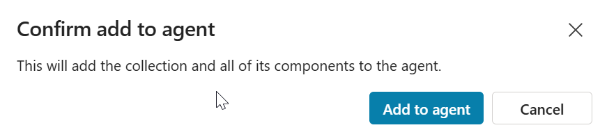

Now by default, on every conversation, the user identity will be captured on the transcript and be available in new feedback records captured going forward.

Note: Make sure you have set the environment variable property 'captureUserActivity' to true and the topic is enabled.

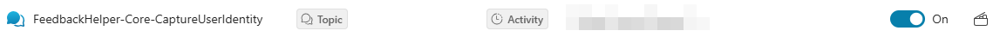

## Optional Configuration - M365 Copilot Channel Feedback
Currently M365 copilot does not collect the same way as other channels. This project leverages adaptive cards to capture feedback from the M365 copilot channel. There are two options to this configuration:
    1. Show the feedback card ad-hoc when a user chooses to: i.e. "provide feedback"
    2. Show the feedback card after every response from the agent

First, add the included provided component collection 'Feedback_M365_Extenstion' to the agent you want to enable M365 copilot feedback capture for. This will also include several helper topics that user to provide the functionality to the agent.

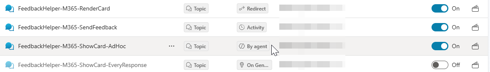

Note: Make sure you have set the environment variable property 'm365Copilot_showCardAfterEveryResponse' to true or false (true: shows the card after every response, false: shows the card on demand) depending on the behavior you want as well as enabling/disabling the appropriate topics.

- Option 1: Show feedback card ad-hoc
    1. In the agent's topics, make sure that the topic 'FeedbackHelper-M365-ShowCard-AdHoc' is enabled AND that the topic 'FeedbackHelper-M365-ShowCard-AfterEveryResponse' is disabled.
    2. In your environment variable configuration, make sure you have have m365Copilot_showCardAfterEveryResponse set to false.
    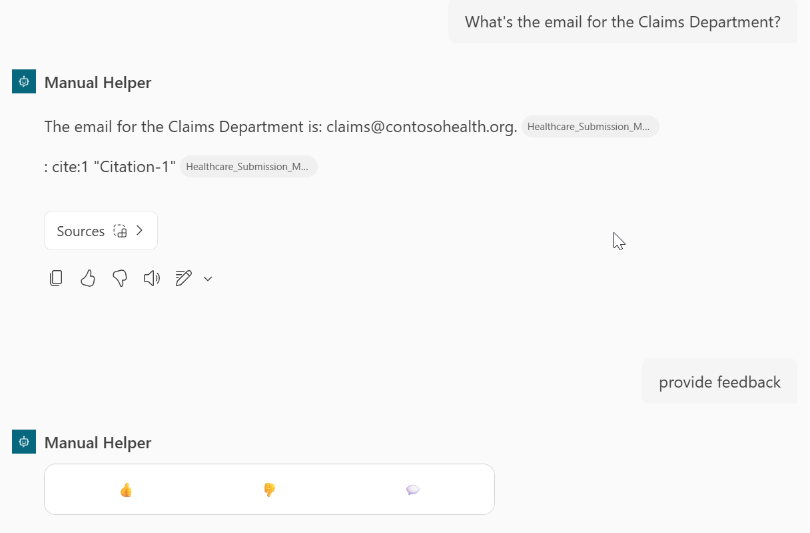
- Option 2: Show feedback card after every response (experimental)
    This option attempts to show the feedback card after every response from the agent.
    1. If you are extending the agent's responses with custom content (i.e. have topics with extendsOnGeneratedResponse ), make sure you set the property in the environment variable configuration 'extendsOnGeneratedResponse' to true.
    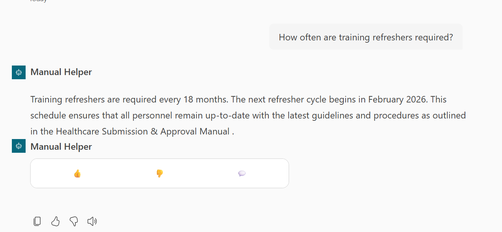

## Feedback Processing
Feedback processing is done through Power Automate, parsing the feedback collected in the conversation transcripts. There are two main flows:

1. Push All Feedback: This flow is intended to be run only once in case there has been already feedback collected prior installing the solution. It will parse all existing feedback and push it to the feedback table.
2. Process New Incoming Feedback: This flow is intended to process feedback as it comes in during conversations.

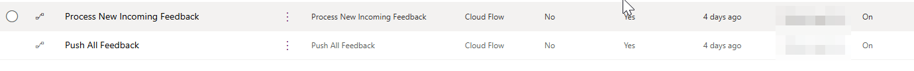

## Feedback Consumption
The processing extracts the feedback and stores it in a dataverse table ('MCS Feedback'). For easy consumption, there is a model driven app included to quickly view and interact with the feedback (MS Feedback Review App).

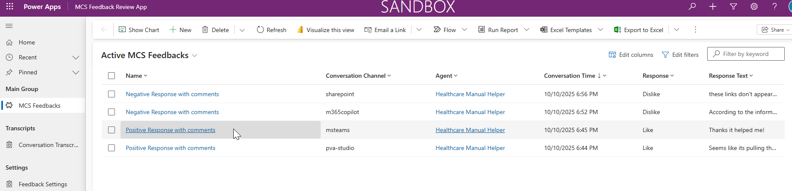

You can quickly view the feedback submitted at high level (channel, rating, comments, time). You can open each record to see more details about the specific feedback including (feedback response & comments, Agent response and original user query).

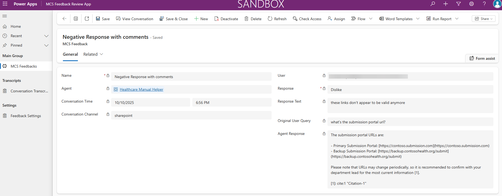

With the model driven app, you can create views, charts, dashboards, export the data as needed to further analyze the feedback collected according to your needs.

## Transcript Viewer (Experimental)
As a fun exercise, there is a custom page included that allows to view the transcript in a 'chat' like view. There are can be some rendering flaws (hopefully fully fixed in later versions). It attempts to provide more context about how a feedback came to be submitted by being able to analyze the full conversation.

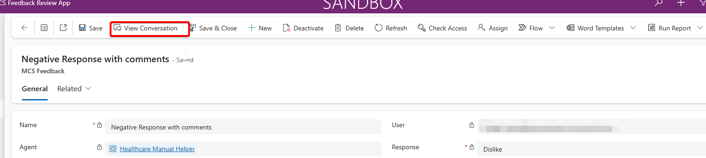
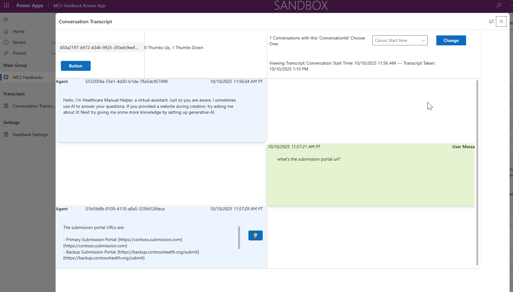