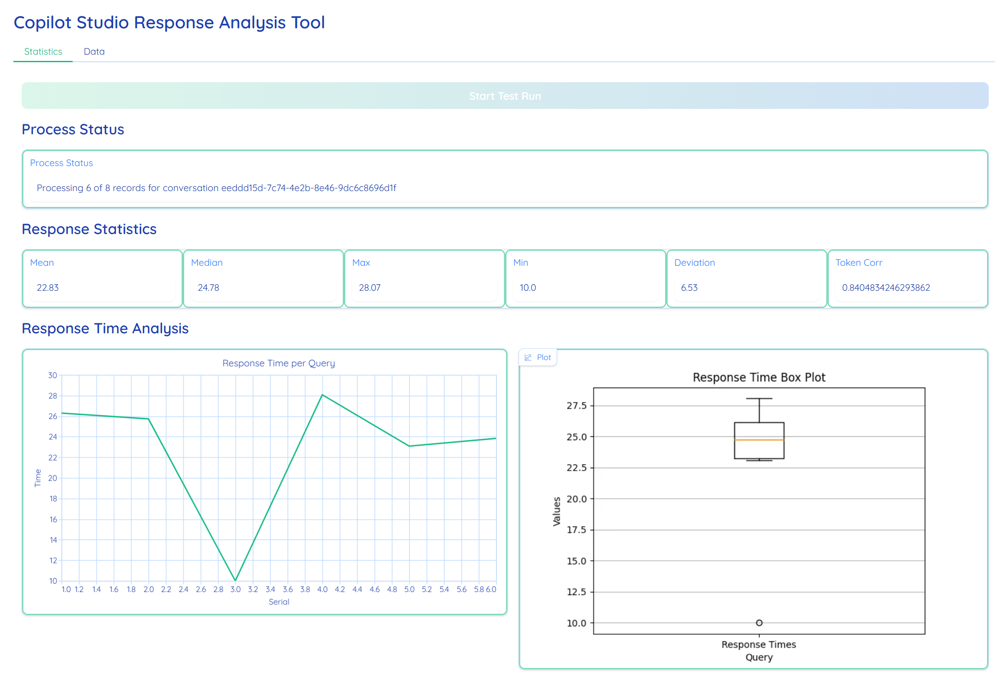
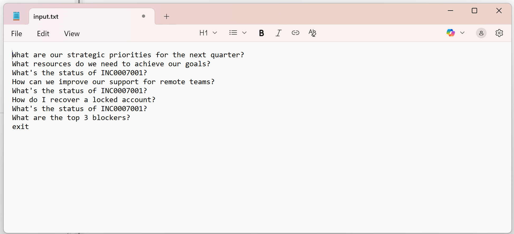
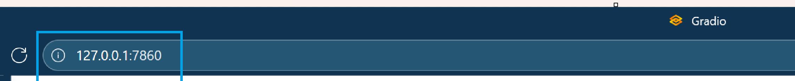

# Copilot Studio Response Analysis Tool :computer:

## Purpose: 
Provide a **lightweight, developer-friendly tool** to - 
- Measure Copilot Agent **response-time performance** and correlate it with output size/tokens. :telescope: 
- Get **metrics** (Mean, Median, Max, Min, Standard Deviation) and **visual charts** to understand Copilot Agent response time trends and variability. :movie_camera: 
- Aggregated **real-time metrics, charts and tables** to spot spikes, drift, and outliers across single conversation. :bar_chart:
- **Trace planner steps: tool invocations, and arguments** to view and validate dynamic plan composition. :computer:
    - Each planner step includes **Thought, Tool, and Arguments**, which together explain why the agent chose a path and how it executed it.
    - **Compare planner steps across queries** highlights tool calls and reasoning.
- Automatically **generates a CSV file** containing all queries, their responses, and corresponding response times. :floppy_disk:

## Interpretion:

### 1. Statistics Tab :mag_right: 
Provides an overview of Copilot Agent performance metrics, including response time summaries (Mean, Median, Max, Min), variability (Standard Deviation), token correlation, and visual charts for trends and distribution.

   <p  align="center">
        
        <br>
   </p> 

#### <center>*Response Statistics:*</center> :chart_with_upwards_trend:
| Metric | Description | Purpose | 
| :------- | :---------- | :---------- |
| **Mean** | The average response time across all responses. | Gives an overall sense of typical performance but can be skewed by very high or low values.
| **Median** | The middle value when all response times are arranged in ascending order. | Represents the central tendency and is less affected by outliers than the mean. Useful for understanding the “typical” response time.
| **Max** |  The longest response time recorded during the test run. | Highlights the worst-case scenario for latency, which is critical for identifying performance bottlenecks.
| **Min** | The shortest response time recorded during the test run. | Shows the best-case performance and can indicate the system’s potential under optimal conditions.
| **Standard Deviation** | Measures how much response times vary from the average. | Helps assess consistency—low SD means stable performance, high SD indicates fluctuating response times.
| **Token Correlation** | Represents the correlation between Cresponse time and the number of tokens in response. | Indicate orchestrator efficiency—higher cost may indicate longer responses or slower performance.

#### <center>*Response Time Analysis:*</center> :chart_with_downwards_trend:
| Chart | Description |
| :------- | :---------- |
| **Line Chart** | Shows how Copilot Agent response time changes across individual queries to identify spikes or trends. |
| **Box Plot** | Summarizes overall response time distribution, highlighting consistency and outliers for performance benchmarking. |

### 2. Data Tab :calendar:
Displays detailed per-query information, including the user’s prompt, Copilot Agent response, response time, output size, and step-by-step planner actions with tools and arguments—used for debugging and performance analysis.

#### Query Response / Time Data: 
A per‑query ledger linking the user prompt, the agent’s full reply, its latency, and output size to diagnose performance.

| Metric | Description | 
| :------- | :---------- | 
| **Serial** | Sequence number of the query in the run. | 
| **Query** | Exact user prompt/utterance. | 
| **Response** | Agent’s generated reply (full text). | 
| **Min** | Latency to produce the response (typically in seconds or ms). | 
| **Char** | Output length indicator (character count). | 

<p  align="center">
        
        <br>
   </p>

#### LLM Planner Steps Data: 
A step‑by‑step trace of the agent’s planning, tools, and arguments that explains how each response was produced.

| Metric | Description | 
| :------- | :---------- | 
| **Serial** | Sequence number matching the query above. | 
| **Query** | Exact user prompt/utterance. | 
| **PlannerStep** | Named step decided by orchestrator. | 
| **Thought** | Model’s internal reasoning summary for the step (high-level) | 
| **Tool** | Action or connector invoked. | 
| **Arguments** | Parameters passed / revieved. | 

<p  align="center">
        
        <br>
   </p>

## Prerequisite:

To set up this sample, you will need the following:

1. [Python](https://www.python.org/) version 3.9 or higher
2. An Agent Created in Microsoft Copilot Studio or access to an existing Agent.
3. Ability to Create an Application Identity in Azure for a Public Client/Native App Registration Or access to an existing Public Client/Native App registration with the `CopilotStudio.Copilots.Invoke` API Permission assigned. 

## Authentication:

The Copilot Studio Response Analysis Tool requires a User Token to operate. For this sample, we are using a user interactive flow to get the user token for the application ID created above. Other flows are allowed.

> [!Important]
> The token is cached in the user machine in `.local_token_cache.json`

## Step 1. Create an Agent in Copilot Studio.

1. Create an Agent in [Copilot Studio](https://copilotstudio.microsoft.com)
    1. Publish your newly created Copilot
    2. Goto Settings => Advanced => Metadata and copy the following values, You will need them later:
        1. Schema name
        2. Environment Id

## Step 2. Create an Application Registration in Entra ID.

This step will require permissions to create application identities in your Azure tenant. For this sample, you will create a Native Client Application Identity, which does not have secrets.

1. Open https://portal.azure.com 
2. Navigate to Entra Id
3. Create a new App Registration in Entra ID 
    1. Provide a Name
    2. Choose "Accounts in this organization directory only"
    3. In the "Select a Platform" list, Choose "Public Client/native (mobile & desktop) 
    4. In the Redirect URI url box, type in `http://localhost` (**note: use HTTP, not HTTPS**)
    5. Then click register.
4. In your newly created application
    1. On the Overview page, Note down for use later when configuring the example application:
        1. The Application (client) ID
        2. The Directory (tenant) ID
    2. Go to API Permissions in `Manage` section
    3. Click Add Permission
        1. In the side panel that appears, Click the tab `API's my organization uses`
        2. Search for `Power Platform API`.
            1. *If you do not see `Power Platform API` see the note at the bottom of this section.*
        3. In the *Delegated permissions* list, choose `CopilotStudio` and Check `CopilotStudio.Copilots.Invoke`
        4. Click `Add Permissions`
    4. (Optional) Click `Grant Admin consent for copilotsdk`

> [!TIP]
> If you do not see `Power Platform API` in the list of API's your organization uses, you need to add the Power Platform API to your tenant. To do that, goto [Power Platform API Authentication](https://learn.microsoft.com/power-platform/admin/programmability-authentication-v2#step-2-configure-api-permissions) and follow the instructions on Step 2 to add the Power Platform Admin API to your Tenant

## Step 3. Configure the Copilot Studio Response Analysis Tool.

With the above information, you can now run the `Copilot Studio Response Analysis Tool` sample.

1. Open the `env.TEMPLATE` file and rename it to `.env`.
2. Configure the values based on what was recorded during the setup phase.

```bash
  COPILOTSTUDIOAGENT__ENVIRONMENTID="" # Environment ID of environment with the CopilotStudio App.
  COPILOTSTUDIOAGENT__SCHEMANAME="" # Schema Name of the Copilot to use
  COPILOTSTUDIOAGENT__TENANTID="" # Tenant ID of the App Registration used to login, this should be in the same tenant as the Copilot.
  COPILOTSTUDIOAGENT__AGENTAPPID="" # App ID of the App Registration used to login, this should be in the same tenant as the CopilotStudio environment.
```

3. Run `pip install -r requirements.txt` to install all dependencies. 

4. List test utterances sequentially in the `/data/input.txt` file. Marke the end of the file with "exit".
    
    <p  align="center">
        
        <br>
	</p> 

## Step 4. Run the Copilot Studio Response Analysis Tool.

1. Run the Copilot Studio Response Analysis Tool using. This should challenge you to login and connect to the Copilot Studio Hosted agent

```sh
python -m src.main
```
2. The command displays the local URL hosting the ap. 

    <p  align="center">
        
        <br>
	</p> 

3. Copy the URL in browser and load application. 

    <p  align="center">
        
        <br>
	</p> 

4. Click `Start Test Run` button the console. This initiates a test run for a test utterances. The tool uses M365 Agent SDK to send utterance in `/data/input.txt` file and recieve response and logs for representation.

    <p  align="center">
        
        <br>
	</p> 

> [!Important]
> Cross check test utterances are sequentially listed in the `/data/input.txt` file.

> [!TIP]
> If the tool is properly setup, `Process Status` displays the current state of processing, including the number of utterances analyzed and conversation identifiers.
> [!TIP]
> `Start Test Run` button woudl be disabled till completion of the session.
> [!TIP]
> Data file can be changed or altered after each session and session re-executed.
> [!TIP]
> After each test run, the tool automatically generates a CSV file containing all queries, their responses, and corresponding response times. The file is stored in the `/data/` directory for easy access.