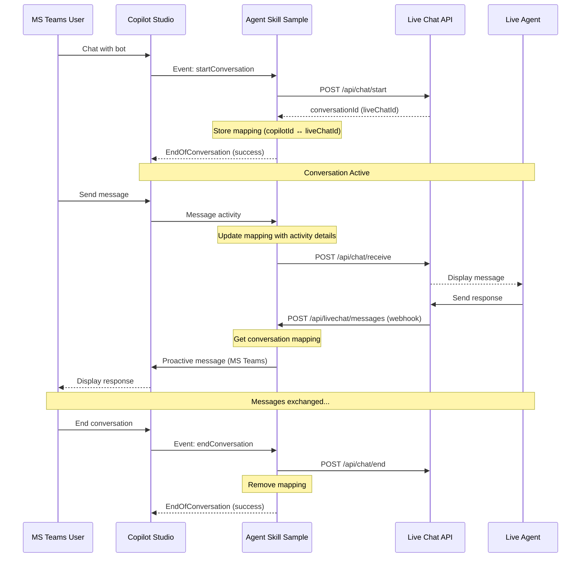

# Handover To Live Agent Sample

A .NET 9.0 Copilot Studio skill that enables seamless handover of conversations from Copilot Studio to a live chat system. This application acts as a bridge between Copilot Studio agents and live support systems, managing bidirectional message flow and conversation state.

## Project Structure

```
HandoverToLiveAgentSample/
├── CopilotStudio/
│   ├── CopilotStudioAgent.cs          # Main agent handling Copilot Studio activities via bot skill
│   ├── ConversationManager.cs         # Manages conversation mappings between MCS and Live Chat mockup app
│   └── MsTeamsProactiveMessage.cs     # Sends proactive messages to MS Teams
├── LiveChat/
│   ├── LiveChatService.cs             # Service to communicate with live chat app
│   └── LiveChatWebhookController.cs   # Receives webhook messages from live chat app
├── wwwroot/
│   └── skill-manifest.json            # Copilot Studio skill manifest 
├── Program.cs                         # Application entry point
├── appsettings.json                   # Configuration (credentials & URLs)
```

## Configuration

Configure authentication and live chat settings in `appsettings.json`. This sample supports using 2 separate app registrations for different service URL patterns:

```json
{
  "LiveChatSettings": {
    "BaseUrl": "http://localhost:5000"
  },
  "Connections": {
    "LiveChat": {
      "ConnectionType": "AzureAD",
      "Settings": {
        "TenantId": "your-tenant-id",
        "ClientId": "your-custom-service-principal-app-id",
        "ClientSecret": "your-custom-service-principal-client-secret",
        "Scopes": ["https://api.botframework.com/.default"]
      }
    },
    "CopilotStudioBot": {
      "ConnectionType": "AzureAD",
      "Settings": {
        "TenantId": "your-tenant-id",
        "ClientId": "your-bot-app-id",
        "ClientSecret": "your-bot-client-secret",
        "Scopes": ["https://api.botframework.com/.default"]
      }
    }
  },
  "ConnectionsMap": [
    {
      "ServiceUrl": "https://smba*",
      "Connection": "CopilotStudioBot"
    },
    {
      "ServiceUrl": "https://pvaruntime*",
      "Connection": "LiveChat"
    }
  ]
}
```

### Configuration Details

#### LiveChat Connection (Custom Service Principal)
- **TenantId**: Your Azure AD tenant ID
- **ClientId**: App ID of your custom service principal created for the live chat integration
- **ClientSecret**: Client secret for the custom service principal

#### CopilotStudioBot Connection (Bot App Registration)
- **TenantId**: Your Azure AD tenant ID (same as above)
- **ClientId**: Your Copilot Studio bot's App ID
- **ClientSecret**: Your Copilot Studio bot's client secret

#### General Settings
- **LiveChatSettings.BaseUrl**: URL of the live chat application (ContosoLiveChatApp), default: `http://localhost:5000`

## Running the Application

1. Navigate to the project directory:
```powershell
cd CopilotStudioSamples\HandoverToLiveAgent\HandoverToLiveAgentSample
```

2. Restore dependencies and run:
```powershell
dotnet run
```

3. The application will start on:
```
http://localhost:5001
```

4. The skill endpoint will be available at:
```
http://localhost:5001/api/messages
```

5. Expose the app over a reverse proxy such as devtunnel. And make sure that the same public endpoint URL is set in the Copilot Studio Sample Agent


## API Endpoints

| Method | Endpoint | Description |
|--------|----------|-------------|
| `POST` | `/api/messages` | Main Copilot Studio skill endpoint (handles skill activities) |
| `POST` | `/api/livechat/messages` | Webhook endpoint to receive messages from live chat app |

## Architecture

### API Flow



### Key Components

#### CopilotStudioAgent
Main agent class that handles incoming activities from Copilot Studio:
- **OnEventAsync**: Handles `startConversation` and `endConversation` events
- **OnMessageAsync**: Forwards user messages to live chat system
- Uses scoped services to resolve dependencies per turn

#### ConversationManager
Manages bidirectional conversation mappings:
- Stores mapping between Copilot conversation IDs and live chat conversation IDs
- Tracks conversation metadata (user ID, channel ID, service URL)
- Resolves SMBA regions for MS Teams proactive messaging
- In-memory storage using static dictionaries

#### LiveChatService
Communicates with the live chat system:
- **StartConversationAsync**: Initiates a new conversation in live chat app
- **SendMessageAsync**: Forwards messages from Copilot Studio to live chat app
- **EndConversationAsync**: Terminates the live chat conversation

#### MsTeamsProactiveMessage
Sends proactive messages back to MS Teams users:
- Uses IChannelAdapter for proactive messaging
- Resolves App ID based on service URL patterns
- Supports SMBA (MS Teams) runtime URLs
- Formats messages with sender name

#### LiveChatWebhookController
Receives webhook callbacks from live chat:
- Accepts messages from live agents
- Looks up conversation mapping
- Sends proactive messages back to Copilot Studio conversation

## Skill Manifest

The `skill-manifest.json` defines the skill's capabilities for Copilot Studio:

**Activities:**
- **startConversation** (event): Initiates a live chat session
- **sendMessage** (message): Sends user messages to live chat
- **endConversation** (event): Terminates the live chat session

**Endpoint Configuration:**
```json
{
  "endpointUrl": "https://your-tunnel-url.com/api/messages",
  "msAppId": "your-bot-app-id"
}
```

Update the `endpointUrl` to your deployed URL or dev tunnel. 
