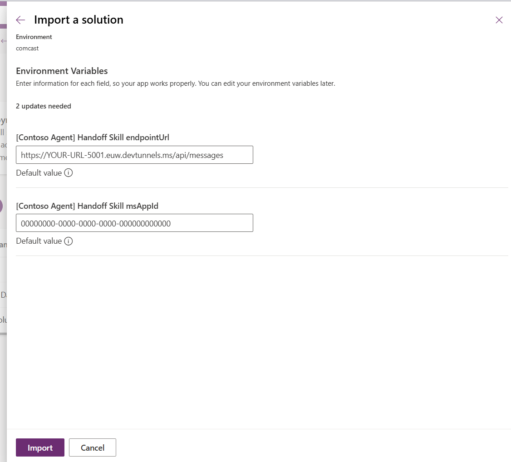

# Copilot Studio Handover To Live Agent Sample

The solution shows how to create a handoff process from Copilot Studio agent to a 3rd party customer service system. 

## Overview 

This solution demonstrates how Copilot Studio agent can hand over a conversation to an external 3rd party application and return the conversation back to the agent. The solution uses [Microsoft Teams proactive messaging](https://learn.microsoft.com/en-us/microsoftteams/platform/bots/how-to/conversations/send-proactive-messages?tabs=dotnet) feature to allow sending multiple asynchronous messages back to the human-to-agent conversation. 

## Solution 

The sample consists of the following elements:

- ContosoLiveChatApp mimicking a 3rd party customer service app. More details on that project can be found in [./ContosoLiveChatApp/Readme.md](./ContosoLiveChatApp/README.md)

- HandoverToLiveAgentSample that is the backend for [Copilot Studio skill](https://learn.microsoft.com/en-us/microsoft-copilot-studio/advanced-use-skills) as a communication layer with ContosoLiveChatApp. More details on that project can be found in [./HandoverToLiveAgentSample/README.md](./HandoverToLiveAgentSample/README.md)

- [HandoverAgentSample.zip](./HandoverAgentSample.zip) solution with an example agent using previously mentioned Copilot Studio skill

## Installation 

1. In order to communicate MCS agent with locally running HandoverToLiveAgentSample app, a reverse proxy is required to expose the app over the internet. You can install [devtunnel](https://learn.microsoft.com/en-us/azure/developer/dev-tunnels/get-started?tabs=windows) and run the following commands:

    ```powershell
    devtunnel login
    devtunnel create <YOUR-NAME> --allow-anonymous
    devtunnel port create <YOUR-NAME> -p 5001
    devtunnel host <YOUR-NAME>
    ```
    
    Take note of the `connect via browser` endpoint, it should look like `https://<YOUR-RANDOM-NAME>-5001.euw.devtunnels.ms`

1. Create new App Registration `LiveChatSample` in your Micrsofot Entra ID and note its AppId and new Secret

1. In a new terminal, run the `.\HandoverToLiveAgentSample\HandoverToLiveAgentSample.csproj` skill hosting app

    ```powershell
    dotnet run --project .\HandoverToLiveAgentSample\HandoverToLiveAgentSample.csproj
    ```

1. Validate that the app is running by going to the devtunnel URL: `https://<YOUR-RANDOM-NAME>-5001.euw.devtunnels.ms/skill-manifest.json`

1. In another terminal, run the `.\ContosoLiveChatApp\ContosoLiveChatApp.csproj` Contoso Live Chat app and in your browser open the following URL: `http://localhost:5000/` and validate that the app is running

    ```powershell
    dotnet run --project .\ContosoLiveChatApp\ContosoLiveChatApp.csproj
    ```

1. Import HandoverAgentSample.zip to your Dataverse environment. 
During the import you will be asked to fill in environment variables:
    - `[Contoso Agent] Handoff Skill endpointUrl`: override value with `https://<YOUR-RANDOM-NAME>-5001.euw.devtunnels.ms/api/messages`
    - `[Contoso Agent] Handoff Skill msAppId`: use your new app registration AppId 

        

1. After solution import is finished, go to `https://copilotstudio.microsoft.com/`, open `Contoso Agent`. Go to "Settings" > "Advanced" > "Metadata" and note the `Agent App ID`

1. In the same app registration, create and note a new secret in "Certificates & secrets" 

1. Go to [appsettings.json](./HandoverToLiveAgentSample/appsettings.json) and set "TenantId", "ClientId" and "Secret" under `CopilotStudioBot` connection from the previous app registration (automatically created Copilot app registration)

1. In the same [appsettings.json](./HandoverToLiveAgentSample/appsettings.json) "TenantId", "ClientId" and "Secret" under `LiveChat` connection using you newly created app registration `LiveChatSample`

1. For the `LiveChatSample` App Registration, go to "Branding & properties" and in the "Home page URL" save the same value as in the environment variable (`https://<YOUR-RANDOM-NAME>-5001.euw.devtunnels.ms/api/messages`) 

       

1. Go to [skill-manifest.json](./HandoverToLiveAgentSample/wwwroot/skill-manifest.json) and replace "endpointUrl" and "msAppId" with `https://<YOUR-RANDOM-NAME>-5001.euw.devtunnels.ms/api/messages` and the `LiveChatSample` app registration AppId. Don't forget to restart the app after changing config files.

1. On the Copilot Studio page, publish the agent and add it to the "Teams and Microsoft 365 Copilot" channel. 

## Usage

When chatting with your agent you can type:

"I want to talk with a person" - to escalate your conversation to the Contoso Live Chat app.

"Good bye" - to end escalation with the Contoso Live Chat app

## Agent architecture 

Contoso Agent uses skills to communicate with the Contoso Live Chat app. Depending on the integration options of your customer service system, this example may require smaller or larger changes. 

Two topics have been customized: 

1. "Escalate to Live Chat" - responsible for creating a new handoff using the "endConversation" skill and "sendMessage" skill to maintain communication. 

1. "Goodbye Live Chat" - responsible for closing the handoff, so that the user can go seamlessly back to the agent. This is done by allowing the topic to jump into the "sendMessage" skill added in "Escalate to Live Chat". Without that, ending the handoff would be possible only in the backend code by hardcoding specific verbs. 

## Extending codebase

You can control how the skills are built by changing the skill-manifest.json and refreshing it in Copilot Studio using the `https://<YOUR-RANDOM-NAME>-5001.euw.devtunnels.ms/skill-manifest.json` link. 

## Known limitations 

1. Proactive Messaging is required, so that the Live Chat user can respond back at any point in time. Without this feature, standard conversations are request-reply based, requiring the Live Chat user to wait for a message to write a reply back. This limits the current scope to only the Microsoft Teams channel (non-Microsoft apps not included).

1. Due to how conversations are mapped between the systems, one MS Teams chat can chat with multiple Live Chat sessions, but that would mean that conversations are simultaneously being received in the same MS Teams agent conversation. Also, if a Teams user would have multiple sessions opened, the sample does not provide a UI that would allow them to pick which session they would like to go back to. 
