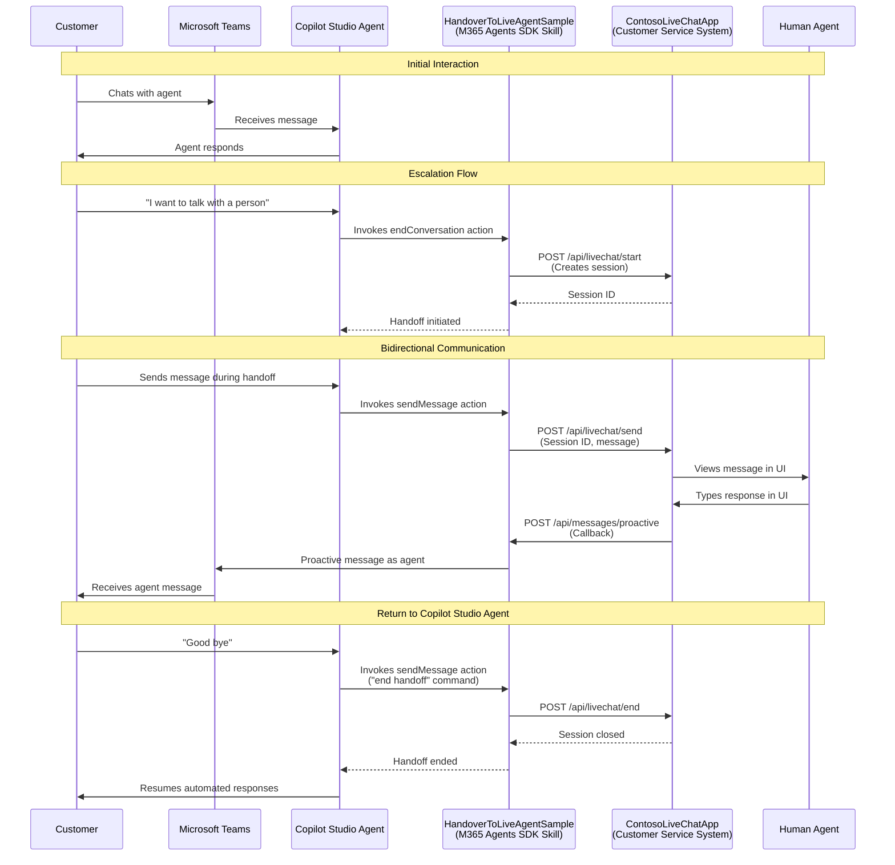

# Copilot Studio Handover To Live Agent Sample

This sample shows how a Copilot Studio agent can escalate to a live agent while keeping Copilot Studio in control of the communication. It uses M365 Agents SDK skills to exchange messages with a live chat solution, preserving native channel features and avoiding engagement hub takeover.

## Background

Typically, in handover scenarios ([see documentation](https://learn.microsoft.com/en-us/microsoft-copilot-studio/advanced-hand-off)), an engagement hub or CCaaS solution (e.g., ServiceNow, Genesys) provides a chat service/widget between the customer and the Copilot Studio agent. When a conversation needs to be routed to a live agent, the engagement hub's chat service routes the conversation to a live chat API, effectively removing Copilot Studio from the line of communication.

This traditional pattern has several limitations:

- **Channel Restrictions**: It doesn't work well when customers want to use native channels that Copilot Studio supports, such as Microsoft Teams or WebChat
- **Orchestration Complexity**: Some CCaaS vendors require plugging the Copilot Studio agent into their own virtual agent, creating a double layer of intent recognition and orchestration
- **Loss of Native Features**: Customers lose the benefits of Copilot Studio's native channel integrations

## What This Sample Does

This sample solves these limitations by keeping the Copilot Studio agent in control of the Microsoft Teams channel while enabling bidirectional communication with a 3rd party customer service system. The solution uses an [M365 Agents SDK skill](https://learn.microsoft.com/en-us/microsoft-copilot-studio/advanced-use-skills) to route messages to a live chat API, and leverages [Microsoft Teams proactive messaging](https://learn.microsoft.com/en-us/microsoftteams/platform/bots/how-to/conversations/send-proactive-messages?tabs=dotnet) to allow live agents to send multiple asynchronous messages back to the customer, creating a seamless handoff experience while preserving native Teams capabilities.

> [!IMPORTANT]
> Agents SDK Skills are currently supported but not the recommended long-term pattern. For new implementations, consider using [multi-agent orchestration over Agents SDK Agents](https://learn.microsoft.com/en-us/microsoft-copilot-studio/add-agent-microsoft-365-agents-sdk-agent), which reflects our forward investment path.

## Solution 

The sample consists of the following elements:

- **ContosoLiveChatApp**: A demonstration customer service application that simulates a 3rd party live chat system. This app:
  - Provides a web-based UI for human agents to view and respond to customer conversations
  - Exposes REST APIs for session management (`/api/livechat/start`, `/api/livechat/send`, `/api/livechat/end`)
  - Sends agent responses back to the skill via callback endpoints
  - Maintains session state and conversation history
  - **Is meant to be replaced** with your actual customer service platform (e.g., ServiceNow, Genesys, Salesforce Service Cloud)
  
  More details: [./ContosoLiveChatApp/README.md](./ContosoLiveChatApp/README.md)

- **HandoverToLiveAgentSample**: The M365 Agents SDK skill that acts as a bridge between Copilot Studio and your customer service system. This skill:
  - Handles authentication with both the Copilot Studio agent and the live chat system
  - Implements skill actions (`endConversation`, `sendMessage`) that the agent can call to manage handoff
  - Manages session lifecycle and conversation context
  - Uses Microsoft Teams proactive messaging to deliver live agent responses asynchronously
  - Stores conversation state to route messages to the correct session
  
  More details: [./HandoverToLiveAgentSample/README.md](./HandoverToLiveAgentSample/README.md)

- **HandoverAgentSample.zip**: A Copilot Studio solution containing:
  - The `Contoso Agent` configured with the handoff skill
  - Two topics: "Escalate to Live Chat" and "Goodbye Live Chat"
  - Environment variables for skill configuration

### How It Works



**Key Flow Components:**

1. **Initial Contact**: Customer interacts with the Copilot Studio agent through Microsoft Teams
2. **Escalation**: When the customer requests a live agent, the agent invokes the skill's `endConversation` action to initiate handoff
3. **Session Creation**: The skill creates a new session in the live chat system and stores conversation context
4. **Bidirectional Communication**: 
   - Customer messages flow: Teams → Agent → Skill → LiveChat → Human Agent
   - Agent messages flow: Human Agent → LiveChat → Skill → Teams (via proactive messaging) → Customer
5. **Return to Copilot Studio Agent**: Customer can end the handoff and return to the Copilot Studio agent

## Prerequisites

Before you begin, ensure you have the following:

### Required Software
- [.NET 8.0 SDK](https://dotnet.microsoft.com/download/dotnet/8.0) or later
- [Visual Studio Code](https://code.visualstudio.com/) or [Visual Studio 2022](https://visualstudio.microsoft.com/) (recommended for development)
- [Dev Tunnels CLI](https://learn.microsoft.com/azure/developer/dev-tunnels/get-started) for local development

### Required Azure & Microsoft 365 Resources
- **Azure Subscription** with permissions to:
  - Create and manage Microsoft Entra ID app registrations
  - Create client secrets
  - Access Azure Portal
- **Microsoft 365 Tenant** with:
  - [Microsoft Copilot Studio license](https://learn.microsoft.com/microsoft-copilot-studio/requirements-licensing)
  - Microsoft Teams enabled
  - Access to [Copilot Studio portal](https://copilotstudio.microsoft.com/)
- **Dataverse Environment** with:
  - Permissions to import solutions
  - Environment maker role or higher

### Required Permissions
- **Microsoft Entra ID**: Application Administrator or Global Administrator role (to create app registrations)
- **Copilot Studio**: Environment Maker role or higher (to import and publish agents)
- **Microsoft Teams**: Ability to add and interact with custom apps

### Knowledge Prerequisites
- Basic understanding of:
  - Azure Portal navigation
  - Microsoft Entra ID app registrations
  - Copilot Studio fundamentals
  - REST APIs and webhooks
  - Command-line interface (PowerShell or terminal)

### Development Environment Setup
1. Verify .NET installation:
   ```powershell
   dotnet --version
   ```
   You should see version 8.0.0 or later.

2. Clone or download this repository to your local machine

3. Ensure you can access:
   - [Azure Portal](https://portal.azure.com)
   - [Copilot Studio](https://copilotstudio.microsoft.com/)
   - [Microsoft Entra admin center](https://entra.microsoft.com/)

## Installation 

This setup requires configuring two separate app registrations in Microsoft Entra ID:

1. **HandoverToLiveAgentSample Skill App Registration**: Allows the skill to authenticate with Azure Bot Service and **receive** communication from the Copilot Studio agent
2. **Copilot Studio Agent App Registration**: Automatically created when you import the solution; allows the skill to **send** proactive messages to Teams as the agent

Both registrations are necessary for the bidirectional communication pattern - the skill acts as a bridge and needs to authenticate in both directions.

### Setup Steps

1. **Set up local development tunnel**: For local development and testing, your Copilot Studio agent needs to communicate with the HandoverToLiveAgentSample skill running on your machine. A reverse proxy is required to expose the app over the internet. Install [devtunnel](https://learn.microsoft.com/en-us/azure/developer/dev-tunnels/get-started?tabs=windows) and run the following commands:

    ```powershell
    devtunnel login
    devtunnel create <YOUR-NAME> --allow-anonymous
    devtunnel port create <YOUR-NAME> -p 5001
    devtunnel host <YOUR-NAME>
    ```
    
    Take note of the `connect via browser` endpoint, it should look like `https://<YOUR-RANDOM-NAME>-5001.euw.devtunnels.ms`

    > [!NOTE]
    > For production deployments, you should deploy the HandoverToLiveAgentSample skill to Azure instead of using devtunnel. The devtunnel approach is only recommended for development and testing purposes.
    
    > [!NOTE]
    > Only the HandoverToLiveAgentSample skill (port 5001) requires devtunnel exposure. The ContosoLiveChatApp (port 5000) runs locally and is accessed only from your machine via `http://localhost:5000/`.

1. **Create App Registration for the HandoverToLiveAgentSample skill**: Create a new App Registration in your Microsoft Entra ID. This app registration will be used by the HandoverToLiveAgentSample skill to authenticate with Azure Bot Service and receive messages from the Copilot Studio agent.
   - Navigate to [Azure Portal](https://portal.azure.com) > Microsoft Entra ID > App registrations > New registration
   - Set the name to `HandoverToLiveAgentSample` (or another descriptive name of your choice)
   - Leave the default settings and click "Register"
   - Copy and save the **Application (client) ID** from the Overview page - you'll need this later when configuring the Copilot Studio agent and skill manifest
   - Go to "Certificates & secrets" > "Client secrets" > "New client secret"
   - Add a description and expiration period, then click "Add"
   - Copy and save the **Value** (not the Secret ID) immediately - this cannot be retrieved later

1. **Run the HandoverToLiveAgentSample skill locally**: In a new terminal, navigate to the project directory and run the skill:

    ```powershell
    dotnet run --project .\HandoverToLiveAgentSample\HandoverToLiveAgentSample.csproj
    ```

1. **Verify the skill is running**: Navigate to your devtunnel URL to validate the skill manifest is accessible: `https://<YOUR-RANDOM-NAME>-5001.euw.devtunnels.ms/skill-manifest.json`

1. **Run the ContosoLiveChatApp**: In another terminal, run the Contoso Live Chat app:

    ```powershell
    dotnet run --project .\ContosoLiveChatApp\ContosoLiveChatApp.csproj
    ```
    
    Open your browser to `http://localhost:5000/` and verify the app is running.

1. **Import the Copilot Studio agent solution**: Import `HandoverAgentSample.zip` to your Dataverse environment. During the import you will be asked to configure environment variables:
    - `[Contoso Agent] Handoff Skill endpointUrl`: Set to `https://<YOUR-RANDOM-NAME>-5001.euw.devtunnels.ms/api/messages`
    - `[Contoso Agent] Handoff Skill msAppId`: Use the Application (client) ID from step 2

    
    
    After the solution import completes:
    - Navigate to `https://copilotstudio.microsoft.com/`
    - Open `Contoso Agent`
    - Go to Settings > Advanced > Metadata
    - Copy and save the **Agent App ID** - this is the automatically created app registration for your Copilot Studio agent

1. **Create a secret for the Copilot Studio agent**: In Azure Portal, find the app registration that was automatically created for your Copilot Studio agent (using the Agent App ID from the previous step):
   - Search for the Agent App ID in Microsoft Entra ID > App registrations
   - Go to Certificates & secrets > Client secrets > New client secret
   - Add a description and expiration period, then click "Add"
   - Copy and save the **Value** immediately - you'll need this in the next step

1. **Configure the HandoverToLiveAgentSample appsettings for Copilot Studio agent authentication**: Open [appsettings.json](./HandoverToLiveAgentSample/appsettings.json) and update the `CopilotStudioBot` connection with credentials from the Copilot Studio agent's app registration:
   - Set `TenantId` to your Microsoft Entra tenant ID
   - Set `ClientId` to the Agent App ID from step 6
   - Set `Secret` to the secret value from step 7
   
   > [!NOTE]
   > This configuration allows the skill to authenticate **as** the Copilot Studio agent using the client credentials flow. The skill needs these credentials to send proactive messages to Teams on behalf of the agent during live chat sessions.

1. **Configure the LiveChat connection**: In the same [appsettings.json](./HandoverToLiveAgentSample/appsettings.json), update the `LiveChat` connection using the app registration credentials from step 2:
    - Set `TenantId` to your Microsoft Entra tenant ID
    - Set `ClientId` to the Application (client) ID from step 2
    - Set `Secret` to the secret value from step 2
    
    > [!NOTE]
    > This configuration allows the skill to authenticate with Azure Bot Service to receive messages **from** the Copilot Studio agent.

1. **Update the app registration home page**: In Azure Portal, navigate to the `HandoverToLiveAgentSample` app registration created in step 2:
    - Go to Branding & properties
    - Set the Home page URL to `https://<YOUR-RANDOM-NAME>-5001.euw.devtunnels.ms/api/messages`
    - Click Save

       

1. **Update the skill manifest**: Open [skill-manifest.json](./HandoverToLiveAgentSample/wwwroot/skill-manifest.json) and update:
    - Set `endpointUrl` to `https://<YOUR-RANDOM-NAME>-5001.euw.devtunnels.ms/api/messages`
    - Set `msAppId` to the Application (client) ID from step 2
    
    Stop the HandoverToLiveAgentSample application (Ctrl+C in the terminal from step 3) and restart it for the changes to take effect:
    
    ```powershell
    dotnet run --project .\HandoverToLiveAgentSample\HandoverToLiveAgentSample.csproj
    ```

1. **Publish the Copilot Studio agent**: In Copilot Studio:
    - Publish the Contoso Agent
    - Add it to the "Microsoft Teams" channel

## Production Deployment

The instructions in this README focus on local development using devtunnel. For production deployments, you must deploy the HandoverToLiveAgentSample skill to Azure. See the deployment guide: https://learn.microsoft.com/en-us/microsoft-365/agents-sdk/deploy-azure-bot-service-manually

## Usage

When chatting with your agent in Microsoft Teams:

- Type **"I want to talk with a person"** to escalate your conversation to the Contoso Live Chat app
- Type **"Good bye"** to end the escalation and return to the Copilot Studio agent

1. **Test returning to the Copilot Studio agent**:
   - In Teams, type: "Good bye"
   - The agent should confirm the handoff has ended
   - Send "Hello" again - you should receive automated responses

## Agent Architecture 

The Contoso Agent uses M365 Agents SDK skills to communicate with the Contoso Live Chat app. Depending on your customer service system's integration options, this example may require modifications.

Two topics have been customized in the agent:

1. **Escalate to Live Chat** - Initiates a new handoff using the skill's `endConversation` action and maintains ongoing communication using the `sendMessage` action

2. **Goodbye Live Chat** - Closes the handoff, allowing the user to seamlessly return to the Copilot Studio agent. This topic can invoke the `sendMessage` action that was added in the "Escalate to Live Chat" topic.

## Extending the Solution

You can customize the skill by:
1. Modifying [skill-manifest.json](./HandoverToLiveAgentSample/wwwroot/skill-manifest.json)
2. Refreshing the skill in Copilot Studio by accessing `https://<YOUR-RANDOM-NAME>-5001.euw.devtunnels.ms/skill-manifest.json`
3. Restarting the HandoverToLiveAgentSample application

## Replacing ContosoLiveChatApp with Your Customer Service System

**ContosoLiveChatApp** is a sample application included in this repository to demonstrate the handoff pattern. For details about how it works, see [./ContosoLiveChatApp/README.md](./ContosoLiveChatApp/README.md).

To integrate with your own customer service platform (ServiceNow, Salesforce Service Cloud, Genesys, Zendesk, etc.), modify the `HandoverToLiveAgentSample` skill at these key integration points:

1. **Session Creation** (in `EndConversationAction.cs`): Replace `/api/livechat/start` with your system's API
1. **Message Forwarding** (in `SendMessageAction.cs`): Replace `/api/livechat/send` with your system's API
1. **Callback Endpoint** (in `MessagesController.cs`): Configure your system to send responses to `/api/messages/proactive`
1. **Session Termination** (in `SendMessageAction.cs`): Replace `/api/livechat/end` with your system's API

> [!TIP]
> Review your customer service platform's documentation for chat/messaging APIs and webhook capabilities. The ContosoLiveChatApp serves as a reference implementation.

## Known Limitations 

1. **Microsoft Teams channel implementation**: This sample uses Microsoft Teams proactive messaging to enable live agents to send asynchronous messages to customers at any time during handoff. While the underlying pattern (Copilot Studio maintaining channel control via M365 Agents SDK skills) is channel-agnostic, this specific implementation is Teams-only. Adapting this pattern to other channels would require replacing the Teams proactive messaging mechanism with the target channel's equivalent capability for bidirectional asynchronous communication.

## Future Enhancements

The following improvements could be added to this sample:

1. **Session validation**: Prevent users from creating multiple concurrent LiveChat sessions for the same Teams conversation. Currently, if a user initiates handoff multiple times without closing previous sessions, the newest session receives messages but all active sessions can send responses to the same Teams thread.

2. **Persistent storage**: Replace in-memory conversation mappings with a persistent store (Azure Table Storage, Cosmos DB, SQL Database) with session timeout and cleanup logic.

3. **Error handling**: Add retry logic for failed API calls, circuit breaker patterns, and graceful degradation when the live chat system is unavailable.

4. **Security**: Store secrets in Azure Key Vault, implement proper authentication with your customer service system, and add request validation and rate limiting.
