# Human Verification Sample

## Overview

In this sample, we will show how a Bot by using Power Virtual Agents can identify if the user on the other side is a Human or a Bot.
This can be achieved by sending an email to the user with a verification code that has to be used on the Bot in order to proceed with the dialog flow.

## Prerequisites

* Email account to send emails from

## Importing the solution

To import the sample bot follow the steps below:

1. Log in to the [Power Apps](make.powerapps.com) site.

2. Select the environment where the PVA sample bot will be imported.

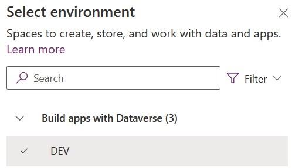

3. Go to the Solutions tab, and on the command bar, select the Import option.

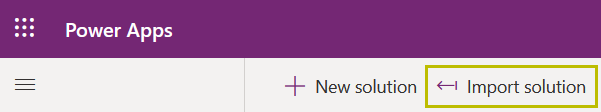

4. Click on the Browse button and locate the HumanVerificationSample_1_0_0_0.zip file included in this repository.

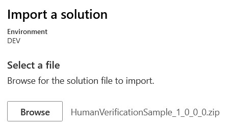

5. Information about the solution will be displayed, click Next

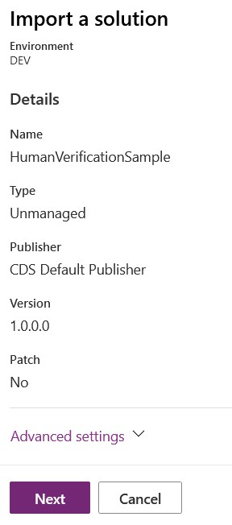

6. If you have an Office connection, select it. Otherwise, create a new connection. After selecting the connection, the Import button will be available.

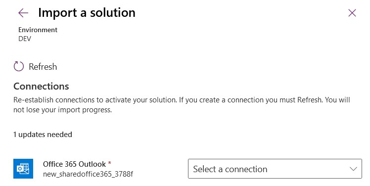

7. After clicking the import button, the solution will start to import into the selected environment.

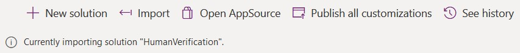

8. When the import process has finished, the following message will appear.

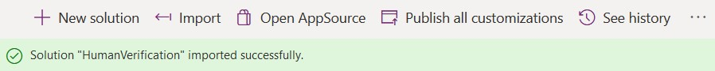

## How to setup code verification

To set up the sample bot, some configurations need to be done to start using it.

1. Go to [Power Virtual Agents](https://web.powerva.microsoft.com/), select the environment and click on the EmailVerificationBot.

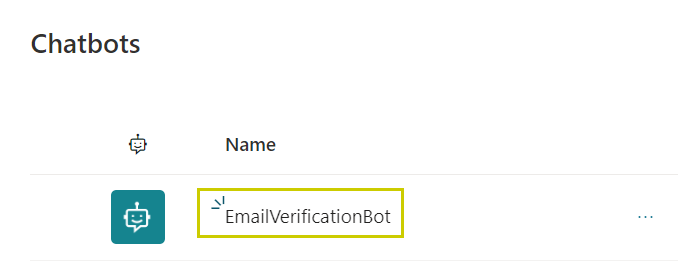

2. Go to the "Human Verification" topic.

3. Go to the "Generate the verification code" flow and click on "View flow details".

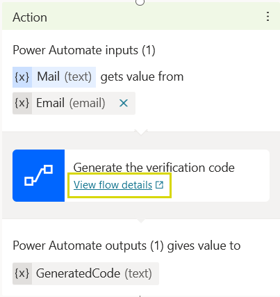

4. After being redirected to power automate, click the "Edit" button.

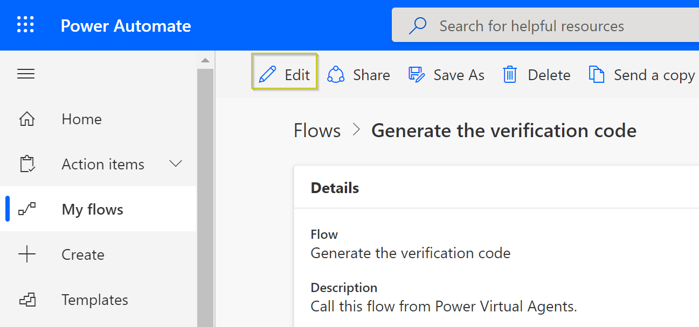

5. On the "Initialize CodeLength variable" step, you can change the value to set the desired length of the verification code that will be sent through email.

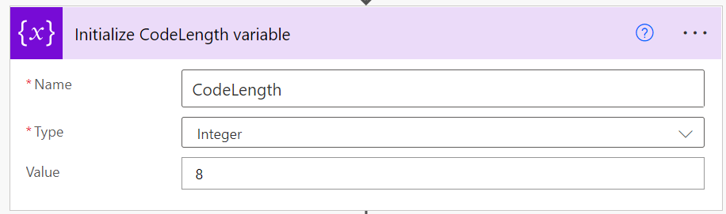

6. On the "Send an email to the account sent as input" step, an email account from which the verification code will be sent, has to be set up. The placeholder "youremail@here" should be replaced.

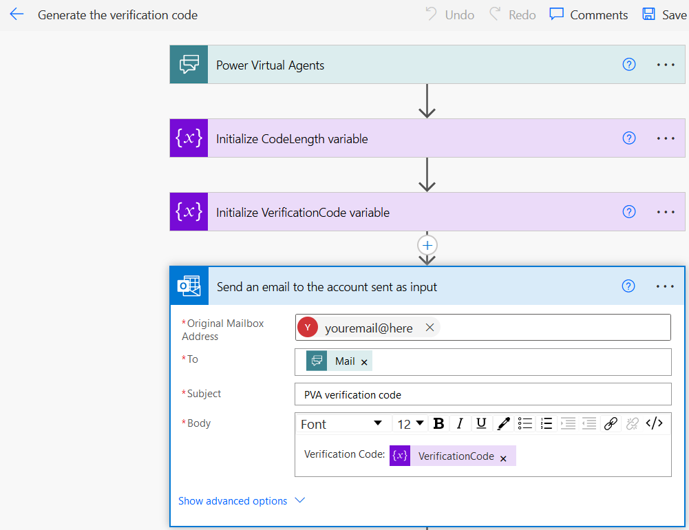

    Note: Make sure to use the same email account used by the connection reference when importing the solution.

## How to use the sample

1. One of these trigger phrases has to be used to start the flow:
    - human verification
    - email verification
    - verification
    - verification code

2. The bot will ask for the user's email to validate that there is a person on the other side

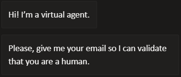

3. The bot will send a verification code through email and the user needs to copy the code and paste it into the chat window

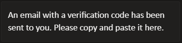

4. Once the email is entered, there can be two different scenarios:

    a) The verification code is correct and the chat flow finishes.

    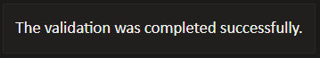

    b) The entered code is not valid.

    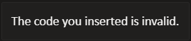

## How does the verification code flow work

1. First, the Mail variable gets filled with the email account provided by the user during the conversation flow.

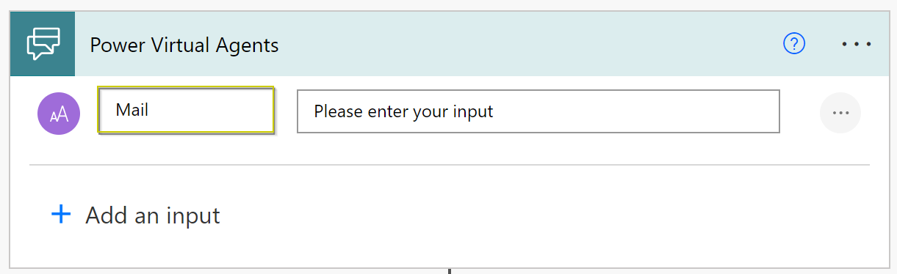

2. Then, the CodeLength and VerificationCode variables are initialized.

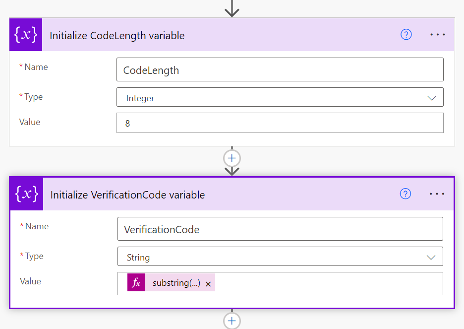

3. After that, the email is composed to be sent to the email account informed by the user, the subject is set as "PVA verification code" and finally the body is formed by the text "Verification code:" and followed by the value of the VerificationCode variable.

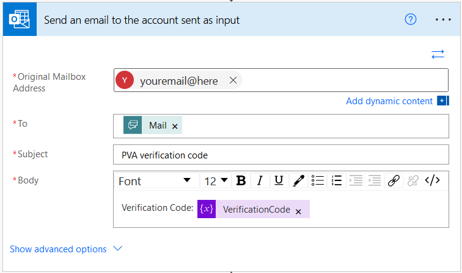

4. Finally, the value of the VerificationCode variable is returned to the bot to be used in a prior step.

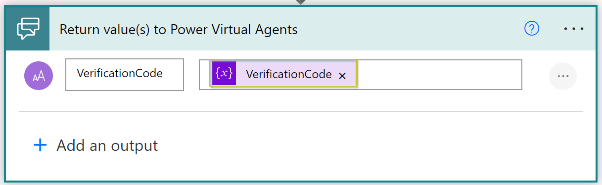
