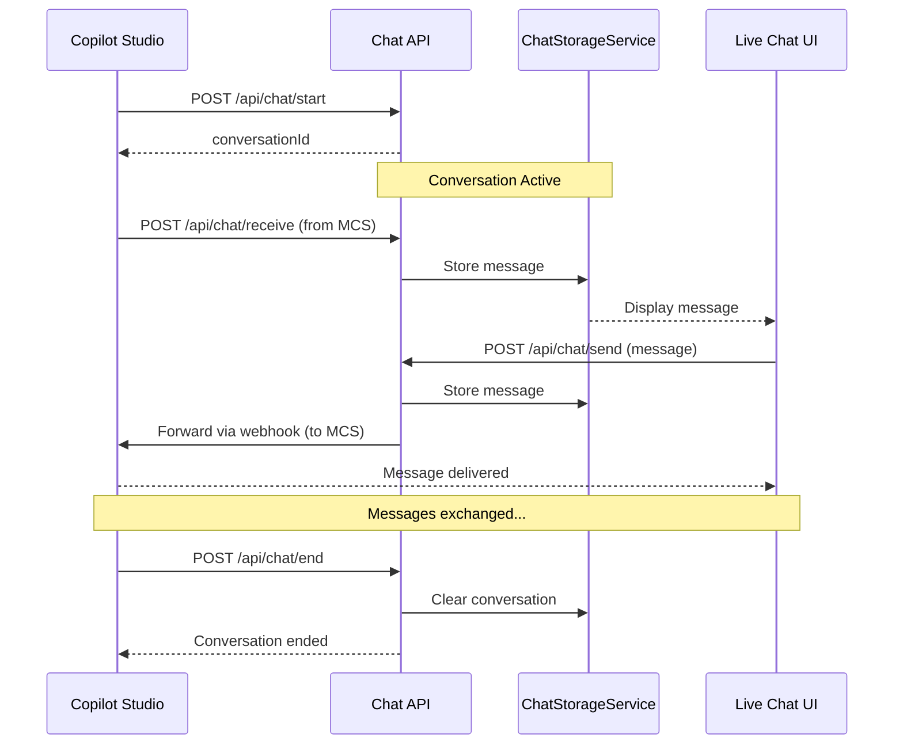

# Contoso Live Chat App

A simple live chat application designed as mock live agent handover scenarios with Copilot Studio. This application simulates a live chat support system that can receive conversations from Copilot Studio and send messages back.

## Project Structure

```
ContosoLiveChatApp/
├── Controllers/
│   └── ChatController.cs          # API endpoints for chat operations (used by Copilot Studio agent)
├── Models/
│   └── ChatMessage.cs             # Chat message data model
├── Services/
│   ├── ChatStorageService.cs      # Conversation-based message storage
│   └── WebhookService.cs          # Outgoing webhook sender (send messages to Copilot Studio agent)
├── wwwroot/
│   └── index.html                 # Chat UI with conversation management
├── Program.cs                     # Application entry point
├── appsettings.json              # Configuration (webhook URL)
```

## Configuration

Configure the webhook URL in `appsettings.json`:

```json
{
  "WebhookSettings": {
    "OutgoingWebhookUrl": "http://localhost:5001/api/livechat/messages"
  }
}
```
This endpoint points to the Copilot Studio agent skill URL. The default configuration assumes the HandoverToLiveAgentSample is running on port 5001.

## Running the Application

1. Navigate to the project directory:
```powershell
cd CopilotStudioSamples\HandoverToLiveAgent\ContosoLiveChatApp
```

2. Restore dependencies and run:
```powershell
dotnet run
```

3. Open your browser and navigate to:
```
http://localhost:5000
```

## API Endpoints

| Method | Endpoint | Description |
|--------|----------|-------------|
| `POST` | `/api/chat/start` | Start a new conversation, returns `conversationId` |
| `GET` | `/api/chat/messages?conversationId={id}` | Get messages for a conversation |
| `POST` | `/api/chat/send` | Send message to Copilot Studio via webhook |
| `POST` | `/api/chat/receive` | Receive message from Copilot Studio |
| `POST` | `/api/chat/end` | End conversation and clear from memory |

## Architecture

### API Flow


