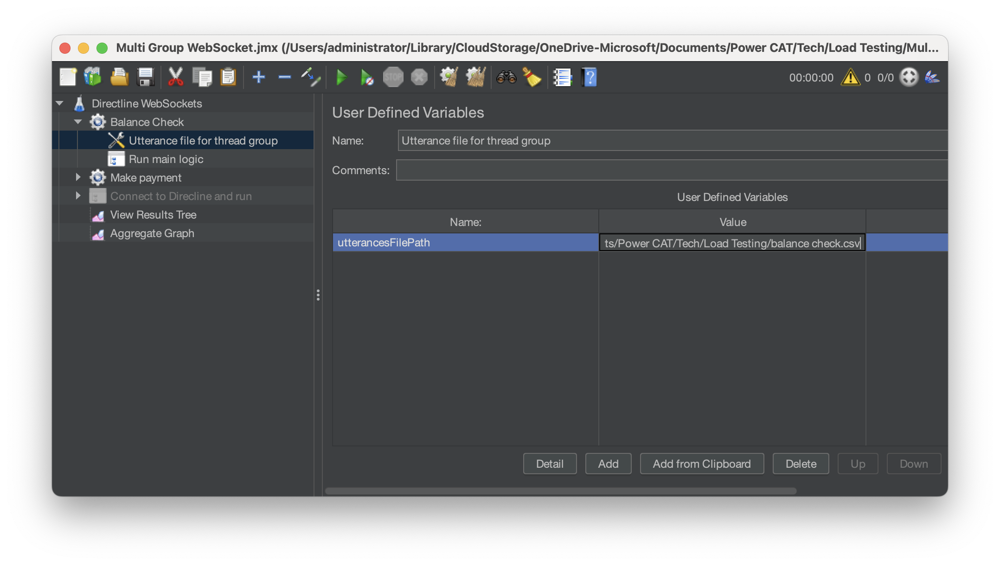
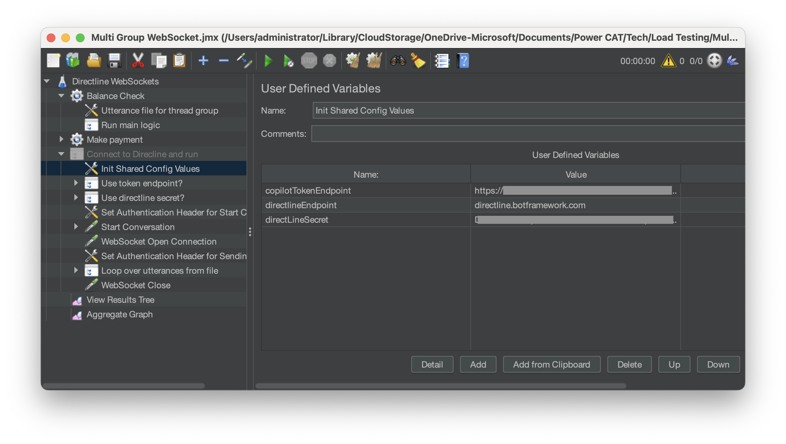
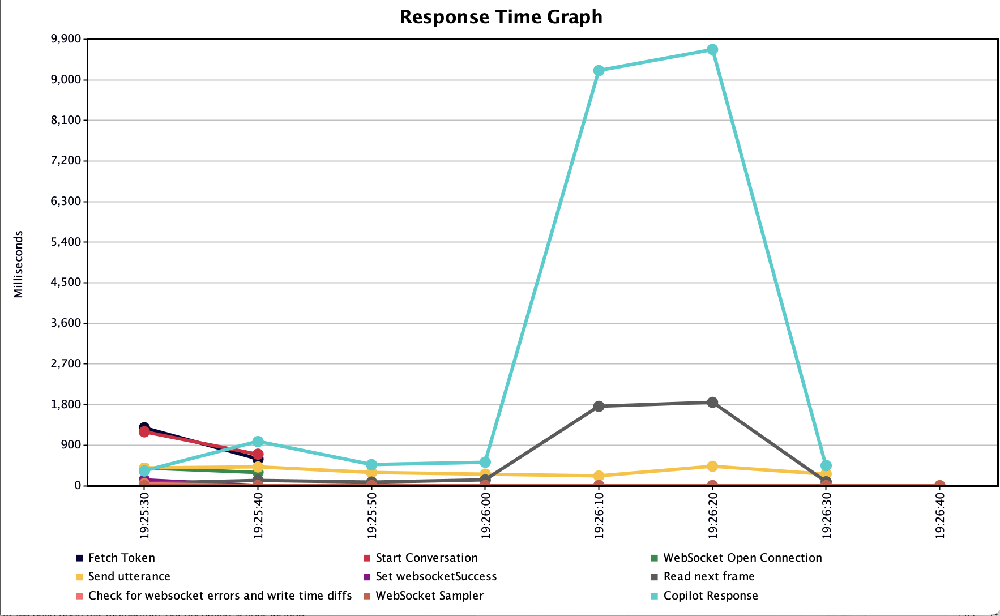
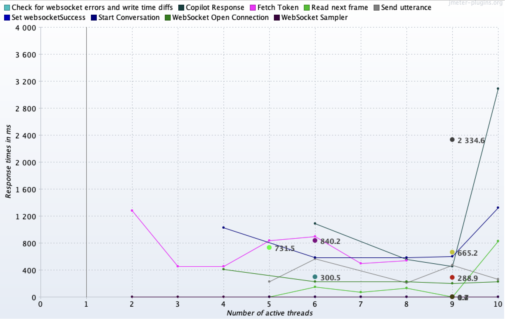
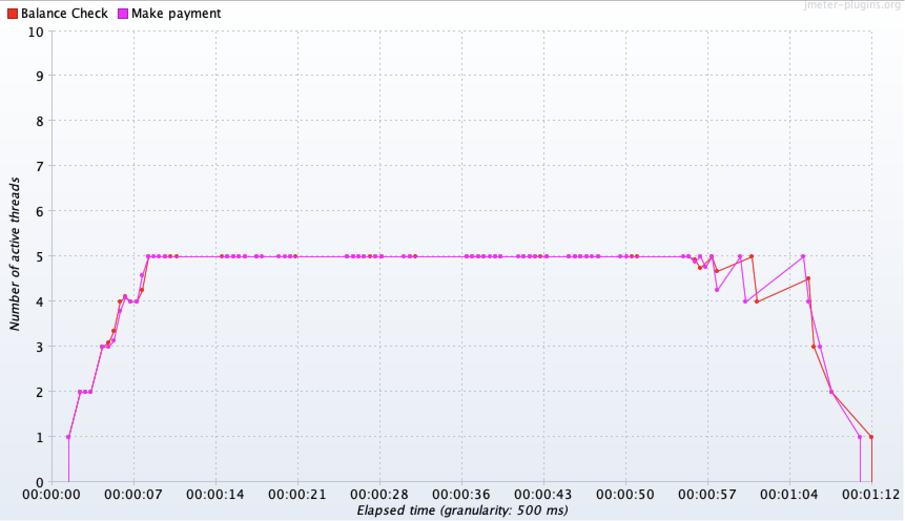

# Copilot Studio load testing with JMeter - Multi Thread Groups with WebSocket support

## Overview
This JMeter test plan was built as a starting point for load testing scripts for conversational agents built with Copilot Studio. 

The test plan demonstrates the following design principles:

- Connecting to a conversational agent using a token endpoint, or a Directline secret
- Driving multi-turn conversations
- Connecting to Directline via WebSockets, which is the pattern used by [WebChat](https://github.com/microsoft/BotFramework-WebChat), the "standard" Web channel for conversational agents built with Copilot Studio.
- Running multiple thread groups, each driving a separate conversational flow (for example, "Check Account Balance" vs. "Make Payment")

> **Note:** end user authentication is currently not implemented by this sample. 

## Prerequisites

- A published conversational agent created with Copilot Studio

- A working deployment of [Apache JMeter](https://jmeter.apache.org/download_jmeter.cgi), with the following plugins installed:

  - [WebSocket Samplers by Peter Doornbosch](https://bitbucket.org/pjtr/jmeter-websocket-samplers/overview)
  - Optional: [3 Basic Graphs](https://jmeter-plugins.org/wiki/ResponseTimesOverTime)
  - Optional: [KPI vs KPI Graphs](https://jmeter-plugins.org/wiki/ResponseTimesVsThreads/)

> **Note:** plugins can be either installed manually, or using the JMeter [plugins manager](https://jmeter-plugins.org/install/Install/). The preferred way is using the plugins manager.

## Preparing to run the test plan

To set up the test plan and prepare it for a first run, follow the steps outlined below

 - Obtain your conversational agent's [token endpoint](https://learn.microsoft.com/en-us/microsoft-copilot-studio/publication-connect-bot-to-custom-application#connect-your-copilot-to-a-web-based-app), or its [Directline endpoint base URI](https://learn.microsoft.com/en-us/azure/bot-service/rest-api/bot-framework-rest-direct-line-3-0-api-reference?view=azure-bot-service-4.0#base-uri) and [secret](https://learn.microsoft.com/en-us/microsoft-copilot-studio/configure-web-security#enable-or-disable-web-channel-security)
 
 - Create an utterances csv file for each conversational flow that your test plan will drive. For example, if your test plan will simulate the conversational flows '[Check Account Balance](./check_account_balance_utterances.csv)' and '[Make Payment](./make_payment_utterances.csv)', create two csv files with a list of utterances for each flow. Each utterance file represents a complete conversation, while each row in the utterances file will be sent as a user utterance to your conversational agent. The following utterance is sent when the conversational agent is no longer sending responses. 

 - [Run JMeter in GUI mode](https://jmeter.apache.org/usermanual/get-started.html#running), and make sure a Thread Group exists for each conversational flow your test plan will drive. You can override the two Thread Groups included in this sample, remove them, or duplicate the existing Thread Groups if more than two are necessary. 

 - Each Thread group should be configured to generate load that would simulate real user behavior corresponding with a specific use case. For example, for the "check account balance" use case, assume around 100 users typically connect during midday. These users gradually log in over a short period. To generate load that would simulate this behavior, set the following properties:
  
    - Set the **number of threads (users)** in the Thread Group to 100, to simulate the number of concurrent users checking their balance.

    - Use a 120-second **ramp-up period** to gradually start all threads, simulating users arriving over time (one thread every 1.2 seconds). Using a ramp-up period is important because it simulates the gradual arrival of users in real life, rather than having all 100 users attempt to check their balance simultaneously. This helps avoid overwhelming the server with a sudden spike in requests, providing a more realistic load test that reflects actual user behavior during midday traffic.

    - Set the **loop count** parameter as appropriate. Set it to 1 for a single balance check per user, or adjust for multiple checks if needed.

    - See [here](https://www.blazemeter.com/blog/jmeter-thread-group) for a comprehensive guide on how to configure Thread Groups in JMeter.

 - Additionally, link each Thread Group to an utterances.csv files, as shown in the image below. 
  
  

- Navigate to "Connect to Directline and run" -> "Init Share Config values", and set values for **either** your copilot's [token endpoint](https://learn.microsoft.com/en-us/microsoft-copilot-studio/publication-connect-bot-to-custom-application#connect-your-copilot-to-a-web-based-app), **or** its [Directline base URI](https://learn.microsoft.com/en-us/azure/bot-service/rest-api/bot-framework-rest-direct-line-3-0-api-reference?view=azure-bot-service-4.0#base-uri) **and** [secret](https://learn.microsoft.com/en-us/microsoft-copilot-studio/configure-web-security#enable-or-disable-web-channel-security). 
                              
 

  - Once the Thread Groups are configured, and either the token endpoint or Directline base URI and secret are provided, save the test plan.

## Running the test plan and analyzing results using the JMeter GUI

- Run the test plan by clicking on the "start" button in the JMeter GUI.
- Once the test is complete, review the response times for the following samplers

  | Sampler Label      | Explanation                                                                                    |
  | ------------------ | ---------------------------------------------------------------------------------------------- |
  | Fetch Token        | Measures the time taken to obtain a token from the token endpoint.                             |
  | Start Conversation | Measures the time taken to establish a new conversation                                        |
  | Send Utterance     | Measures the time taken to send a user utterance.                                              |
  | Copilot Response   | Measures the time taken for a for the conversational agent to respond to the user's utterance. |

- Results can be visualized using any JMeter listener, however the sample includes the following listeners for demonstration purposes:
  
  - Response Time Graph (built-in)
  

  - Response Times vs Threads (KPI vs KPI Graphs plugin) 
  
  
  - Active Threads over Time (3 Basic Graphs plugin)
  

  ## Running the test plan and analyzing results using the JMeter CLI

  - Running the test plan

  ```bash
  jmeter -n -t Multi\ Group\ WebSocket.jmx -l result-file.jtl
  ```

  - Generating JMeter reports

  ```bash
  jmeter -g result-file.jtl -o ./report-folder
  ```

 


