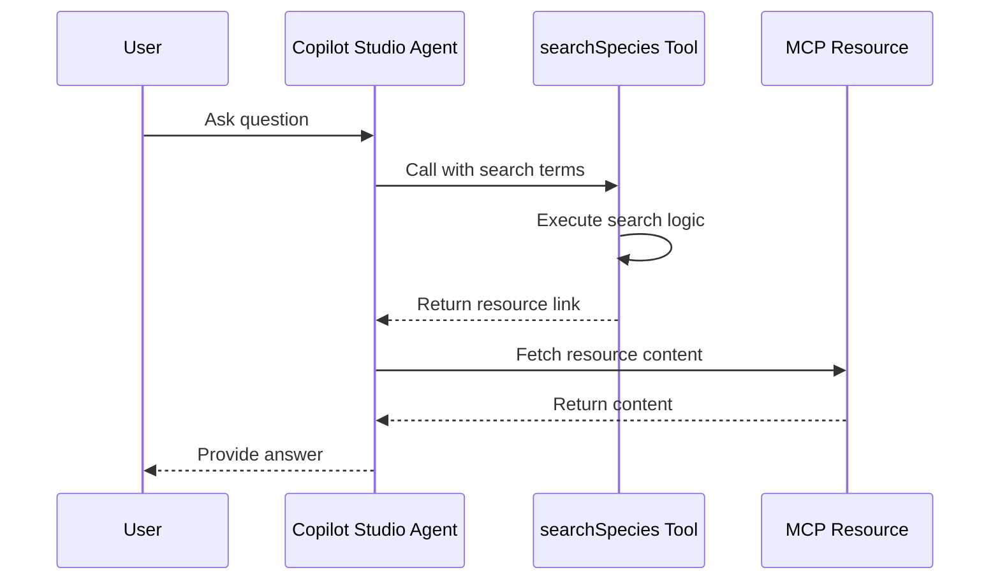

# Biological Species MCP Server

A Model Context Protocol (MCP) server demonstrating enterprise-ready resource access patterns for Microsoft Copilot Studio.

## Key Concept: Tool-Mediated Resource Access

**Important**: Copilot Studio's orchestrator does **not directly call MCP resources**. Resources must be returned through tool calls.

### Why This Pattern?

In enterprise scenarios, MCP servers often expose large numbers of resources. Rather than forcing the orchestrator to enumerate and filter through all of them, we use tools to mediate access and return the right resource based on context. Search is one way to do this, but tools can use any logic—filtering by category, user permissions, recency, or business rules—to determine which resource to return.

### How It Works



**Example Code:**

First, we register resources dynamically:
```typescript
// Register each species as a resource
SPECIES_RESOURCES.forEach((species) => {
  server.registerResource(
    species.id,
    `species:///${species.id}`,
    {
      title: `${species.commonName} (${species.scientificName})`,
      description: species.description,
      mimeType: 'text/plain'
    },
    async (uri) => ({
      contents: [{
        uri: uri.href,
        text: formatSpeciesText(species)
      }]
    })
  );
});
```

Then, our search tool returns [resource links](https://modelcontextprotocol.io/specification/2025-06-18/server/tools#resource-links) to guide the agent:
```typescript
server.tool("searchSpecies", ..., async ({ searchTerms }) => {
  const results = fuse.search(searchTerms);
  const species = results[0].item;
  
  // Return resource link
  return {
    content: [{
      type: "resource",
      resource: {
        uri: `species:///${species.id}`,
        mimeType: "text/plain",
        text: formatSpeciesText(species)
      }
    }]
  };
});
```

## Quick Start

### 1. Install & Build
```bash
npm install
npm run build
npm start
```

### 2. Create Dev Tunnel (Anonymous)

**VS Code (Recommended):**
1. Open Ports panel (View → Terminal → Ports)
2. Forward port 3000
3. Set visibility to **Public**
4. Copy the HTTPS URL

**Or via CLI:**
```bash
devtunnel host -p 3000 --allow-anonymous
```

### 3. Configure Copilot Studio

1. Go to [Copilot Studio](https://copilotstudio.microsoft.com)
2. Open your agent
3. Navigate to **Tools** → **+ Add a tool**
4. Select **New tool** → **Model Context Protocol**
5. In the MCP onboarding wizard, enter:
   - **Server name:** `Biological Species MCP`
   - **Server description:**
     ```
     MCP server providing search capabilities for biological species information 
     including habitat, diet, conservation status, and interesting facts. 
     Supports fuzzy keyword search.
     ```
   - **Server URL:** `https://your-tunnel-url-3000.devtunnels.ms/mcp`
     
   > [!IMPORTANT]
   > **⚠️ Double-check your tunnel URL format!**
   > 
   > ✅ **CORRECT:** `https://abc123-3000.devtunnels.ms/mcp`  
   > ❌ **WRONG:** `https://abc123.devtunnels.ms:3000/mcp`
   > 
   > If you use the wrong format, the connection will fail. The port must be embedded in the hostname with a hyphen.

6. **Authentication type:** Select **None**
7. Click **Create**


## Example Usage

**User:** "Tell me about endangered species in Africa"  
→ Calls `searchSpecies` with "endangered africa"  
→ Returns African Elephant resource  
→ Copilot provides rich answer

**User:** 
```
search for info on pandas
```

The agent calls `searchSpecies("pandas")` → Returns Red Panda resource → Agent responds:

```
Red Panda (Ailurus fulgens)
The red panda is a small arboreal mammal native to the eastern Himalayas...
Conservation Status: Endangered
```

**User:** 
```
what about sharks?
```

The agent calls `searchSpecies("sharks")` → Returns Great White Shark resource → Agent responds:

```
Great White Shark (Carcharodon carcharias)
The world's largest predatory fish. These apex predators can grow up to 6 meters...
Conservation Status: Vulnerable
```


## License

MIT
