# Translation Bot sample

## Overview
The main idea of this sample is to show the user how a PVA Bot can be connected using DirecLine API and using all its topics in different languages, by using a middleware (Azure Bot) to translate the messages between the user and the PVA Bot. The middleware will be using Cognitive services to translate the texts during the entire conversation.

## Prerequisites

- An Azure subscription
- A Translator service deployed on Azure
- A custom dictionary already published (optional)

Follow this [link](https://docs.microsoft.com/en-us/azure/cognitive-services/translator/translator-how-to-signup) to have more information on how to create the Translator service.

## Bot resources list
These are the Bot resources needed by the sample:
- An Azure Bot (middleware)
- A PVA Bot

## Features
The sample supports the following features:
- Basic text translation
- Adaptive cards and Flows translations
- Custom dictionaries
- To add Omnichannel integration please check the additional readme file.

## Architecture diagram
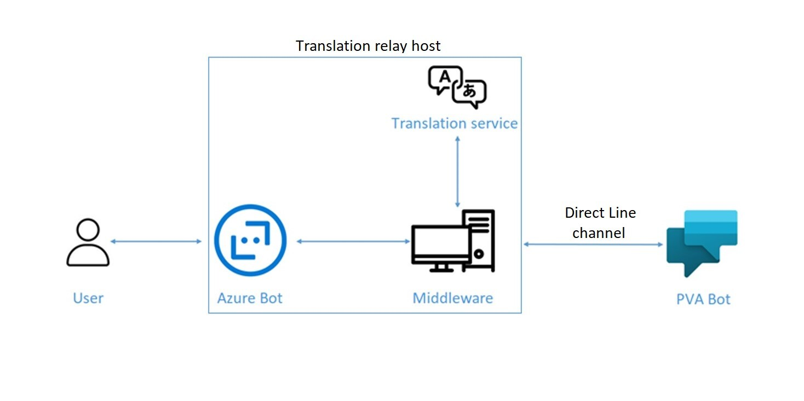

## How the bot works
1.	The user sends a message to the PVA bot
2.	The middleware (Azure Bot) intercepts the message and translates it (if needed) to the PVA Bot's language before sending it
4.	The PVA bot will receive the message and trigger a topic based on the user's message
3.	The PVA bot response is sent back to the user
4.	The middleware intercepts and translates the message back (if needed) based on the user's language
7.	The user gets the message

## Create a Translator resource
### Create your resource
Azure Translator is a cloud-based machine translation service that is part of the Azure Cognitive Services family of REST APIs. Azure resources are instances of services that you create on the [Azure portal](https://portal.azure.com/#create/Microsoft.CognitiveServicesTextTranslation).

### Complete your project and instance details
1. Subscription: Select one of your available Azure subscriptions.

2. Resource Group: You can create a new resource group or add your resource to a pre-existing resource group that shares the same lifecycle, permissions, and policies.

3. Resource Region: Choose Global unless your business or application requires a specific region. If you're planning on using the Document Translation feature with managed identity authentication, choose a non-global region.

4. Name: Enter the name you have chosen for your resource. The name you choose must be unique within Azure.

5. Pricing tier: Select a pricing tier that meets your needs:

    - Each subscription has a free tier.
    - The free tier has the same features and functionality as the paid plans and doesn't expire.
    - Only one free tier is available per subscription.
    - Document Translation isn't supported in the free tier. Select Standard S1 to try that feature.

6. If you've created a multi-service resource, you'll need to confirm additional usage details via the checkboxes.

7. Select Review + Create.

8. Review the service terms and select Create to deploy the resource.

9. After your resource has successfully deployed, select Go to the resource.

### Authentication keys and endpoint URL
All Cognitive Services API requests require an endpoint URL and a read-only key for authentication

- Authentication keys. Your key is a unique string that is passed on every request to the Translation service. You can pass your key through a query-string parameter or by specifying it in the HTTP request header.

- Endpoint URL. Use the Global endpoint in your API request unless you need a specific Azure region or custom endpoint. See Base URLs. The Global endpoint URL is api.cognitive.microsofttranslator.com.

### Get your authentication keys and endpoint
1. After your new resource deploys, select Go to resource or navigate directly to your resource page.
2. In the left rail, under Resource Management, select Keys and Endpoint.
3. Copy and paste your key and region in a convenient location, such as Microsoft Notepad.


## Create an App registration

An App registration is needed to deploy an Azure Bot. The following sections will give more details on this task.

### Permissions required for registering an App

The user needs to have sufficient permissions to register an App in the Azure AD tenant. Check this [link](https://docs.microsoft.com/en-us/azure/active-directory/develop/howto-create-service-principal-portal#permissions-required-for-registering-an-app) for more information about it.

### Steps to create an App registration

1. Sign in to the [Azure Portal](https://portal.azure.com/).
2. If you have access to multiple tenants, use the Directories + subscriptions filter in the top menu to switch to the tenant in which you want to register the application.
3. Search for and select Azure Active Directory.
4. Under Manage, select App registrations > New registration.
5. Enter a display name for the application. Users of this application might see the display name when they use the app. The app registration's automatically generated Application (client) ID, not its display name, uniquely identifies the app within the identity platform.
6. Specify the account type, by selecting the option "Accounts in any organizational directory and personal Microsoft accounts".
7. Don't enter anything for Redirect URI (optional).
8. Select Register to complete the initial app registration.
9. From the overview page, copy the Application (client) Id and the Tenant id values as they will be used in further steps.

### Add a credential to the App registration

Credentials allow an application to authenticate as a user, requiring no interaction from a user at runtime.

1. In the Azure portal, in App registrations, select the application created earlier.
2. Select Certificates & secrets > Client secrets > New client secret.
3. Add a secret description.
4. Select an expiration for the secret or specify a custom lifetime.
5. Select Add.
6. Record the secret's value. This secret value is never displayed again after you leave this page.

## Bot deployment

The bot can be deployed using these two methods:
- Using ARM templates
- using an Azure Pipeline

### Deploy the bot using ARM templates

Follow these steps to deploy the bot using the Azure CLI. This approach assumes that the resource group already exists.

1. Download the Azure CLI (if needed) from this [link](https://learn.microsoft.com/en-us/cli/azure/install-azure-cli-windows?tabs=azure-cli).

2. Download the Zip file containing the Bot source code from this repo.

3. Open the appsettings.json file located in the Bot folder. The file should look like this image.

    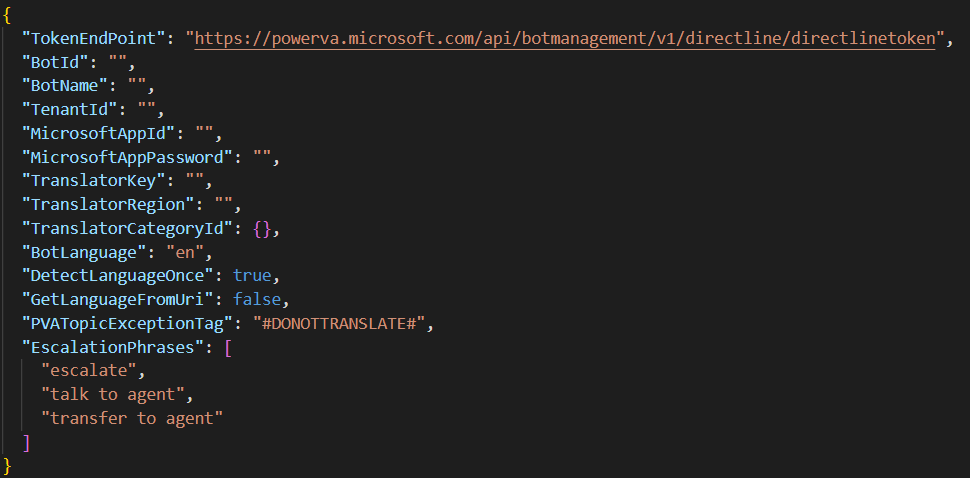

    Update the following settings, ommiting the optional ones:

    - TokenEndpoint: https://powerva.microsoft.com/api/botmanagement/v1/directline/directlinetoken
    - BotId: The id of the PVA bot.
        ```
        NOTE: To obtain the bot id go to Settings -> Channels -> Mobile App and copy the token endpoint where you will find the bot id
        ```

        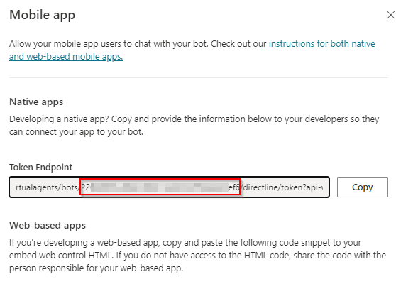

    - BotName: The name of the PVA bot.
    - TenantId: Bot Tenant id. This can be obtained from the details page on PVA under the manage option.    

        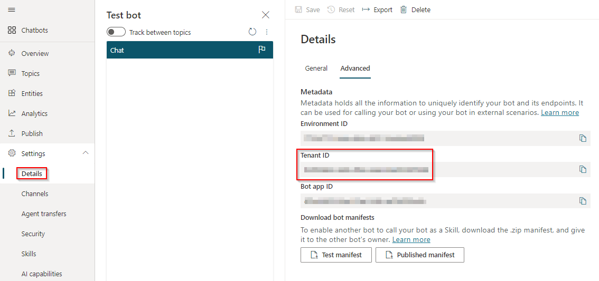

    - TranslatorKey: The value in the Azure secret key for the Translator resource.
    - TranslatorRegion: The region of the multi-service or regional translator resource.
    - TranslatorCategoryId: The category id for the translator service's custom dictionary (optional).
        For example:
        ```
        "TranslatorCategoryId": {
            "en": {
                "dictionary": "category-id"
            }
        }
        ```
    - BotLanguage: your PVA bot's language (e.g: en).
    - DetectLanguageOnce: true/false value to enable language detection on the first message or every message received from the user.
    - GetLanguageFromUri: true/false value to get the language to be used in the conversation. It will be received through the connection endpoint (optional).
        For example:
        ```
        http://localhost:3979/api/messages/es
        ```
    - PVATopicExceptionTag: Tag to be used as an exception to avoid the translation of user's responses (optional).
    - EscalationPhrases: Phrases that will be used to identify and handle the hand-off process to a human agent in Omnichannel (optional).
    - MicrosoftAppId: App id obtained from the App registration Overview page.

        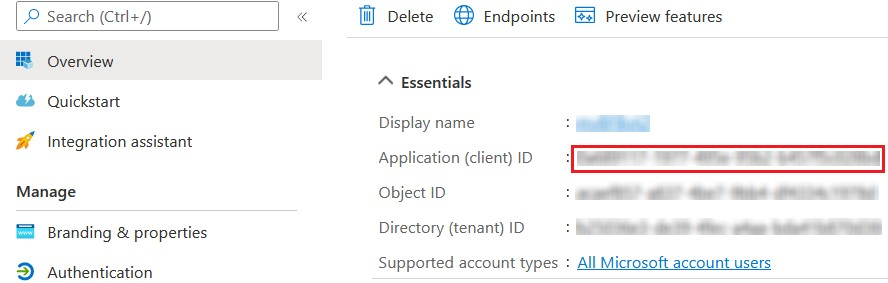

    - MicrosoftAppPassword: Secret configured for the App registration.

        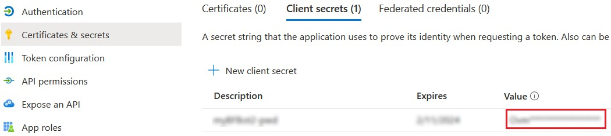

3. Open the CMD or Powershell console and login to Azure using the following command:
    ```
    az login
    ```

4. Update the parameters-for-template-BotApp-with-rg.json file with the proper information, this file can be found in the Bot root folder under the DeploymentTemplates\DeployUseExistResourceGroup directory.
    The file should look like this image.

    

    Update the following settings, ommiting the optional ones:

    - appServiceName: The globally unique name of the Web App.
    - existingAppServicePlanName (optional): The name of an existing appService if you have one, otherwise leave it empty.
    - existingAppServicePlanLocation (optional): The location of an existing appService if you have one, otherwise leave it empty.
    - newAppServicePlanName: The name of the new App Service Plan.
    - newAppServicePlanLocation: The location of the App Service Plan.
    - newAppServicePlanSku: The SKU of the App Service Plan. Defaults to Standard values.
    - appType: Type of Bot Authentication. set as MicrosoftAppType in the Web App's Application Settings. Allowed values are MultiTenant, SingleTenant, UserAssignedMSI. Defaults to MultiTenant.
    - appId: App id obtained from the App registration Overview page.
    - appSecret: Secret configured for the App registration.
    - UMSIName (optional): For user-assigned managed identity app types, the name of the identity resource. Leave it empty.
    - UMSIResourceGroupName (optional): For user-assigned managed identity app types, the resource group for the identity resource. Leave it empty.
    - tenantId: Tenant id obtained from the App registration Overview page.

5. Deploy the BotApp using the following command. These parameters need to be specified:
    - resource-group: The name of the resource group used to deploy the resources.
    - template-file: The path of the template-BotApp-with-rg.json file. This file can be found in the Bot root folder under the DeploymentTemplates\DeployUseExistResourceGroup directory.
    - parameters: The path of the parameters-for-template-BotApp-with-rg.json file This file can be found in the Bot root folder under the DeploymentTemplates\DeployUseExistResourceGroup directory.
    ```
    az deployment group create --resource-group "resource-group-name" --template-file template-BotApp-with-rg.json --parameters "parameters-for-template-BotApp-with-rg.json"
    ```
    
    Once executed a message like the following will be received:

    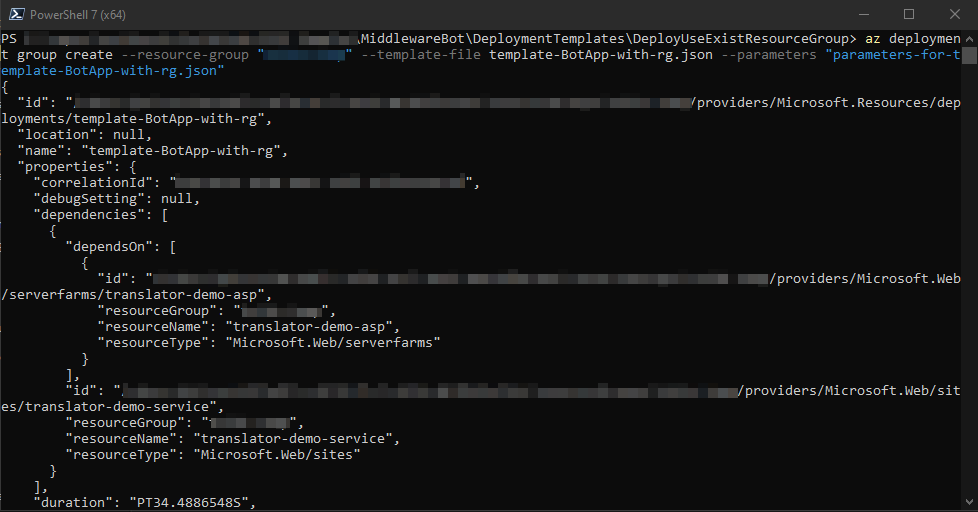

6. Update the parameters-for-template-AzureBot-with-rg.json file with the proper information, this file can be found in the Bot root folder under the DeploymentTemplates\DeployUseExistResourceGroup directory.
    The file should look like this image.

    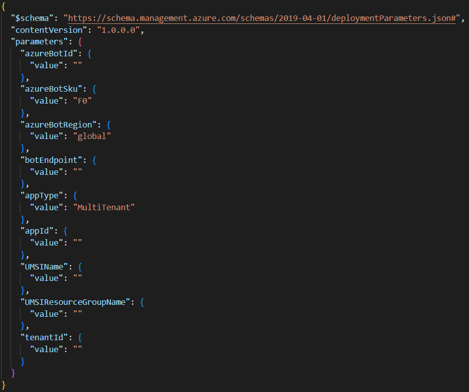

    Update the following settings, ommiting the optional ones:

    - azureBotId: The globally unique and immutable bot ID.
    - azureBotSku: The pricing tier of the Bot Service Registration.
    - azureBotRegion: Specifies the location of the new AzureBot.
    - botEndpoint: Use to handle client messages, Such as https://[botappServiceName].azurewebsites.net/api/messages.
    - appType: Type of Bot Authentication. set as MicrosoftAppType in the Web App's Application Settings. Allowed values are MultiTenant, SingleTenant, UserAssignedMSI. Defaults to MultiTenant.
    - appId: App id obtained from the App registration Overview page.
    - UMSIName (optional): For user-assigned managed identity app types, the name of the identity resource. Leave it empty.
    - UMSIResourceGroupName (optional): For user-assigned managed identity app types, the resource group for the identity resource. Leave it empty.
    - tenantId: Tenant id obtained from the App registration Overview page.

7. Deploy the AzureBot using the following command. These parameters need to be specified:
    - resource-group: The name of the resource group used to deploy the resources.
    - template-file: The path of the template-AzureBot-with-rg.json file. This file can be found in the Bot root folder under the DeploymentTemplates\DeployUseExistResourceGroup directory.
    - parameters: The path of the parameters-for-template-AzureBot-with-rg.json file This file can be found in the Bot root folder under the DeploymentTemplates\DeployUseExistResourceGroup directory.
    ```
    az deployment group create --resource-group "resource-group-name" --template-file template-AzureBot-with-rg.json --parameters "parameters-for-template-AzureBot-with-rg.json"
    ```

    Once executed a message like the following will be received:

    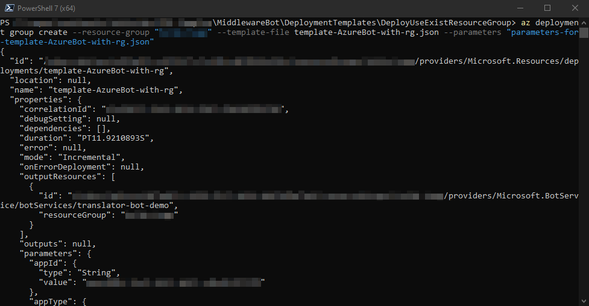

8. Execute the following command:
    ```
    az bot prepare-deploy --lang Csharp --code-dir "." --proj-file-path "<my-cs-proj>"
    ```

    Once executed a message like the following will be received:

    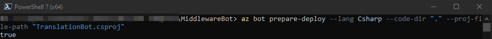

9. Create a zip file with the solution content. This zip file should contain all the folders and files included in the Bot directory.

    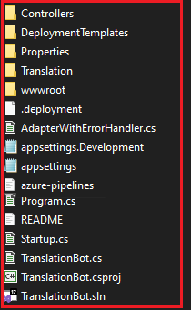

10. Execute the deployment command. These parameters need to be specified:
    - resource-group: The name of the resource group used to deploy the resources.
    - name: App service name.
    - src: Path to the zip file created in the previous step.
    ```
    az webapp deployment source config-zip --resource-group "resource-group-name" --name "app-service-name" --src "zip-file-name"
    ```

    Once executed a message like the following will be received:

    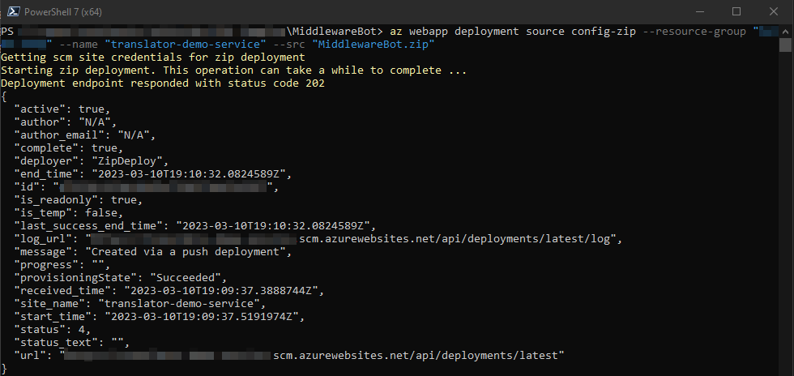

11. Now the bot and its components are deployed, so you can move on to the "How to use the bot" section.

### Deploy the bot using Azure pipeline

### Step 1: Create an Azure Resource Manager service connection

1. In Azure DevOps, open the Service connections page from the [project settings page](https://docs.microsoft.com/en-us/azure/devops/project/navigation/go-to-service-page?view=azure-devops#open-project-settings). In TFS, open the Services page from the "settings" icon in the top menu bar.

2. Choose + New service connection and select Azure Resource Manager.

    

3. Choose Service Principal (manual) option and enter the Service Principal details.

    

4. Enter a user-friendly Connection name to use when referring to this service connection.

5. Select the Environment name (such as Azure Cloud, Azure Stack, or an Azure Government Cloud).

6. If you do not select Azure Cloud, enter the Environment URL. For Azure Stack, this will be something like https://management.local.azurestack.external

7. Select the Scope level you require:

    - If you choose Subscription, select an existing Azure subscription. If you don't see any Azure subscriptions or instances, see [Troubleshoot Azure Resource Manager service connections](https://docs.microsoft.com/en-us/azure/devops/pipelines/release/azure-rm-endpoint?view=azure-devops).
    - If you choose Management Group, select an existing Azure management group. See [Create management groups](https://docs.microsoft.com/en-us/azure/azure-resource-manager/management-groups-create).

8. Enter the information about your service principal into the Azure subscription dialog textboxes:

    - Subscription ID
    - Subscription name
    - Service principal ID
    - Either the service principal client key or, if you have selected Certificate, enter the contents of both the certificate and private key sections of the *.pem file.
    - Tenant ID

    You can obtain this information if you don't have it by hand downloading and running [this PowerShell script](https://github.com/Microsoft/vsts-rm-extensions/blob/master/TaskModules/powershell/Azure/SPNCreation.ps1) in an Azure PowerShell window. When prompted, enter your subscription name, password, role (optional), and the type of cloud such as Azure Cloud (the default), Azure Stack, or an Azure Government Cloud.

9. Choose Verify connection to validate the settings you've entered.

10. After the new service connection is created:

    - If you are using it in the UI, select the connection name you assigned in the Azure subscription setting of your pipeline.
    - If you are using it in YAML, copy the connection name into your code as the azureSubscription value.

11. If required, modify the service principal to expose the appropriate permissions. For more details, see [Use Role-Based Access Control to manage access to your Azure subscription resources](https://docs.microsoft.com/en-us/azure/role-based-access-control/role-assignments-portal). [This blog post](https://devblogs.microsoft.com/devops/automating-azure-resource-group-deployment-using-a-service-principal-in-visual-studio-online-buildrelease-management/) also contains more information about using service principal authentication.

### Step 2: Create the Azure pipeline

1. Login to your [Azure dev](https://dev.azure.com/) account

2. On the left menu click on pipelines -> pipelines

    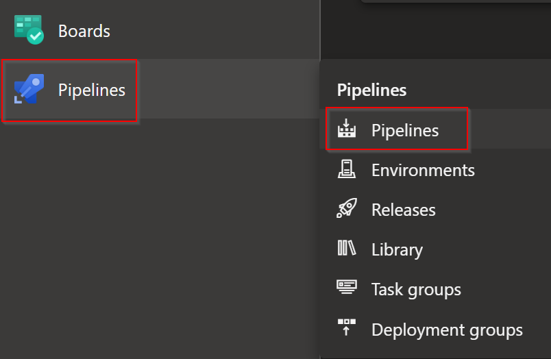

3. Select New pipeline

4. On the connect window, select the GitHub option to connect the pipeline to your repository

    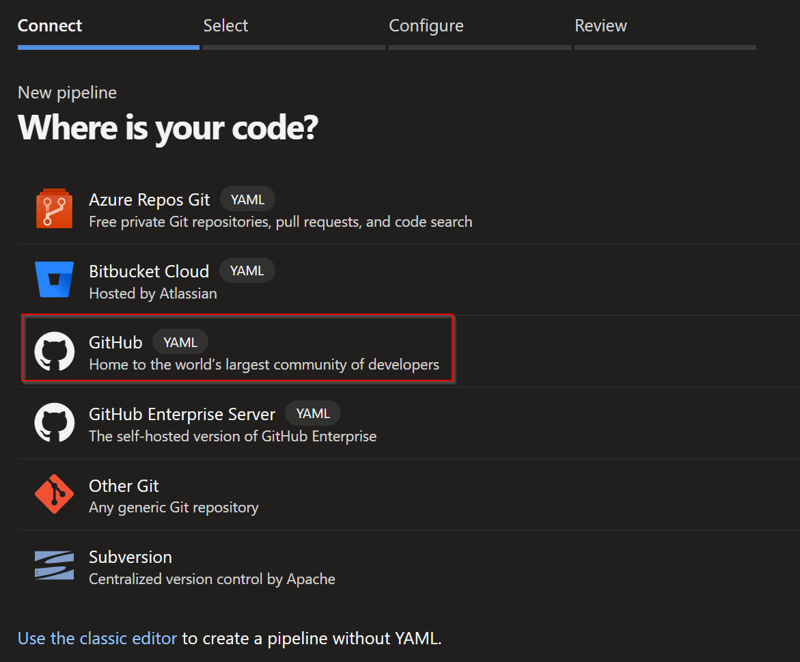

5. Select your repository

6. On the configure your pipeline window select the Existing Azure Pipelines YAML file option

    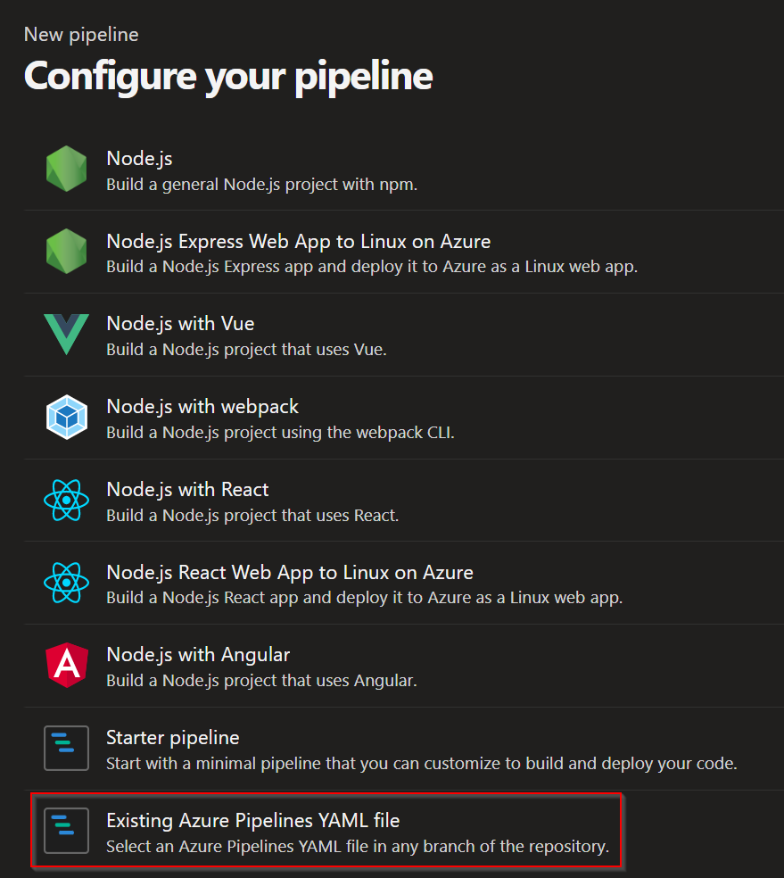

7. Select the branch and path where your YAML file is located inside your repository

    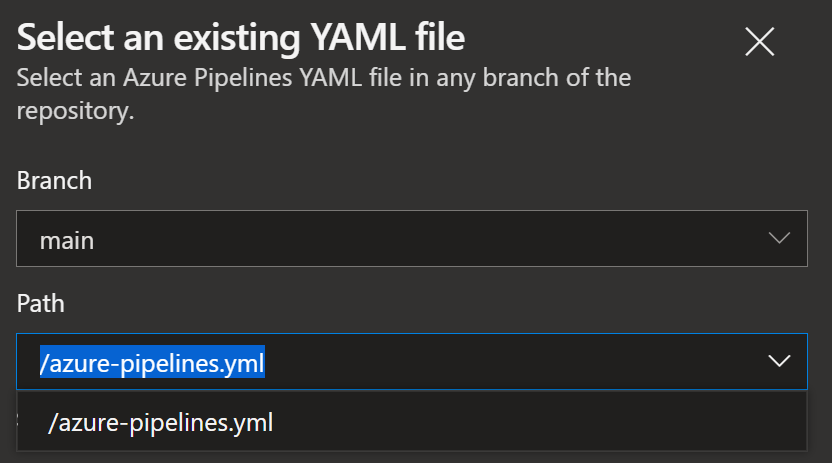

8. On the top right corner, click on Save

    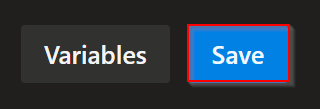


9. Complete the commit message, description, select your branch and click on save to commit the changes to your repository.

    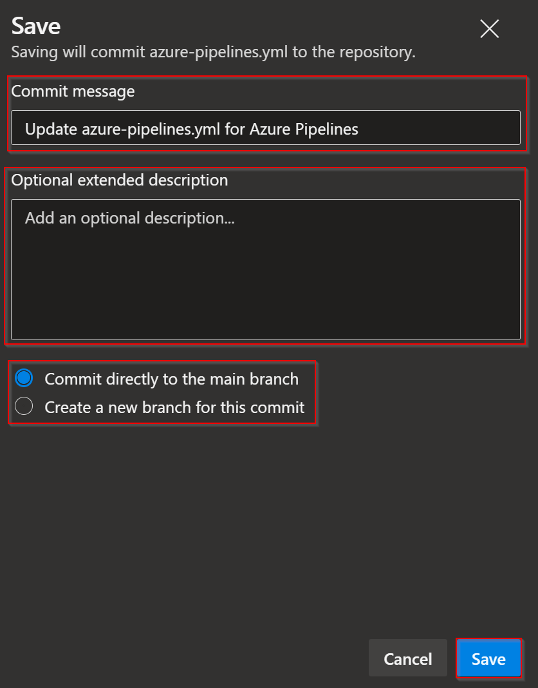

10. On the top right corner, click on variables and setup the following variables:

    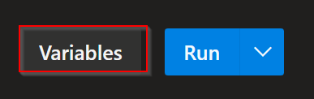

        Note: Make sure to check the "Let users override this value when running this pipeline" box on every variable
        
    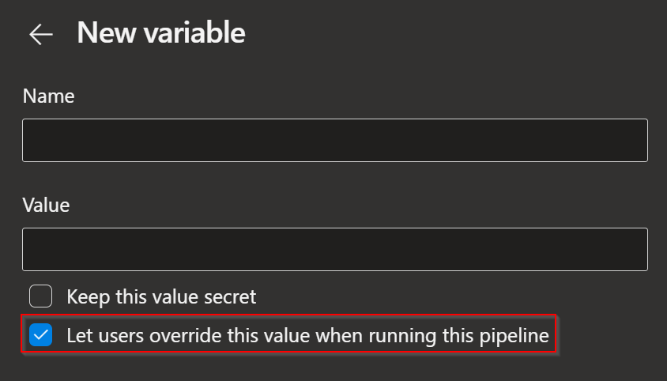
    
    - TokenEndpoint: https://powerva.microsoft.com/api/botmanagement/v1/directline/directlinetoken
    - BotId: The id of the PVA bot.
    - BotName: The name of the PVA bot.
    - TenantId: Bot Tenant id. This can be obtained from the details page on PVA under the manage option.    
    - TranslatorKey: The value in the Azure secret key for the Translator resource.
    - TranslatorRegion: The region of the multi-service or regional translator resource.
    - TranslatorCategoryId: The category id for the translator service's custom dictionary (optional).
        For example:
        ```
        "TranslatorCategoryId": {
            "en": {
                "dictionary": "category-id"
            }
        }
        ```
    - BotLanguage: your PVA bot's language (e.g: en).
    - DetectLanguageOnce: true/false value to enable language detection on the first message or every message received from the user.
    - GetLanguageFromUri: true/false value to get the language to be used in the conversation. It will be received through the connection endpoint (optional).
        For example:
        ```
        http://localhost:3979/api/messages/es
        ```
    - PVATopicExceptionTag: Tag to be used as an exception to avoid the translation of user's responses (optional).
    - EscalationPhrases: Phrases that will be used to identify and handle the hand-off process to a human agent in Omnichannel (optional).

            Note: For the last variables, make sure to also check the "Keep this value secret" box.
    
        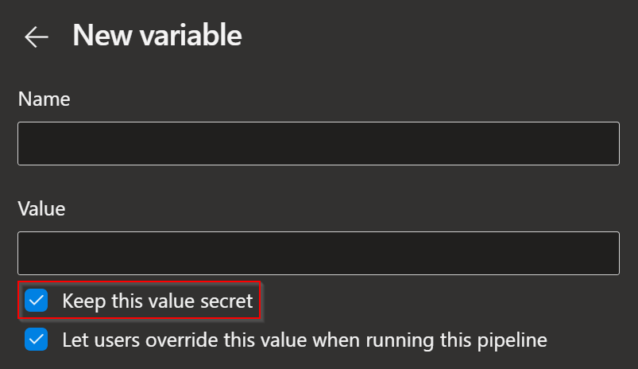

    - MicrosoftAppId: App id obtained from the App registration Overview page.
    - MicrosoftAppPassword: Secret configured for the App registration.

11. On the top right corner, click on Run

    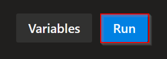

12. Select the Branch/tag and commit where the pipeline version you want to run is located

    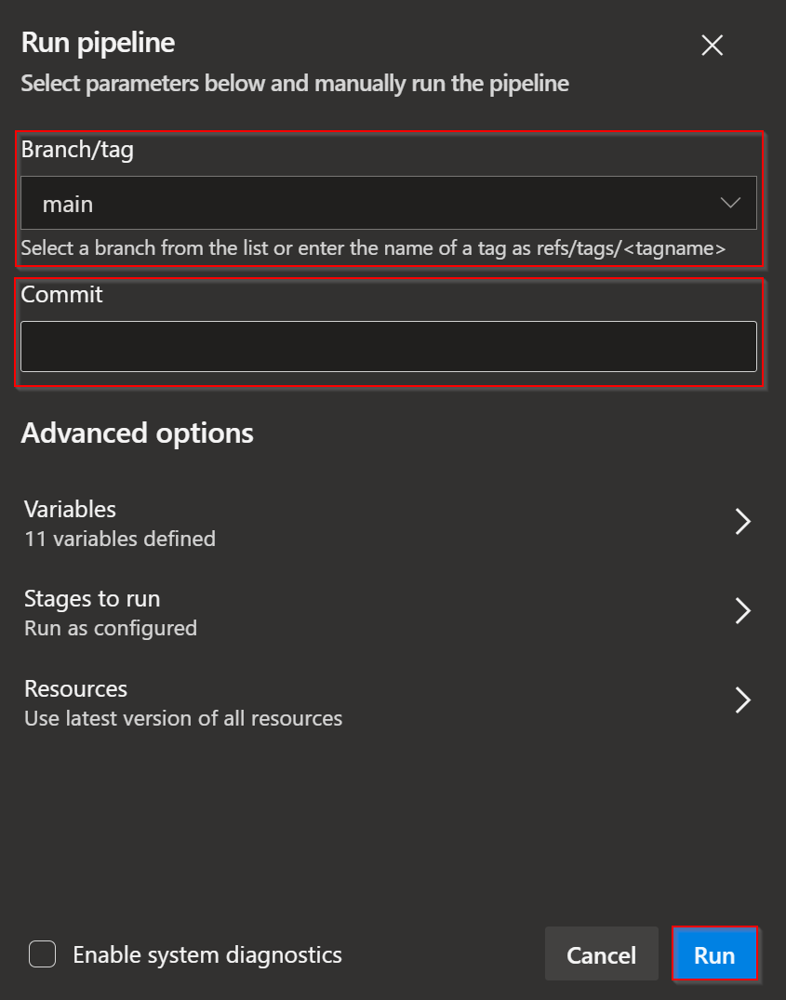

13. Now the bot and its components are deployed, so you can move on to the next section.

## How to use the bot

After the bot is deployed it can be tested using one of the following methods:

### Bot Framework Emulator
1. Install the Bot Framework Emulator in case it is not already installed from [this](https://github.com/Microsoft/BotFramework-Emulator/blob/master/README.md) link. Here is another [link](https://learn.microsoft.com/en-us/azure/bot-service/bot-service-debug-emulator?view=azure-bot-service-4.0&tabs=csharp) with additional information on how to use the Bot Framework Emulator tool.
2. Get the messaging endpoint of your bot by going to the [Azure Portal](https://portal.azure.com) and clicking on the Azure Bot resource

    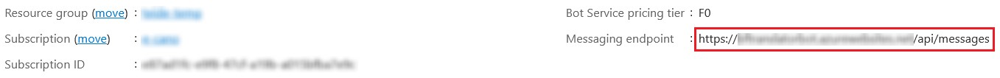

3. Connect to your bot on Bot Framework Emulator by specifying your messaging endpoint, the AppID and AppPassword you used to deploy your bot

4. Enter one of the triggering phrases in order to start the conversation with your PVA bot in the desired language

### Azure portal
1. Go to the [Azure Portal](https://portal.azure.com) and select your Azure bot
2. On the left panel, click on Test in Web Chat under settings

    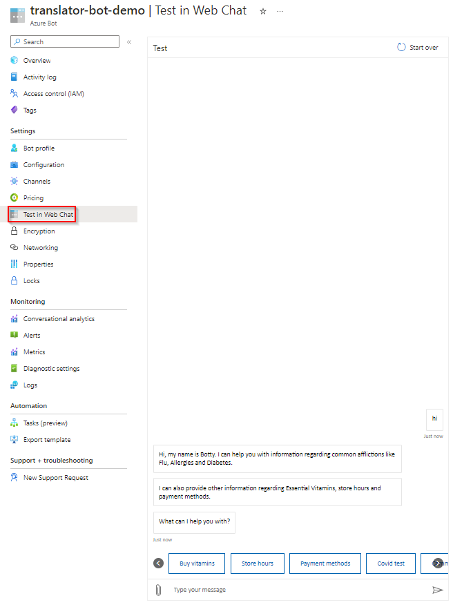

## Troubleshoot using appsettings.json
If the Bot is not working properly after the deployment, the values of the deployed appsettings can be validated from the Azure Portal instead of doing it locally and deploying again. To do this, follow these steps:

1. Go to the [Azure Portal](https://portal.azure.com) and select your Azure bot webapp.
2. On the left panel, under development tools, click on App Service Editor and then click on open editor.

    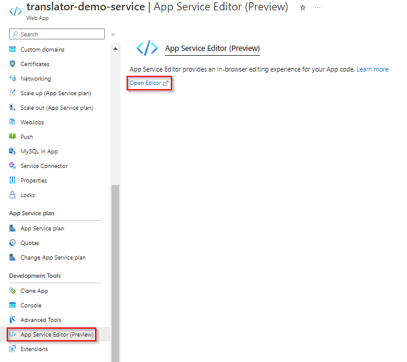

3. A new window will be opened with the appsettings and all files.

    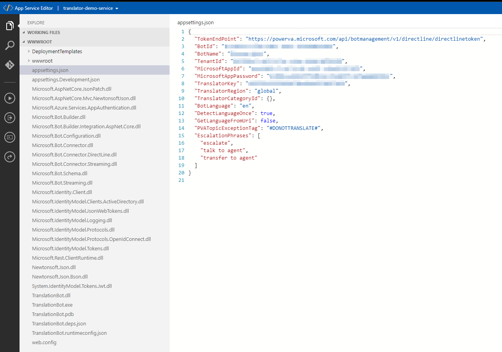

4. These settings will be saved automatically.

## Setting up exceptions in the translation Bot (optional)
Exceptions can be configured to avoid the translation of a particular user's response to a Bot question. This can be achieved using a custom PVA topic.

### Using a custom PVA topic
This scenario will enable Bot authors using PVA to set up a flag topic that will be used in other topics to indicate that the response to a particular question should not be translated. 
Steps to configure:

1. Create a new topic that will be used to flag the exception.

    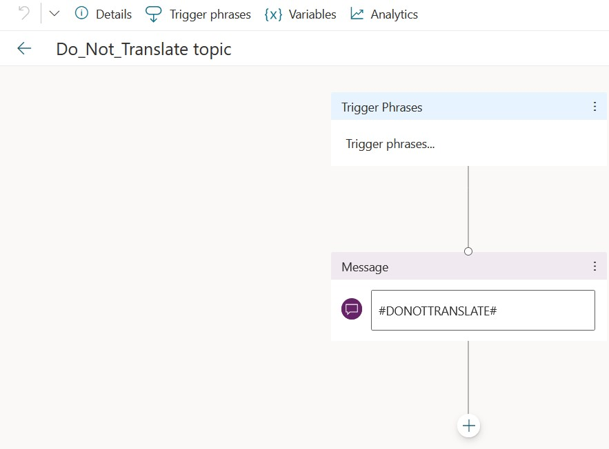

2. Edit the topic where the exception should be applied. The exception topic should be invoked before the question that will be sent to the user.

    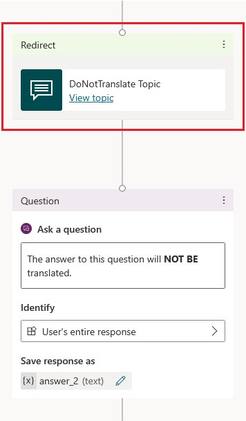

3. Edit the Bot appsettings file to configure the tag used for the topic created in step 1.

    ```
    "PVATopicExceptionTag": "#DONOTTRANSLATE#",
    ```
