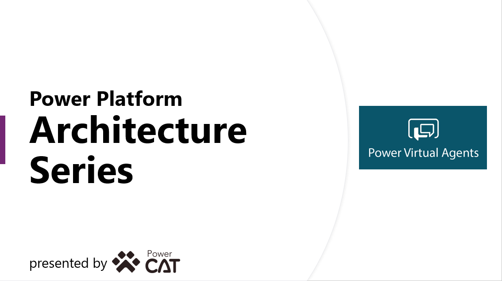

# Supporting content for the Power Virtual Agents architecture series

Supplementary materials for the Power Virtual Agents Architecture series. View the series: https://www.youtube.com/playlist?list=PLi9EhCY4z99W2QOTgbwhFZEjpqc8YZDVH

## File

- PVA_Arch_Series.pptx - this is the PowerPoint deck we use in the series - all six sessions.
- PVA_Arch_Bot_1_0_01.zip - This is a solution export that you can use to understand PVA, and as the basis for a new bot. We show this bot in the series - you can import into your environment and fllow along.

## Installation

To set up ya bot using the solution example above, you will need to have access to a Power Platform Environment (a Trial or Sandbox environment is fine). To import, please follow the documented instructions: https://docs.microsoft.com/en-us/power-virtual-agents/authoring-export-import-bots#export-and-import-bots