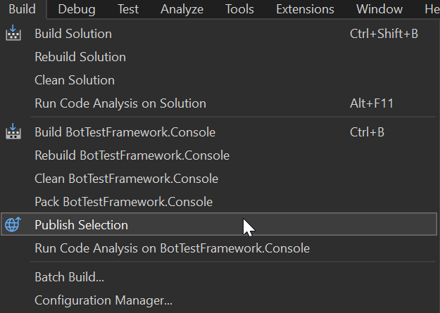
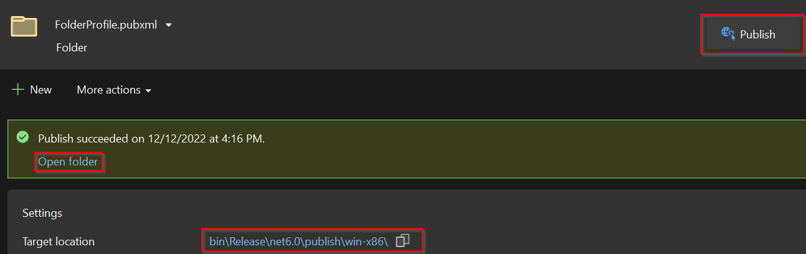
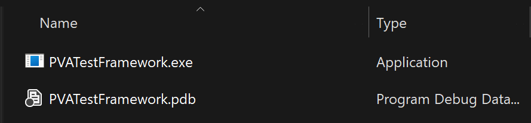
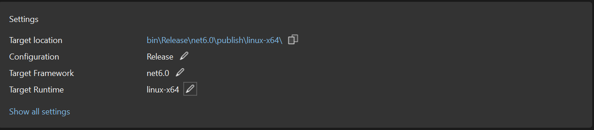
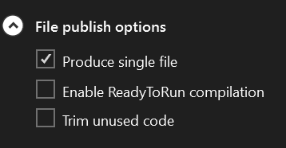
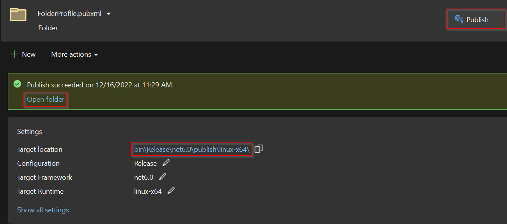
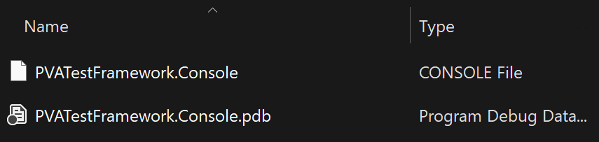

# How to publish the solution on Windows
To use the tool inside a pipeline, a single .exe file must be generated with the solution.
This guide will show you the steps for doing this:

1.  from Visual Studio with the solution opened go to Build -> Publish Selection.

2. a new tab will open where you can select the target location, framework and runtime.

3. from there click on "Show all settings", and in the "File publish options" click on the "Produce single file" checkbox.

4. after that, click on "Save" and then "Publish"

5. you can open the Target location by clicking on either the "Open folder" link or the path.

6. now you have the solution on a single .exe file.

# How to publish the solution on Linux
To use the tool inside a pipeline, a single file must be generated with the solution.
This guide will show you the steps for doing this:

1.  from Visual Studio with the solution opened go to Build -> Publish Selection.

2. a new tab will open where you can select the target location, framework and runtime. Here you MUST select linux as Target Runtime.

3. from there click on "Show all settings", and in the "File publish options" click on the "Produce single file" checkbox.

4. after that, click on "Save" and then "Publish"

5. you can open the Target location by clicking on either the "Open folder" link or the path.

6. now you have the solution on a single file.

