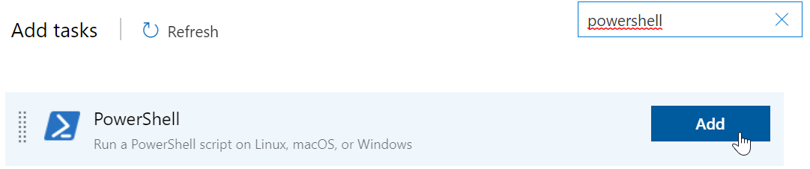
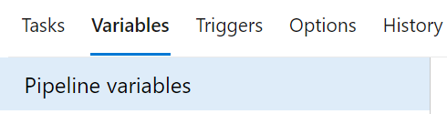
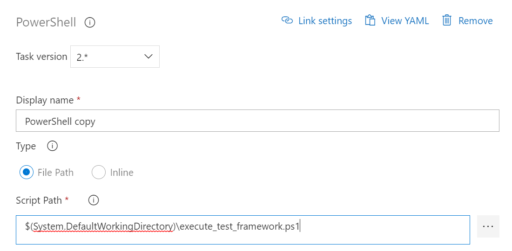
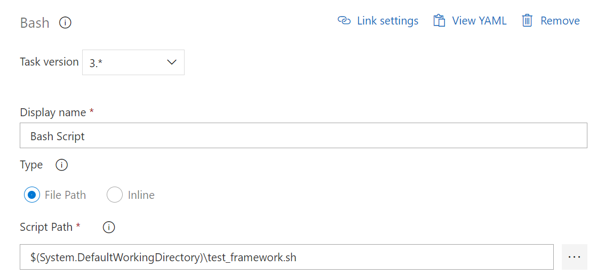
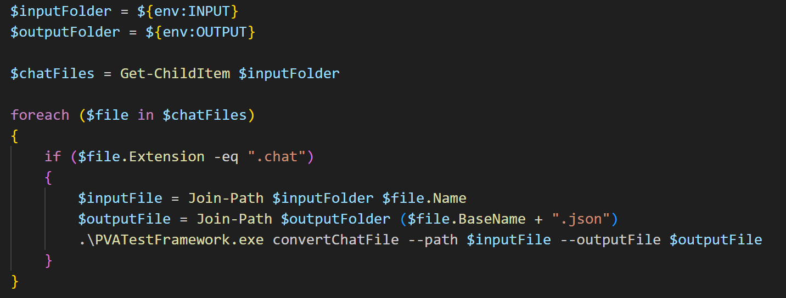
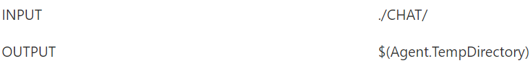
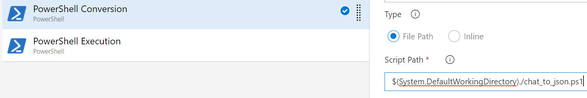
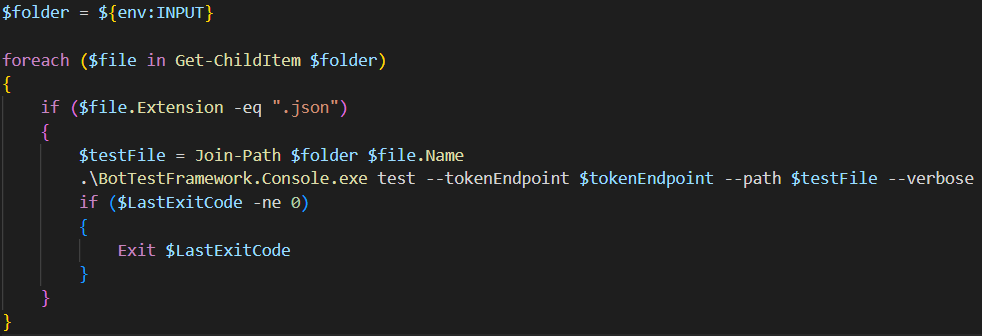
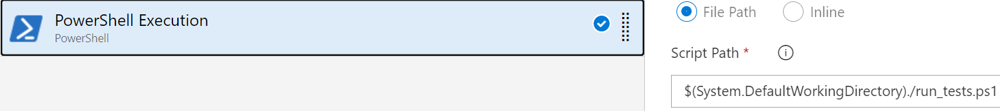

# How run the solution from an ADO pipeline using a Windows VM
To run the solution inside an ADO pipeline it needs to be on a single .exe file obtained by doing the publish procedure for Windows runtime on Visual Studio.
Please follow these steps:

1. First, the .exe file should be in the repo, so the easiest way to do this is to commit and push it there.

2. Go the Azure Pipeline that needs to be configured and click on Add a task.


3. Select the PowerShell script task and click on Add.



4. After that, a new task will appear, leave the browser open and lets move to the desktop.

5. The next step is to create a simple PowerShell script to run the tool. Create a simple text file and change the extension .txt to .ps1. Then open the file and paste the command to execute on the script.

For example:

```
./tool/BotTestFramework.Console.exe ${env:COMMAND} --tokenEndpoint ${TOKENENDPOINT} --path ${env:FILEPATH} --verbose
```
Note that since the .exe file is inside a folder, relative paths are used to indicate the location of the .exe from the root of the repository. Also, keep in mind that the --verbose flag is optional and can be removed.

Each of these variables needs to be created from the variables tab in ADO:


This is an example for the first variable creation.


This needs to be done for each of the variables used.

6. Save the file, commit and push it to the repo.

7. Now go back to the browser, in the options of the task created, either manually write the path or select it from the three dots explore button on the right "...".



8. After the selection of the PowerShell script created, save the pipeline and test it.


# How run the solution from an ADO pipeline using a Linux VM
To run the solution inside an ADO pipeline it needs to be on a single file obtained by doing the publish procedure on for Linux runtime on Visual Studio. Then, please follow these steps:

1. First, the file should be in the repo, so the easiest way to do this is to commit and push it there.

2. Go the Azure Pipeline that needs to be configured and click on Add a task.


3. Select the Bash task and click on Add.


4. After clicking on Add, a new task will appear on the Pipeline, leave the browser open and lets move to the desktop.

5. The next step is to create a simple Bash script to run the tool. Create a simple text file and change the extension .txt to .sh. Then open the file and paste the command to execute on the script.

```
chmod +x BotTestFramework.Console
./BotTestFramework.Console $(COMMAND) --tokenEndpoint ${TOKENENDPOINT} --path $(FILEPATH) --verbose 
```
Please note that the name of the tool does not have the .exe extension because the file generated by VS for linux does not have extension either and that the chmod command is also needed in a bash script to make the tool executable. Also, keep in mind that the --verbose flag is optional and can be removed.

Each of these variables need to be created from the variables tab in ADO:


Here its an example for the first variable.


This needs to be done for each of the variables used.

6. Save the file, commit and push it to the repo.

7. Now go back to the browser, and in the options of the task created, either manually write the path or select it from the three dots explore button on the right "...".



8. After the selection of the Bash script created on Step 4, save the pipeline and test it.


# Use PowerShell scripts to run the tool
Included with the solution, there is a "Scripts" folder containing some PowerShell scripts that can be used to extend the functionality of the tool. This guide will help you to set up those scripts on the pipeline.

1. The `chat_to_json.ps1` script is receiving the INPUT and OUTPUT variables each one indicating a folder, and converting (with the tool) each .CHAT file on the INPUT folder into a .JSON file on the OUTPUT folder.



2. These variables can be set up from the "Variables" tab inside the pipeline configuration. The only condition is that these paths need to exist otherwise the tool will return an error.

3. Also, predefined environment variables can be used, the ones available on Azure Pipelines can be found in this [link](https://learn.microsoft.com/en-us/azure/devops/pipelines/build/variables?view=azure-devops&tabs=yaml).

4. Consider in this example that it was not desired to save the files in a separate folder called ./JSON/. The variables can therefore be set up like the following:



5. Then a Powershell task called "PowerShell Conversion" can be created with the path of the PowerShell Script.



6. The `run_tests.ps1` script will be executing the tool and test all the transcript files included in a folder.





7. This way, the Pipeline will be executing two steps:

- 1. Converting the .CHAT files into .JSON files in a temporal folder
- 2. Running the tool to test each of the converted chat transcripts

*NOTE: The temporal folder will be deleted after the JOB has finished.*


# How to run the solution from a Github pipeline

1. In your repository, under the actions tab, click on new workflow.

    

2. On the choose a workflow window, click on "set up a workflow yourself".

    

3. Use one of the following structures to create the file:

- To run on windows:
  ```
  name: run-test-tool

  on:
    workflow_dispatch:
      inputs:
        tokenEndpoint:
          required: false
          description: "tokenEndpoint"
        path:
          required: false
          description: "path"
        verbose:
          required: false
          description: "verbose"

  jobs:
    run-test-tool:
      runs-on: windows-latest
      name: test
      steps:
          - uses: actions/checkout@v2

          - name: Execute bot test
            shell: cmd
            run: |
              cd tool
              .\BotTestFramework.Console.exe test --tokenEndpoint "${{ github.event.tokenEndpoint }}" --path "${{ github.event.inputs.path }}" --verbose
  ```

- To run on linux:
  ```
  name: run-test-tool

  on:
    workflow_dispatch:
      inputs:
        tokenEndpoint:
          required: false
          description: "tokenEndpoint"
        path:
          required: false
          description: "path"
        verbose:
          required: false
          description: "verbose"

  jobs:
    run-test-tool:
      runs-on: ubuntu-latest
      name: test
      steps:
          - uses: actions/checkout@v2

          - name: Make app executable
            run: chmod +x ./tool/CommandLineApp
          - name: Execute bot test
            shell: bash
            run: ..\BotTestFramework.Console test --tokenEndpoint "${{ github.event.tokenEndpoint }}" --path "${{ github.event.inputs.path }}" --verbose
  ```
```
Note: you can change the command to run the command you want, just make sure to call the required arguments using the ones declared as inputs
```

4. Once the YML file is updated, click on start commit and upload the file to your repository.

5. To run the pipeline, click on Run workflow

    

6. Complete the arguments required to run your command.
