# How to use the tool
## Content / Index:

1. [How to run a test.](./TOOL_USAGE.MD#how-to-run-a-test)

2. [How to run a Scale test.](./TOOL_USAGE.MD#how-to-run-a-scale-test)

3. [How to download a file from dataverse](./TOOL_USAGE.MD#how-to-download-a-file-from-dataverse)

4. [Configure an app registration](./TOOL_USAGE.MD#configure-an-app-registration)

5. [How to obtain the Dataverse URI](./TOOL_USAGE.MD#how-to-obtain-the-dataverse-uri)

6. [How to convert a .chat file to .json.](./TOOL_USAGE.MD#how-to-convert-a-chat-file-to-json)

7. [How to get the PVA token endpoint.](./TOOL_USAGE.MD#how-to-get-the-pva-token-endpoint)

8. [Tips and tricks.](./TOOL_USAGE.MD#tips-and-tricks)

9. [Captured errors.](./TOOL_USAGE.MD#captured-errors)

10. [Exit codes.](./TOOL_USAGE.MD#exit-codes)

## How to run a test
A test can be used to reproduce in real time a conversation with a bot using a .json file. The test can be used to test the entire chat transcript, to validate trigger phrases or check that suggested actions when a DYM is triggered match with the expected ones.
This can be useful for ensuring that the bot is behaving properly after some changes were applied.

*Note: For more information on how to get the token endpoint parameter, go to [this](./TOOL_USAGE.MD#how-to-get-the-pva-token-endpoint) section.*

- Usage:
  BotTestFramework.Console test [options]

- Options:

  --tokenEndpoint <tokenEndpoint> (REQUIRED) The PVA token endpoint that will be used to generate a token to connecto to the Direct Line channel.

  --path <path> (REQUIRED) The file or folder to be used as a source to run the test.

  --dymMessage The message that the PVA bot sent to the user when a DYM situation is triggered.

  --noneOfTheseMessage The text for the "None of these" option when the DYM message is triggered.
  
  --verbose This flag enables verbose output.

  --log This flag enables the generation of the .log file.

  -?, -h, --help Show help and usage information.

Example:
```
.\BotTestFramework.Console.exe test --tokenEndpoint ${TOKENENDPOINT} --path ${PATH}
```

## How to run a Scale test
A scale test can be used to test load on the bot, this combined with Azure analytics can help the user to find where the bottleneck may be.

*Note: For more information on how to get the token endpoint parameter, go to [this](./TOOL_USAGE.MD#how-to-get-the-pva-token-endpoint) section.*

- Usage:
  BotTestFramework.Console testScale [options]
- Options:

  --tokenEndpoint <tokenEndpoint> (REQUIRED) The PVA token endpoint that will be used to generate a token to connecto to the Direct Line channel.

  --path <path> (REQUIRED) The file or folder to be used as a source to run the test.

  --maxAttempts <maxAttempts> (REQUIRED) The number of messages to be sent to the Bot.

  --dymMessage The message that the PVA bot sent to the user when a DYM situation is triggered.

  --noneOfTheseMessage The text for the "None of these" option when the DYM message is triggered.

  --verbose This flag enables verbose output.

  --log This flag enables the generation of the .log file.

  --regionalBot This flag indicates that it is regional bot, otherwise assumes global. [default: False]

  -?, -h, --help Show help and usage information.

### Example:
```
.\BotTestFramework.Console.exe testScale --tokenEndpoint ${TOKENENDPOINT} --path ${PATH} --maxAttempts ${MAXATTEMPTS}
```

## How to download a file from dataverse
Downloading a chat transcript from dataverse can be useful to test with information of certain days/weeks or simply obtain the last n conversation transcripts for testing purposes.
- Usage:
  BotTestFramework.Console getFromDV [options]
- Options:
  --interval <LastNDays|LastNTranscripts|LastNWeeks> (REQUIRED) The interval range to be used to get data from Dataverse.

  --value <value> (REQUIRED) The number of transcripts, days or weeks to be obtained.

  --path <path> (REQUIRED) The output file that will be generated with the chat transcript downloaded.
  
  --tenantId <tenantId> (REQUIRED) The tenant id to be used to connect with dataverse.
  
  --environmentUrl <environmentUrl> (REQUIRED) The environment URL to be used to connect with dataverse.

  --interactive Defines whether to use the interactive login. [default: False]

  --clientId <clientId> (REQUIRED) The client id to be used to connect with dataverse.

  --clientSecret <clientSecret> The client secret to be used to connect with dataverse.

  --botId <botId> (REQUIRED) The bot id to be used to connect with dataverse.

  --verbose This flag enables verbose output.

  -?, -h, --help Show help and usage information.

The authentication to dataverse can be either interactive (if the flag is present), or non-interactive. In this case, you would need to provide the clientSecret by the command line.
To be able to execute this feature, the minimum role required is the Service reader role.

### Example:
```
.\BotTestFramework.Console.exe getFromDV --interval {INTERVAL} --value ${VALUE} --path ${PATH} --tenantId ${TENANTID} --environmentUrl ${ENVIRONMENTURL} --clientId ${CLIENTID} --clientSecret ${SECRET} --botId ${BOTID}
```

For more information about the available regions check this [link](https://learn.microsoft.com/en-us/power-platform/admin/new-datacenter-regions).

## Create an App Registration
To download the chat transcripts from dataverse an App Registration is needed. Follow the steps below to create it.

1. Go to the [Azure Portal](https://portal.azure.com/#home) and click on App Registrations.


2. Then, click on New Registration.

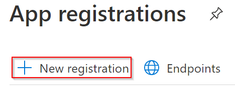

3. Write a name for the application and then fill in the other fields like the following image.

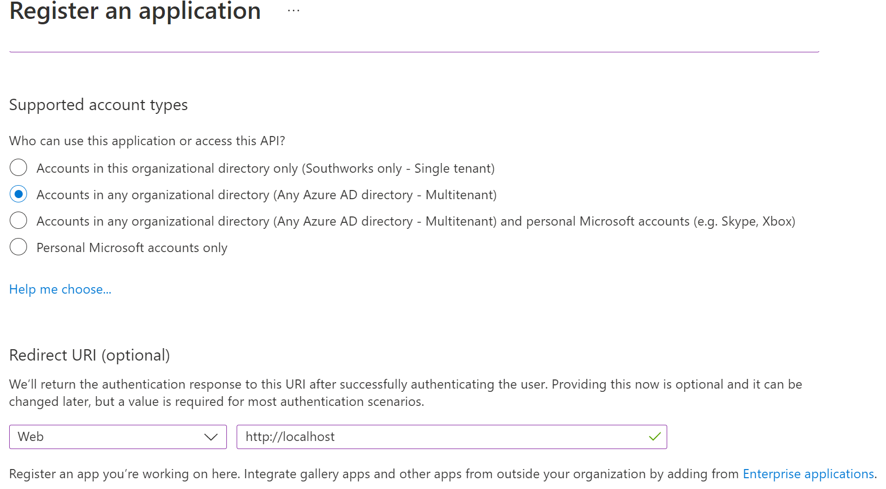

4. Select Register to complete the initial app registration.
5. From the overview page, copy the Application (client) Id value as it will be used in further steps.

### Configure the App Registration permissions
After the App Registration is created, the permissions can be configured.

1. Go to the "API permissions" section and click on "Add a permission".

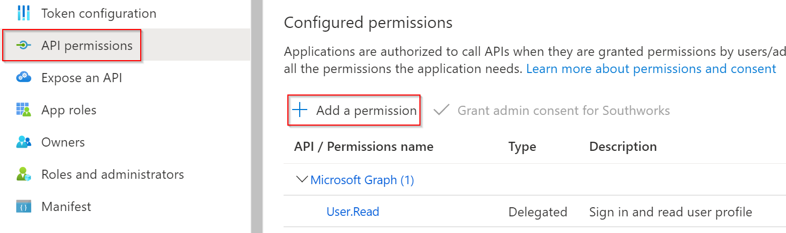

2. Select Dynamics CRM from the permission list.

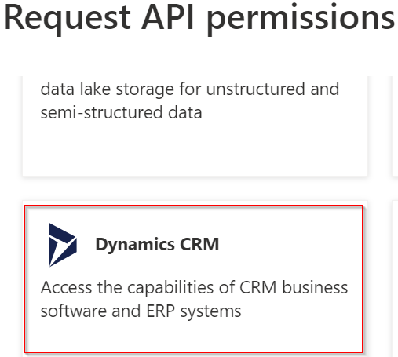

3. Then add the "user_impersonation" permission.

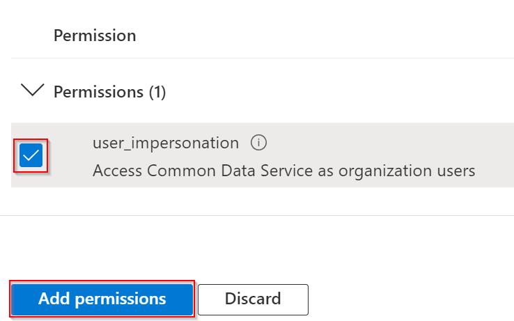

### Add a credential to the App registration
Credentials allow an application to authenticate as a user, requiring no interaction from a user at runtime.

1.  In the Azure portal, in App registrations, select the application created earlier.
2.  Select Certificates & secrets > Client secrets > New client secret.

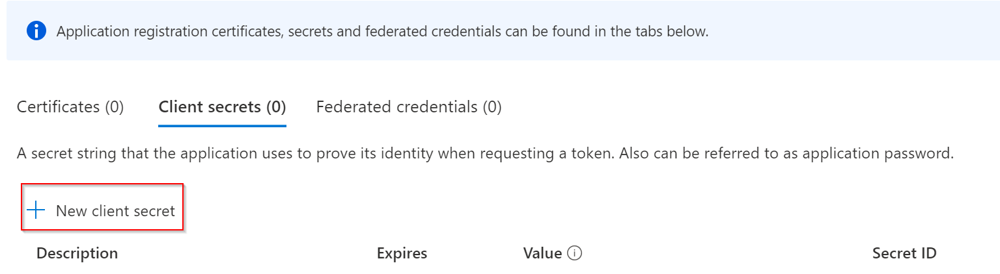

3.  Add a secret description.
4.  Select an expiration for the secret or specify a custom lifetime.

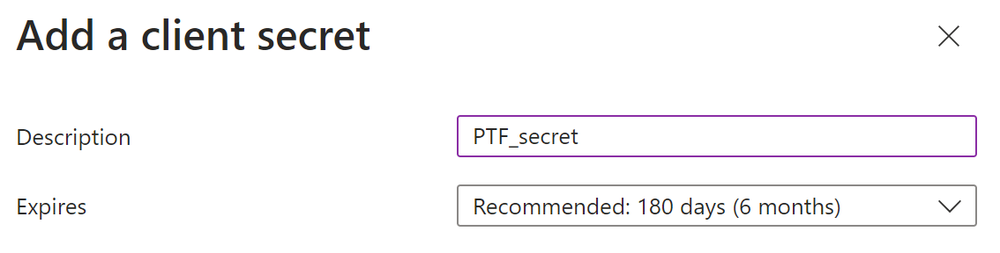

5.  Select Add.
6.  Record the secret's value. This secret value is never displayed again after you leave this page.

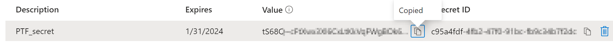

## Enable the App Registration as a management App
Follow these steps to enable the App Id into Power Platform:

1. Go to the [Power Platform Admin Center](https://admin.powerplatform.microsoft.com/home) site, select the environment, and click on settings.


2. In the "Users + Permissions" section, click on "Application Users".


3. Click on "New app user".


4. Select an organization from the menu and then click on "Add an app".


5. Select the App Registration from Azure Active Directory created in the previous section, then click on "Add".

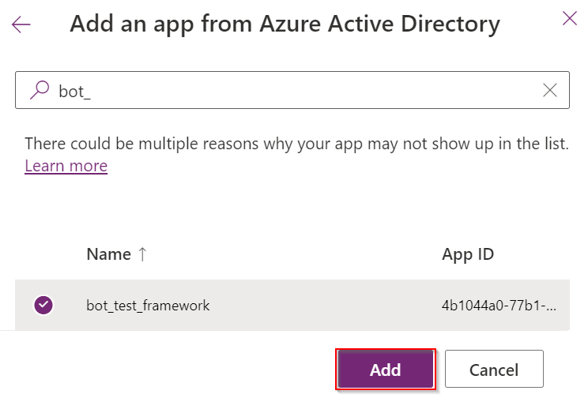

6. Select the App Registration recently added and click on the three dots, then "Edit security roles".

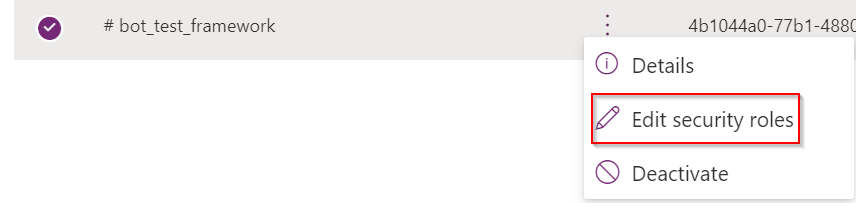

7. Select the "Service Reader" security role and then click on Save.


The clientId and clientSecret values are ready to be used in the getFromDV command.

## How to obtain the Environment URI to connect to Dataverse
To download a chat transcript from Dataverse an Environment URI is needed. Follow the steps below to obtain it.

1. Go to the [Power Apps](https://make.powerapps.com/) site and select the environment.

2. From there, go to Settings -> Session details


3. The Environment URI is the one listed as Instance url

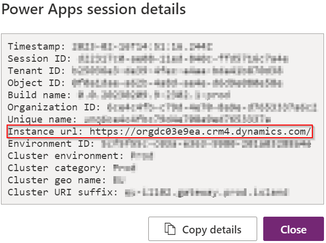

## How to convert a .chat file to .json
A simple text file with .chat extension can be used to mock a conversation between the user and the bot, and then convert it to a valid .json with the convertChatFile command.

The syntax to write the mock is quite simple: 

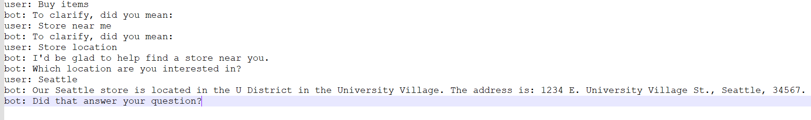

Just make sure to write the words "user:" and "bot:" correctly and without any typos because that's what we use to parse the conversation.
It is also supported, to convert a single file containing multiple conversations. The only requirement is to add the end-of-conversation tag (<EOC>), so the tool can identify that file include more than one conversation.


For creating a basic DYM test script, the only consideration to have is that the suggested topics need to be declared using the *suggested* term. The following example will validate that the suggested topics sent from the bot are "Open Hours" and "Buy Vitamins".

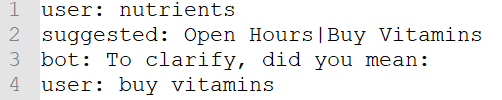

- Usage:
  BotTestFramework.Console convertChatFile [options]
- Options:

  --path <path> (REQUIRED) The path of the .chat file (input).

  --outputFile <outputFile> (REQUIRED) The path of the .json file (output).

  --log This flag enables the generation of the .log file.

### Example:
```
.\BotTestFramework.Console.exe convertChatFile --path to_convert.chat --outputFile converted.json
```

## How to get the PVA token endpoint
Follow these steps to get the PVA token endpoint.

1. Go to the [PVA](https://web.powerva.microsoft.com/) site.

2. On the left panel, click the Channels option.


3. On the right panel, click the Mobile App option.

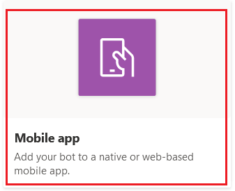

4. Click the Copy button to copy the PVA token endpoint.

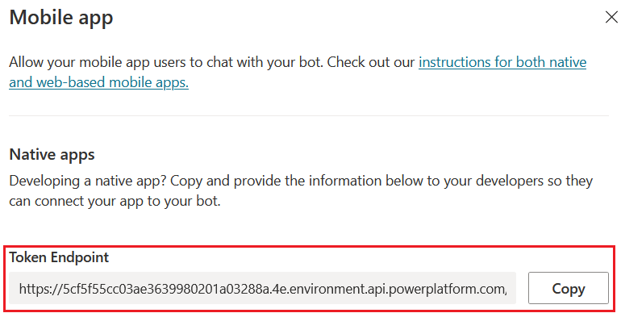

This endpoint should be used as the --tokenEndpoint parameter to run the test tool.

 ## Tips and tricks
 - If you want to run a bunch of files of the same extension, it is recommended to create a folder and then run the tool using a relative path to the folder. E.g: 
 ```
 .\BotTestFramework.Console.exe test --tokenEndpoint ${TOKENENDPOINT} --path ./FOLDER/
 ```
 This option is recommended for testing the tool locally and not when using it inside a Pipeline.

## Log File Generation
 - By default, when a test is executed the tool generates a .csv output file that can be found on the project folder, this file can later be processed by variety of tools (like MS Excel or MS Power BI) to obtain useful analytics or insights.
 Below there is the detail and description of each field that this .csv file contains:

    - SessionDate: date and time of the interaction.
    - BotId: the BotId used in the interaction.
    - ConversationId: the ConversationId assigned during the interaction.
    - UserUtterance: the phrase that triggered the response. (could be empty)
    - ExpectedResponse: the expected response from the test, taken from the .json test file.
    - ReceivedResponse: the received response from the bot, obtained directly from the bot using DirectLine.
    - DYM_Option1,2,3: The different options or suggested actions that were shown to the user if a "Did you mean..?" was triggered. (could be empty)
    - Result: the result of the executed test.
    - TestFile: the path of the file used for the test.

The program uses the default system list separator to generate the .csv file. In Windows operating systems, this configuration can be checked in the regional settings going to Control Panel -> Clock and Region -> Regional -> Adittional Settings.

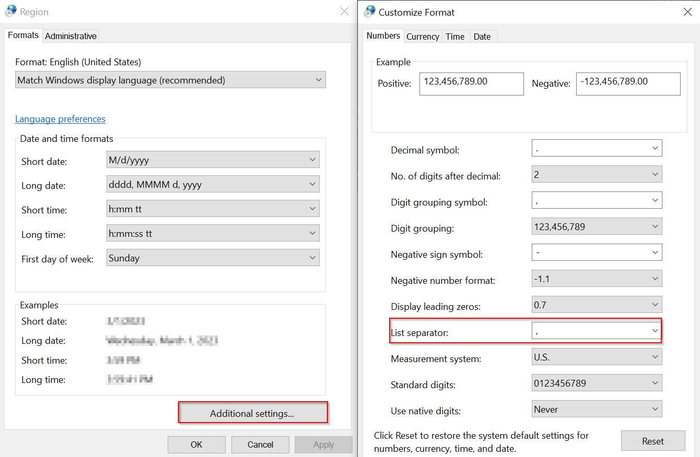

 - An additional .log file can also be generated using the optional --log flag. This file can be found on the project folder and combined with the --verbose flag can be used for debugging if an error is encountered. Only one log file will be created per day, and the content will be appended to the file only if the --log flag is present in the command.

 

## Message variations
 - The tool supports message variations on the bot side using RegEx. It will detect a tag with the following format <(REGEX)> on the message attribute of the transcript file used as input. This can be done by modifying the chat transcript file or simply mocking a .chat file and converting it to JSON using the appropriate command. This is an example of the second option:
 
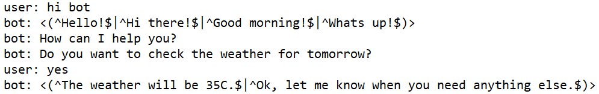

 Below are some RegEx examples:
 - To match an exact phrase use the following syntax. E.g. "^hello$". This will validate that the phrase returned by the bot, should be "hello" otherwise the test will fail.
 - To indicate that the text message should match different phrases, a pipe "|" character can be used.

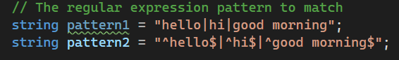

 


 - To match any phrase this wildcard can be used:
 ```
 [\\s\\S]*?
 ```

## Captured errors

### File extension errors

On some commands the user is required to specify input or output file paths, these must include the extensions or we can have errors.

For example, on the conversion command we have to specify both the input file path and the output file path.

The input file must have a .chat extension or will throw the following error:
```
The input file should have a .chat extension.
```

The output file must have .json extension or will throw the following error:
```
The output file should have a .json extension.
```

### Receiving activities error

When running a transcript, the tool will be trying to connect to the bot to receive the activities, after 3 attempts the tool will stop trying to receive activities and will throw the following error:
```
Failed to receive activities from the Bot after 3 attempts.
```

### Invalid script role

When running a transcript, the tool will be analyzing each activity to get the role which the message comes from, if the obtained role is neither user or bot, the following error will be thrown:
```
Invalid script role {activity.From.Role}.
```

### DirectLine token expired

In order to connect to the bot, the tool uses DirectLine, generating a token that lasts for 30 minutes. If we still try to receive activities from the bot after 30 minutes, the following error will be thrown:
```
The directline token has expired.
```

If we introduce a wrong parameter to create the connection for the bot, the tool won't be able to generate the token correctly and the following error will be thrown:
```
There was an error getting the directline token. Please check the bot url.
```

### Wrong file path to download from Dataverse

When downloading a Chat transcript from dataverse, the file path where the transcript will be saved must be specified including the extension, or the following error will be thrown:
```
Filepath should have a .json extension.
```

### Interactive sign-in canceled/incomplete

When using the interactive login, a login window will be prompted, closing windows or canceling the sign in process will be causing the following error to be thrown:
```
User canceled authentication or did not complete the sign-in process.
```

### Invalid JSON file

When running a transcript, the JSON file format can be invalid, causing the following error to be thrown:

```
An error occurred while running the test. Details: The json file used as an input is not valid.
```

### Wrong path or unexisting file
When specifying the --path, we can specify a wrong path, causing the following error to be thrown:

```
An error occurred while running the test. Details: Could not find file {filePath}.
```

### Problem to start a new conversation
In some cases where the region used to connect to the Direct Line API is not properly configured, the conversation will not be able to start successfully, causing the following error to be thrown:

```
There was an error starting the conversation.
```

## Exit codes

When the tool is executed it will return two different codes depending on the execution result:

  - 0: The execution was successful
  - 1: The execution failed

These codes are useful when the tool is instantiated from a pipeline to execute an additional step or retry a previous one based on the exit code.
