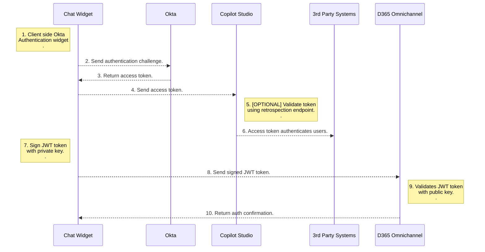
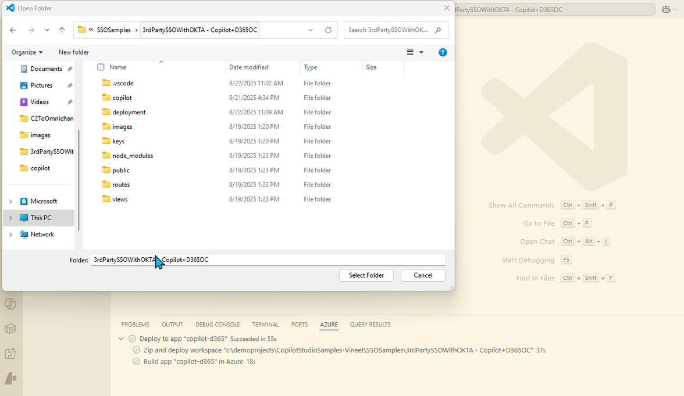
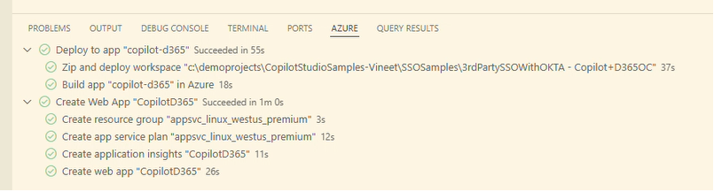
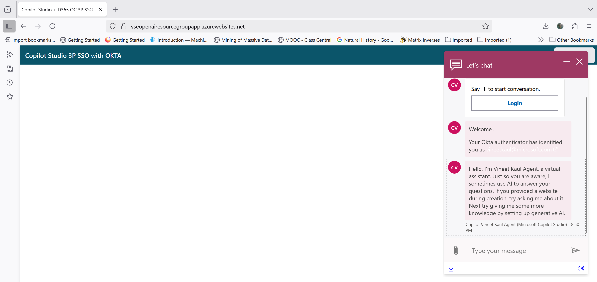
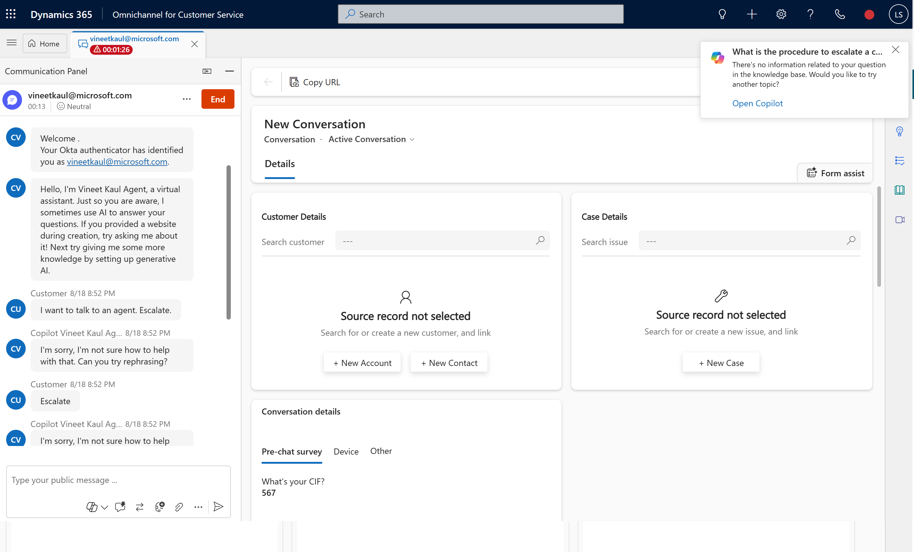

# Unified SSO with Copilot Agent and D365 Omnichannel

This sample app demonstrates unified SSO with Copilot Agent and D365 Omnichannel using a 3rd party authentication provider. 

*Use Case:* C2 get authenticated to Copilot agent and D365 Omnichannel at the start of the session. C2 can get authenticated / private information from Copilot agent and continue to have secure conversation with live agent on agent handover. 

## Authentication Process

## Getting started

To run this sample app with end-to-end SSO flow with OKTA, you will need to:

1. Deploy sample app to Azure.
2. Create an OKTA developer account, or use an existing one
3. Create a new app integration in OKTA.
4. Setup manual authentication in Copilot Studio and D365 Omnichannel.
5. Update constants in the sample app. 
6. Redeploy sample app to Azure.

> Replace  `<>`  with your appropriate values.</em>

## Detailed instructions

### 1. Deploy sample app to Azure:

1. Navigate to your project directory.
 
     `cd <your-project-folder>` 
 
2. Open the project director in VS Code. 

	

	
	 
	
 
 
3. In Command Bar, select `Show and Run Commands`. 

	

	
	 
	
 
 
4. In Command Bar, select `AppCenter > Create New App`. 

	

	 Create New App`."  width="800px">
	 
	
 
	
5. In Command Bar, enter the name of app and clict Enter. 

	

	
	 
	
 	

6. In Command Bar, select location of the app resource. 

	

	
	 
	
 	
	
7. In Command Bar, select `Node 22 LTS` as runtime stack. 

	

	
	 
	
 	

8. In Command Bar, select pricing tier and click enter.

	

	
	 
	
 
	
8. Confirm successful app creation.

	

	
	 
	
 	
	
 9. Login into [Azure Portal](https://portal.azure.com/). Search for app created in the previous step and go to **Overview** page. 

 10. Verify **Status = Running** on the **Overview** page. Copy the `Default domain` from the detail page. 
 
 

 	
 	 
	
 	

### 2. Create an OKTA developer account:
1. Sign up for an [OKTA developer account](https://developer.okta.com/signup/)

### 3. Create a new app integration in OKTA:

1. Sign in to the OKTA admin dashboard. 
	- Note the URL **https://{your OKTA domain}-admin.okta.com/**.
	- Note the `{yourOktaDomain}`.
	- Create a new app integration with the following details.

|Application Property|Value|
|--|--|
| Sign-in method | OIDC - OpenID Connect |
| Application type | Single-Page Application |
| Grant type | Authorization Code, Interaction Code |
| Sign-in redirect URIs | the URL to `https://<Default domain>` |
| Sign-out redirect URIs | the URL to `https://<Default domain>/signout` |
| Trusted origins | your base URL i.e. `https://<Default domain>` |
| Assignments | allow access to specific users or groups based on your requirements |

3. After creating the app integration, note its Client ID

4. This sample app uses the OKTA sign-in widget which relies on the Interaction Code sign-in flow. To enable the Interaction Code flow:

5. Navigate to the API settings page under ***Security -> API***

6. Under the Authorization Servers tab, note the default authorization server Name - `{yourOktaAuthServer}`.

8. Edit the default authorization server. Under Access Policies, edit the default policy rule

10. Under ***IF Grant type is*** -> ***Other grants***, click on **Interaction Code**. Update the rule

11. Verify that CORS has been enabled for your base URL. On the same API page, under the ***Trusted Origins*** tab, base URL of the app i.e. `https://<Default domain>` should appear under ***Trusted Origins*** with CORS and -   Redirect enabled. In case base URL is missing, add the URL i.e. `https://<Default domain>` with CORS and Redirect enabled.

### 4. Setup manual authentication in Copilot Studio and D365 Omnichannel:

> This section assumes that [Copilot handoff to Dynamics 365 Customer Service](https://learn.microsoft.com/en-us/microsoft-copilot-studio/configuration-hand-off-omnichannel?tabs=webApp) is configured.

#### Public Key / Private Key Setup:
 > [!NOTE] 
 > **OPTIONAL** - This sample app comes with pre configured public/private keys. This step is optional if self generated keys are not required. 

 1. Install [Git Bash](https://www.atlassian.com/git/tutorials/git-bash) on your machine.
 
 2. Generate a private key by running the command on git bash. 
 
	 `openssl genpkey -algorithm RSA -out private_key.pem -pkeyopt rsa_keygen_bits:2048`
 
 3. Open the `private_key.pem` using text editor. Copy the key and update the  `PRIVATE_KEY` environment variable in `.env` file in the root folder. 
 
	> Make sure the entire text is copied beginning with "-----BEGIN PUBLIC KEY-----" and ending with "-----END PUBLIC KEY-----". 

 5. Generate a public key file by running the command on git bash. 
 
	 `openssl rsa -pubout -in private_key.pem -out public_key.pem`
	 
 6. Rename the file `public.key` and save the file in `/keys` project folder. 

#### D365 Omnichannel:

 1. Open browser and type in URL `https://<Default domain>/publickey`. The browser should display public key definition. 

/publickey`. The browser should display public key definition."  width="600px">
 

 
 2. Create a chat authentication setting record in the D365 Admin App.
     1. In the site map of Copilot Service admin center, select **Customer Settings**.
	 
     2. In the **Authentication settings** section, select **Manage**.
	 
     3. Select **New Authentication Settings**, and then provide the following information on the **Add authentication setting** page:
    
   | Application Property | Value |
   |--|--|
   | Name | Enter a name for the authentication setting. |
   | Owner| Accept the default value or change it to a required value.|
   |Authentication type|By default, OAuth 2.0 can't be edited.|
   |Public key URL|`https://<Default domain>/publickey`|      
   |JavaScript client function|auth.getAuthenticationToken |

 3. In Copilot Service admin center, edit the chat widget in the Workstream settings, and then go to the **Behaviors** tab.
 
 4. In the **Authentication settings** box, browse and select the chat authentication record.

#### Copilot Studio:

 1. In the Copilot Studio **Settings** select **Security**. Set  **Authentication** to **Authenticate manually**. 
 
 2. Provide the following information on the **Authentication** page and click Save:
   
   | Application Property | Value |
   |--|--|
   | Redirect URL | `https://token.botframework.com/.auth/web/redirect` |
   | Service provider| Generic OAuth 2|
   | All other values| String - `placeholder`|
   
 3. In the Copilot Studio **Topics** select **System**. Click on **Sign In** topic. 
    
 4. Click on **More** and select **Open code editor**.  
 
 ##### Use pass-through pattern. 
  > [!TIP] 
  > In this pattern, only the token and not the JWT payload (typically includes information about the authenticated user, such as their identity, attributes etc.) is sent to Copilot Studio. 
  > In addition, the token is **not** validated by Copilot till it is used e.g.to cal an API. 
  > Authentication flow works as long as Copilot Studio receives the token. 
 
 5. Copy YAML code from `/copilot/SingIn - Pass Through Pattern Flow.YAML` file and paste in the code editor. Save topic.
 
 6. Publish the agent.
 
 ##### Use introspection API. 
 > [!NOTE] 
 > **OPTIONAL** - Steps [7], [8], [9] are to be followed **only** when implementing introspection API pattern.
 
 > [!TIP] 
 > In this pattern, the token is sent to Copilot Studio. The Copilot Studio calls the Idp instrspection API to validate the token and get the JWT payload (typically includes information about 
 > the authenticated user, such as their identity, attributes etc.). 
 > The authentication flow validates the token at the time of SSO. 
 
 7. Copy YAML code from `/copilot/SingIn - Introspection Flow.YAML` file and paste in the code editor.
 
 8. Replac the following placeholder in the code. Save topic.

| Placeholder | Value |
   |--|--|
   | Env.cat_OktaValidationURL | `https://{yourOktaDomain}/oauth2/` |
   | Env.cat_OktaValidationURI)| `{yourOktaAuthServer}/v1/introspect`|
   | Env.cat_OktaClientId| Client ID of Okta app noted above.|

 9. Publish the agent.

### 5. Update constants in the sample app:

1. Update environment variable in `.env` file in the root folder. Save the file after updates.

| Placeholder | Value |
   |--|--|
   | AZURE_DEFAULT_DOMAIN| `https://<Default domain>`|
   | COPILOT_BOT_TOKEN_URL| In the Copilot Studio select **Channels** and **Web App**. Copy the **Connection String** value. |
   | OKTA_ORG_URL| `https://{yourOktaDomain}.okta.com`|
   | OKTA_CLIENT_ID| The Client ID of the OKTA application noted above.|
   | OKTA_SCOPES| `okta.users.read`|
   | OKTA_REDIRECT_URI| `https://<Default domain>`|
   | OKTA_AUTHORIZATION_SERVER| `default` |

### 6. Redeploy updated sample app to Azure:

1. Navigate to your project directory.
 
     `cd <your-project-folder>` 
 
2. Open the project director in VS Code. 

	

	
	 
	
 
      
4. Click `Deploy to web app`.

	

		
		 
	
 
  
### Test the SSO flow:

Follow the demo steps below to test SSO flow - 

Step 1: 

Step 1: <em> Note the Okta **username** of the test user. </em>

 

Step 2: <em> Go to `https://[Default domain]`. Log in using Okta Credentials as test user. </em>

 

Step 3: <em> Verify login. Logout button would be visible.</em>

 

Step 4: <em> Once logged in; click on the chat widget top open. </em>

 

 

Step 5: <em> Agent displays Okta identification message with **username** of the test user. This step confirm Copilot Studio authentication. </em>

 

Step 6: <em> Type `i want to talk to an agent` in chat window to transfer / handover chat to D365 Omnichannel. </em>

 

Step 7: <em> Check Live Agent is available from Presence Status. </em>

 

Step 8: <em> Open Omnichannel for Customer Service console in D365 Service. A chat request notification pops with **username** of the test user.  This step confirm D365 Omnichannel authentication.  </em>
  > [!TIP] 
  > Rewrite utterance `i want to talk to an agent` in chat widget if chat request notification does not come up.

 

Step 9: <em> Click on accept button. Chat window opens up with Okta username for Copilot & D365 Omnichannel. </em>

 

