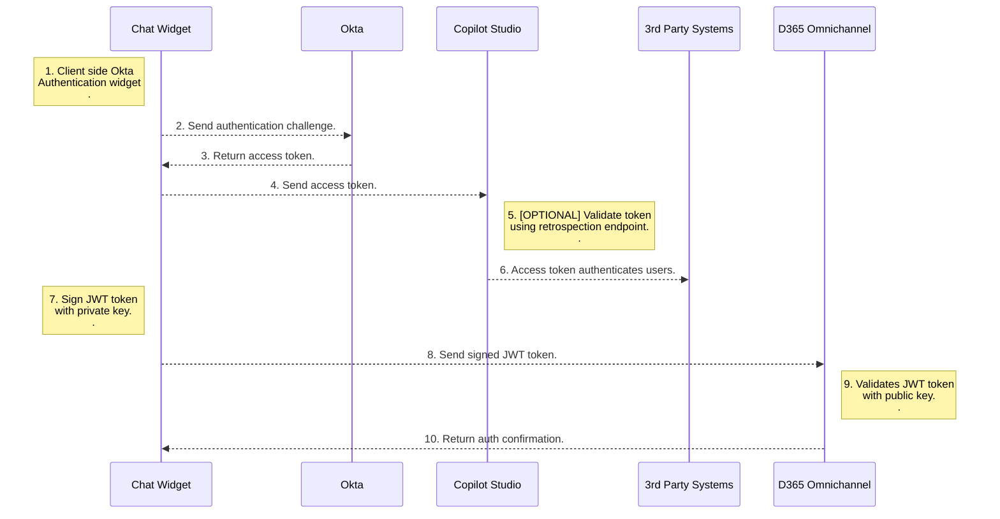

# Unified SSO with Copilot Agent and D365 Omnichannel

This sample app demonstrates unified SSO with Copilot Agent and D365 Omnichannel using a 3rd party authentication provider. 

> *Use Case:* C2 get authenticated to Copilot agent and D365 Omnichannel at the start of the session. C2 can get authenticated / private information from Copilot agent and continue to have secure conversation with live agent on agent handover. 

## Authentication Process

## Detailed instructions

- [Run locally](/SSOSamples/3rdPartySSOWithOKTA - Copilot D365OC/docs/README-RunOnAzure.md)
- [Run on Azure](/SSOSamples/3rdPartySSOWithOKTA - Copilot D365OC/docs/README-RunOnAzure.md)

## Authors

- [Vineet Kaul](vineetkaul@microsoft.com)
- [Jeff Luo](jluo@microsoft.com)

## License

