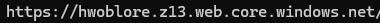
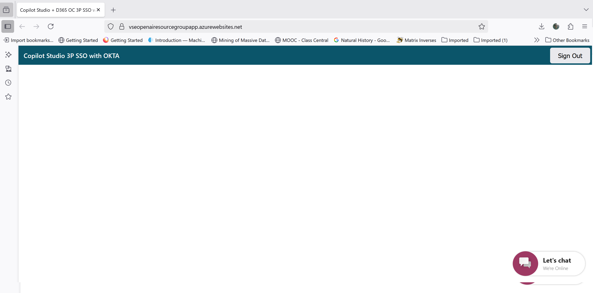
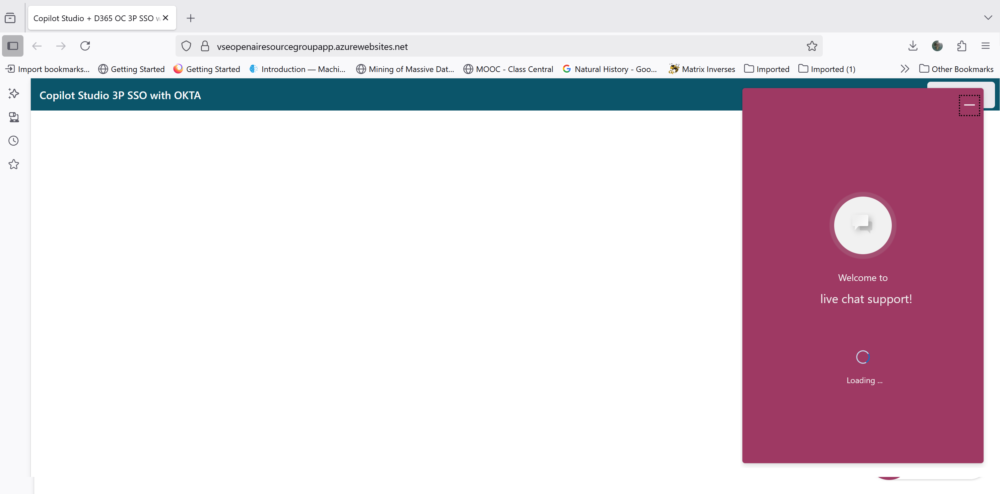
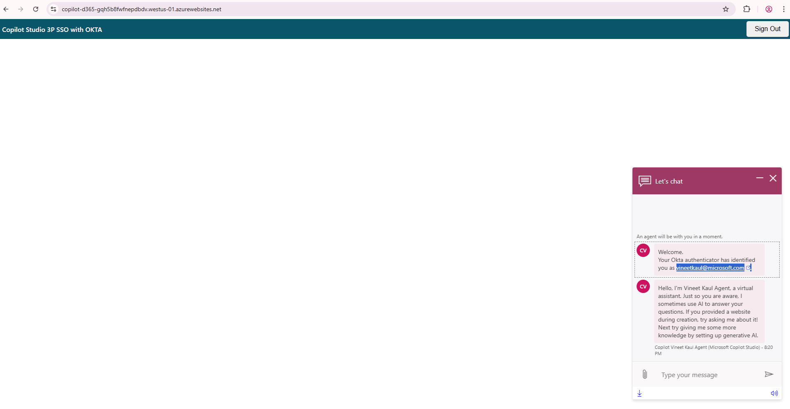
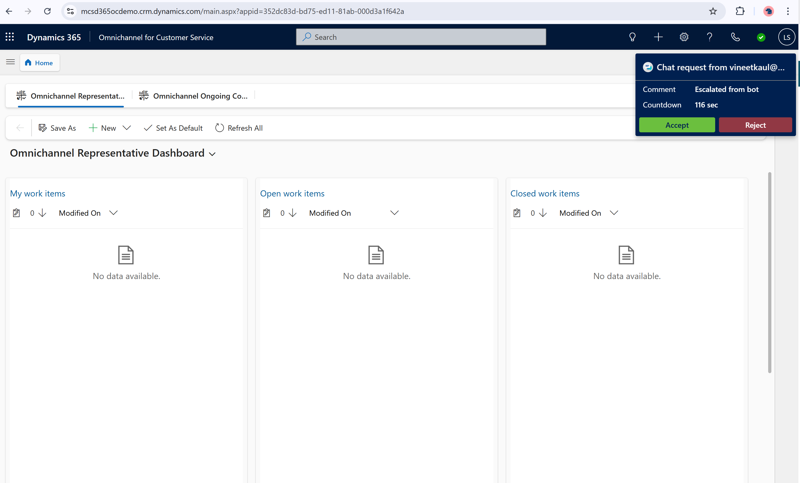
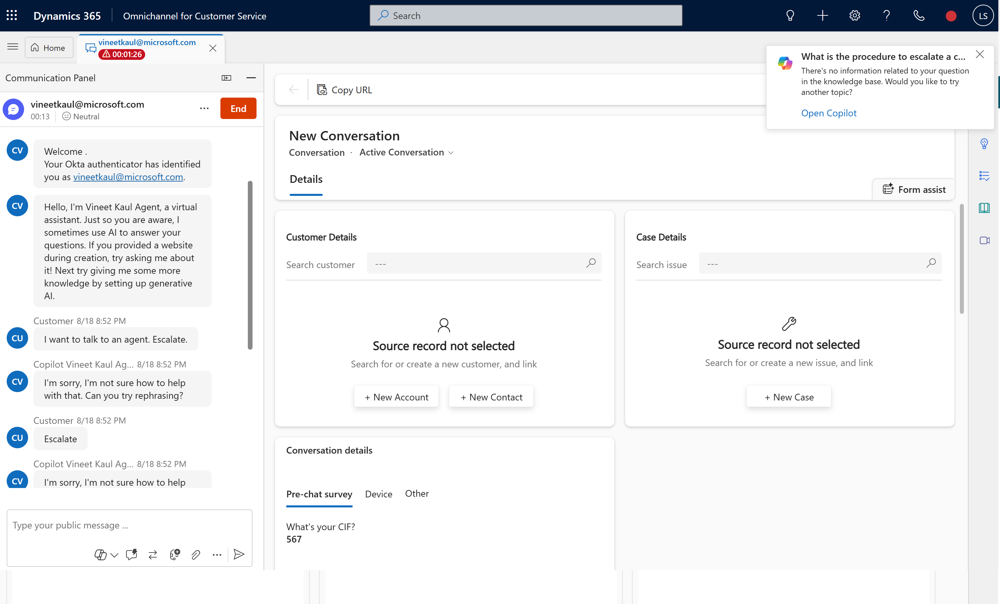

  
  
# Unified SSO with Copilot Agent and D365 Omnichannel
This sample app demonstrates unified SSO with Copilot Agent and D365 Omnichannel using a 3rd party authentication provider. 

> *Use Case:* C2 get authenticated to Copilot agent and D365 Omnichannel at the start of the session. C2 can get authenticated / private information from Copilot agent and continue to have secure conversation with live agent on agent handover. 

## Detailed Instructions - Run on local machine

### 1. Setup Public Key / Private Key:
> [!NOTE]
> **OPTIONAL** - This sample app comes with per-configured public/private keys. This step is optional if self generated keys are not required.

1. Install [Git Bash](https://www.atlassian.com/git/tutorials/git-bash) on your machine.

2. Generate a private key by running the command on git bash.

`openssl genpkey -algorithm RSA -out private_key.pem -pkeyopt rsa_keygen_bits:2048`

3. Open the `private_key.pem` using text editor. Copy the key and update the `PRIVATE_KEY` environment variable in `.env` file in the root folder.

> Make sure the entire text is copied beginning with "-----BEGIN PUBLIC KEY-----" and ending with "-----END PUBLIC KEY-----".

5. Generate a public key file by running the command on git bash.

`openssl rsa -pubout -in private_key.pem -out public_key.pem`

6. Rename the file `public.key` and save the file in `/keys` project folder.
  
### 2. Host public key URL:
> Execute the given commands as given in each step.
> Replace `<>` with your appropriate values.</em>

1. Clone the repository 

	` git clone <repository_url>`

2. Navigate to your project directory.

	`cd <your-project-folder>`

3. If your identity is associated with more than one subscription, then set your active subscription to subscription of the storage account that will host your static website.

	  `az account set --subscription <subscription-id>`

	- Replace the `<subscription-id>` placeholder value with the ID of your subscription.

4. Create Azure Storage Account.

	` az storage account create --name <mystorageaccount123> --resource-group <myresourcegroup> --location <eastus> --sku <Standard_LRS>`

	- Replace the `<mystorageaccount123>` placeholder value with the name of your storage account. 
	- Replace the `<myresourcegroup>` placeholder value with the resource group where you want to create the storage account.
	- Replace the `<eastus>` placeholder value with the location of storage account. 
	- Replace the `<Standard_LRS>` placeholder value with the storage account SKU.

5. Enable static website hosting.

	` az storage blob service-properties update --account-name <storage-account-name> --static-website --404-document <error-document-name> --index-document <index-document-name>`

	- Replace the `<storage-account-name>` placeholder value with the name of your storage account.
	-   Replace the `<error-document-name>` placeholder with the name of the error document that will appear to users when a browser requests a page on your site that does not exist.
	-   Replace the `<index-document-name>` placeholder with the name of the index document. This document is commonly "index.html".

6. Upload public key to the _$web_ container from a source directory..

	` az storage blob upload-batch -s <source-path> -d '$web' --account-name <storage-account-name> --content-type 'text/html' `

	- Replace the `<storage-account-name>` placeholder value with the name of your storage account.
	-   Replace the `<source-path>` placeholder with a path to the location of the files that you want to upload.

7. Find the public URL of your static website.

	` az storage account show -n <storage-account-name> -g <resource-group-name> --query "primaryEndpoints.web" --output tsv`

	Copy the URL in the output. The `https://<static_website_url>/public.key` is the public key URL.
	

/public.key"  width="800px">
 

8. Open browser and type in URL `https://<static_website_url>/public.key`. The browser should display public key definition.

/publickey`. The browser should display public key definition."  width="400px">
 

### 3. Create an OKTA developer account:

1. Sign up for an [OKTA developer account](https://developer.okta.com/signup/)

### 4. Create a new app integration in OKTA:

1. Sign in to the OKTA admin dashboard.

- Note the URL **https://{your OKTA domain}-admin.okta.com/**.

- Note the `{yourOktaDomain}`.

- Create a new app integration with the following details.
  
| Application Property | Value |
|--|--|
| Sign-in method | OIDC - OpenID Connect |
| Application type | Single-Page Application |
| Grant type | Authorization Code, Interaction Code |
| Sign-in redirect URIs |  `http://localhost:5000/` |
| Sign-out redirect URIs | `http://localhost:5000/signout` |
| Trusted origins | `http://localhost:5000/` |
| Assignments | allow access to specific users or groups based on your requirements |

2. After creating the app integration, note its Client ID

3. This sample app uses the OKTA sign-in widget which relies on the Interaction Code sign-in flow. To enable the Interaction Code flow:

4. Navigate to the API settings page under ***Security -> API***

5. Under the Authorization Servers tab, note the default authorization server Name - `{yourOktaAuthServer}`.

6. Edit the default authorization server. Under Access Policies, edit the default policy rule

7. Under ***IF Grant type is*** -> ***Other grants***, click on **Interaction Code**. Update the rule

8. Verify that CORS has been enabled for your base URL. On the same API page, under the ***Trusted Origins*** tab, base URL of the app i.e. `http://localhost:5000/` should appear under ***Trusted Origins*** with CORS and - Redirect enabled. In case base URL is missing, add the URL i.e. `http://localhost:5000/` with CORS and Redirect enabled.

### Setup manual authentication in Copilot Studio and D365 Omnichannel:

> This section assumes that [Copilot handoff to Dynamics 365 Customer Service](https://learn.microsoft.com/en-us/microsoft-copilot-studio/configuration-hand-off-omnichannel?tabs=webApp) is configured.

#### D365 Omnichannel:

1. Create a chat authentication setting record in the D365 Admin App.

2. In the site map of Copilot Service admin center, select **Customer Settings**.

3. In the **Authentication settings** section, select **Manage**.

4. Select **New Authentication Settings**, and then provide the following information on the **Add authentication setting** page:

	| Application Property | Value |
	|--|--|
	| Name | Enter a name for the authentication setting. |
	| Owner| Accept the default value or change it to a required value.|
	|Authentication type|By default, OAuth 2.0 can't be edited.|
	|Public key URL|`https://<static_website_url>/public.key`|
	|JavaScript client function|auth.getAuthenticationToken |

5. In Copilot Service admin center, edit the chat widget in the Workstream settings, and then go to the **Behaviors** tab.

6. In the **Authentication settings** box, browse and select the chat authentication record.

#### Copilot Studio:

1. In the Copilot Studio **Settings** select **Security**. Set **Authentication** to **Authenticate manually**.

2. Provide the following information on the **Authentication** page and click Save:

	| Application Property | Value |
	|--|--|
	| Redirect URL | `https://token.botframework.com/.auth/web/redirect` |
	| Service provider| Generic OAuth 2|
	| All other values| String - `placeholder`|

3. In the Copilot Studio **Topics** select **System**. Click on **Sign In** topic.

4. Click on **More** and select **Open code editor**.

##### Use pass-through pattern.

  > [!TIP] 
  > In this pattern, only the token and not the JWT payload (typically includes information about the authenticated user, such as their identity, attributes etc.) is sent to Copilot Studio. 
  > In addition, the token is **not** validated by Copilot till it is used e.g.to cal an API. 
  > Authentication flow works as long as Copilot Studio receives the token. 

5. Copy YAML code from `/copilot/SingIn - Pass Through Pattern Flow.YAML` file and paste in the code editor. Save topic.

6. Publish the agent.

##### Use introspection API.

> [!NOTE] 
 > **OPTIONAL** - Steps [7], [8], [9] are to be followed **only** when implementing introspection API pattern.
 
 > [!TIP] 
 > In this pattern, the token is sent to Copilot Studio. The Copilot Studio calls the Idp instrspection API to validate the token and get the JWT payload (typically includes information about 
 > the authenticated user, such as their identity, attributes etc.). 
 > The authentication flow validates the token at the time of SSO. 

7. Copy YAML code from `/copilot/SingIn - Introspection Flow.YAML` file and paste in the code editor.

8. Replace the following placeholder in the code. Save topic.

	| Placeholder | Value |
	|--|--|
	| Env.cat_OktaValidationURL | `https://{yourOktaDomain}/oauth2/` |
	| Env.cat_OktaValidationURI)| `{yourOktaAuthServer}/v1/introspect`|
	| Env.cat_OktaClientId| Client ID of Okta app noted above.|

9. Publish the agent.

### 5. Update constants in the sample app:

1. Update environment variable in `.env` file in the root folder. Save the file after updates.

	| Placeholder | Value |
	|--|--|
	| AZURE_DEFAULT_DOMAIN| `http://localhost:5000`|
	| OKTA_ORG_URL| `https://{yourOktaDomain}.okta.com`|
	| OKTA_CLIENT_ID| The Client ID of the OKTA application noted above.|
	| OKTA_SCOPES| `okta.users.read`|
	| OKTA_REDIRECT_URI| `http://localhost:5000`|
	| OKTA_AUTHORIZATION_SERVER| `default` |

### Test the SSO flow:

Follow the demo steps below to test SSO flow -

Step 1: <em> Note the Okta **username** of the test user. </em>

 

Step 2: <em> Navigate to your project directory and run app. 

	`node app.js'

Step 3: Go to `http://localhost:5000`. Log in using Okta Credentials as test user. </em>

 

Step 4: <em> Verify login. Logout button would be visible.</em>

 

Step 5: <em> Once logged in; click on the chat widget top open. </em>

 

Step 6: <em> Agent displays Okta identification message with **username** of the test user. This step confirm Copilot Studio authentication. </em>

 

Step 7: <em> Type `i want to talk to an agent` in chat window to transfer / handover chat to D365 Omnichannel. </em>

 

Step 8: <em> Check Live Agent is available from Presence Status. </em>

 

Step 9: <em> Open Omnichannel for Customer Service console in D365 Service. A chat request notification pops with **username** of the test user. This step confirm D365 Omnichannel authentication. </em>

> [!TIP]

> Rewrite utterance `i want to talk to an agent` in chat widget if chat request notification does not come up.

 

Step 10: <em> Click on accept button. Chat window opens up with Okta username for Copilot & D365 Omnichannel. </em>

 

