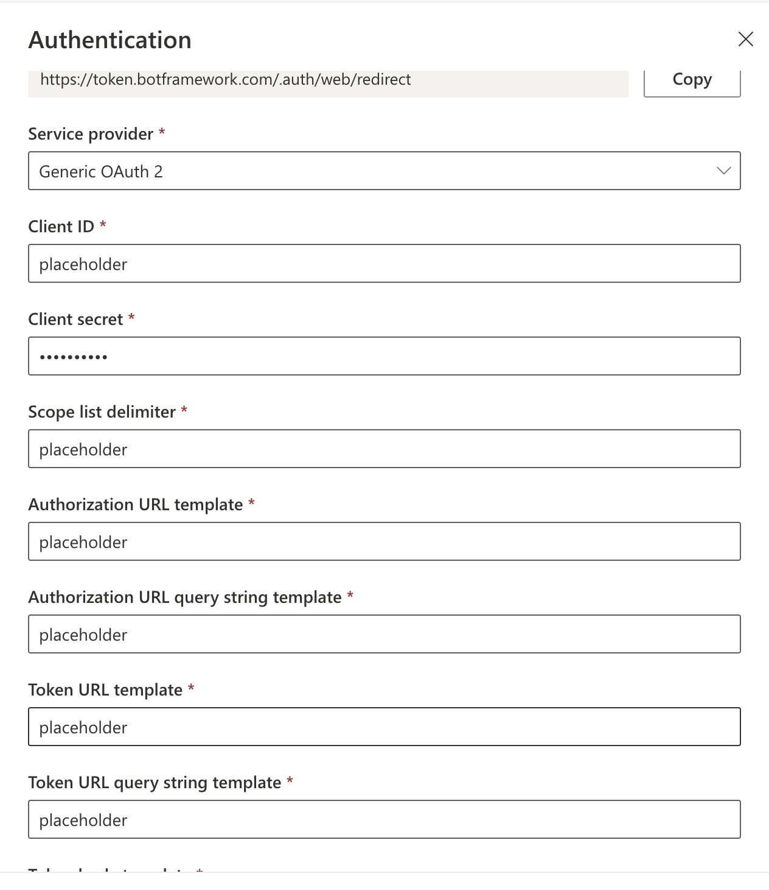
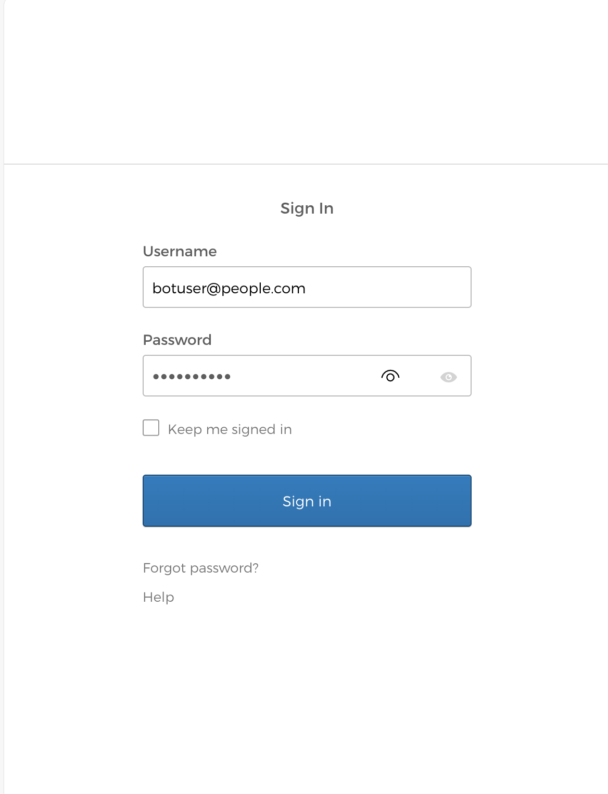
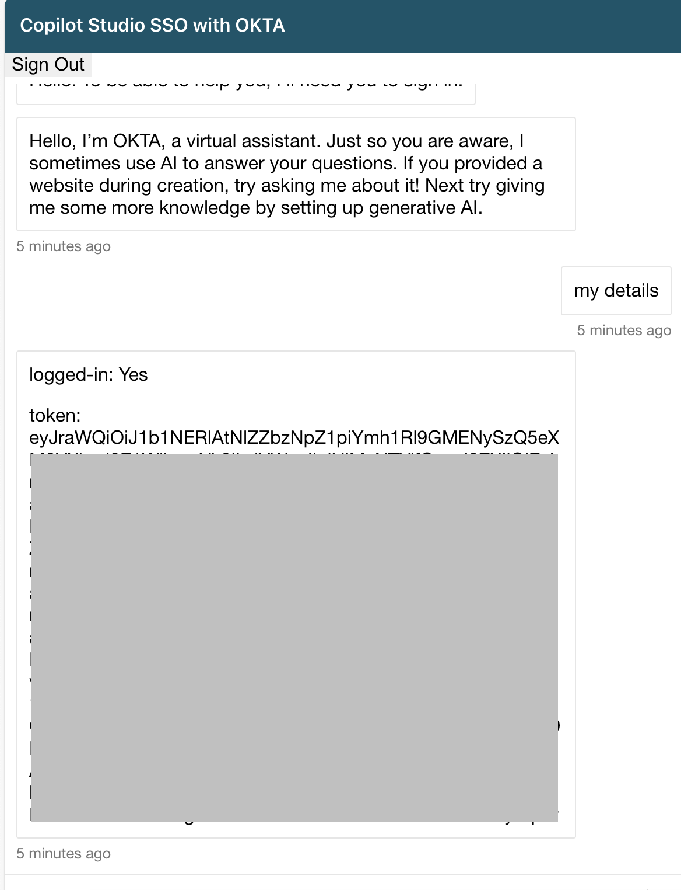

# Description

This custom canvas demonstrates how an access token obtained from a 3rd party identity provider, like OKTA, can be used in the context of a single sign-on (SSO) login flow with Copilot Studio.

## Getting started

To run this sample, including the end-to-end SSO flow with OKTA, you will need to:

1. Deploy [index.html](./public/index.html) and [signout.html](./public/signout.html) on a remote or local server 
2. Create an OKTA developer account, or use an existing one
3. Create a new app integration in OKTA
4. Configure the default access policy in the OTKA authorization server
5. Retrieve the token endpoint for a custom copilot that is configured with manual authentication
6. Update configuration values in index.html

## Detailed instructions

### Deploy the sample files

Deploy [index.html](./public/index.html) and [signout.html](./public/signout.html) on a local or a remote server, so they are available via two URLs. For example: [http://localhost:8080/index.html](http://localhost:8080/index.html) and [http://localhost:8080/signout.html](http://localhost:8080/signout.html)

### Configure OKTA

1. Sign up for an [OKTA developer account](https://developer.okta.com/signup/)
2. Sign in to the OKTA admin dashboard at **https://{your domain}-admin.okta.com/** and create a new app integration with the following details.

| Application Property   | Value                                                               |
| ---------------------- | ------------------------------------------------------------------- |
| Sign-in method         | OIDC - OpenID Connect                                               |
| Application type       | Single-Page Application                                             |
| Grant type             | Authorization Code, Interaction Code                                |
| Sign-in redirect URIs  | the URL to index.html                                               |
| Sign-out redirect URIs | the URL to signout.html                                             |
| Trusted origins        | your base URL, for example http://localhost:8080                    |
| Assignments            | allow access to specific users or groups based on your requirements |

3. After creating the app integration, note its Client ID
4. **Index.html** uses the OKTA sign-in widget which relies on the Interaction Code sign-in flow. To enable the Interaction Code flow:
   
   1. Navigate to the API settings page under ***Security -> API***
   2. Under the Authorization Servers tab, edit the default authorization server
   3. Under Access Policies, edit the default policy rule
   4. Under ***IF Grant type is*** -> ***Other grants***, click on **Interaction Code**. 
   5. Update the rule
   6. You should also verify that CORS has been enabled for your base URL. On the same API page, under the ***Trusted Origins*** tab, your base url (e.g. http://localhost:8080) should appear under ***Trusted Origins*** with CORS enabled. In case your base url is missing, add the url with CORS enabled.
   

### Configure authentication in Copilot Studio, and obtain the token endpoint

1. This SSO pattern will work for copilots configured with [manual authentication and any OAuth authentication provider](https://learn.microsoft.com/en-us/microsoft-copilot-studio/configuration-end-user-authentication#manual-authentication-fields). Since it is a passthrough pattern, in which the token is sent to Copilot Studio, but not validated, it will even work when no values are provided for an authentication provider. To configure manual authentication without providing any real values, select "Generic OAuth 2.0" and enter **placeholder** in required fields.

  
   
  <em>Manual authentication without real values</em>

> [!IMPORTANT]
> When using "placeholder" instead of real values, SSO will not work in the test canvas, and users will not be able to sign-on using the standard "login card".
> After making any changes to the copilot's authentication settings, publish the copilot.

2. Copy the copilot's token endpoint from Settings -> Channels -> Mobile App

### Populate configuration values in index.html

1. Populate the following values in index.html, based on your configuration

| Variable              | Value                                                                                     |
| --------------------- | ----------------------------------------------------------------------------------------- |
| baseUrl               | your OKTA domain, for example: https://mydomain.okta.com/                                 |
| clientID              | The Client ID of the OKTA application                                                     |
| redirectUri           | the URL for index.html, for example: http://localhost:8080/src/index.html                 |
| issuer                | {your OKTA domain}/oauth2/default, for example: https://mydomain.okta.com/oauth2/default |
| tokenEndpoint         | Your copilot's token endpoint                                                             |
| postLogoutRedirectUri | he URL for signout.html, for example: http://localhost:8080/src/signout.html              |

2. Publish or save index.html, depending if it is deployed locally or remotely

### Test the SSO flow

After signing-in using the OKTA sign-in widget, the user's access token will be sent to Copilot Studio and stored in ***System.User.AccessToken***, which can be used by copilot makers to make calls to protected APIs

  
   
  <em>The OKTA sign-in widget</em>

  
   
  <em>System.User.AccessToken is populated</em>

