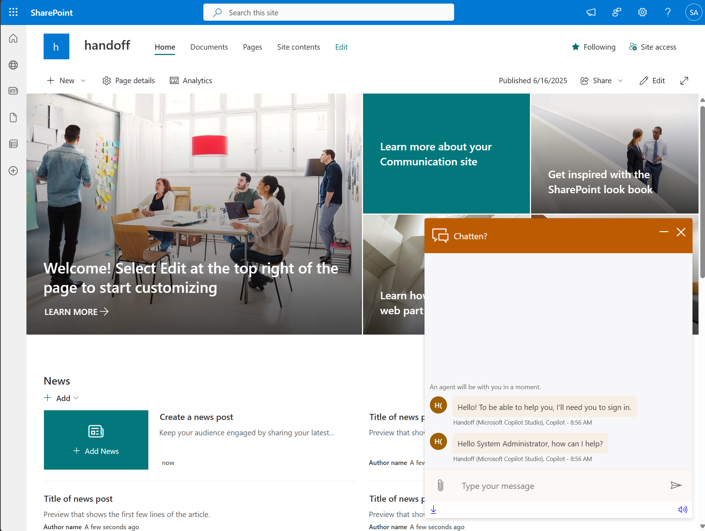

# Dynamics Live Chat SSO Sample

## Summary

This sample contains a SharePoint webpart that implements SSO for Copilot Studio based agents within Dynamics Customer Service (Omnichannel). While the sample is a Sharepoint component, this also demonstrates more generally how to set-up SSO when combining a Copilot Studio agent that requires authentication with Dynamics Customer Service.
The scenario that is implemented is described here on [Microsoft Learn](https://learn.microsoft.com/en-us/dynamics365/customer-service/develop/pass-auth-token-sso-live-chat).

To keep it simple, the default Dynamics chat widget is used, but the same principle can be applied with the more advanced options as described [here](https://learn.microsoft.com/en-gb/dynamics365/customer-service/develop/develop-live-chat-widget).

## How it works
The webpart has 2 aspects to make the SSO work, both can be found in the `src/webparts/dynamicsLiveChatSso/utils` folder:
- chat.ts: renders the out of the box dynamics chat widget and has a function for providing custom styling to the chat widget. Furthermore, it has a listener that intercepts the sign in request card from Copilot Studio, upon receiving this card, the code will silently request a token using msal.ts. For the logic for this, see: [Pass auth token](https://learn.microsoft.com/en-us/dynamics365/customer-service/develop/pass-auth-token-sso-live-chat).
- msal.ts: uses MSAL to acquire a token for copilot studio silently for the end-user, this way enabling SSO. Msal is used as the user is logged into SharePoint in this scenario. However, if your website/app uses another IdP, you can also use that to get the token in the background.

## Prerequisites
- Configure user authentication with Entra ID in Copilot Studio, following these docs [End user auth with Entra ID](https://learn.microsoft.com/en-us/microsoft-copilot-studio/configuration-authentication-azure-ad?tabs=fic-auth).
- Configure a "canvas" app registration for SSO with Copilot Studio, see [Canvas app registration](https://learn.microsoft.com/en-us/microsoft-copilot-studio/configure-sso?tabs=webApp#create-app-registrations-for-your-custom-website). Make sure to add the Sharepoint site URL where you want to deploy the bot as a redirect URI.
- Set-up the handoff to the dynamics engagement hub in copilot studio [Docs](https://learn.microsoft.com/en-us/microsoft-copilot-studio/configuration-hand-off-omnichannel?tabs=webApp).
- Set-up the workstream and make sure the handoff works properly without SSO!

## Set-up the component
After going through all the prerequisites, you can set-up the component. To make sure everything works as expected, run the component locally before deploying.

### Run locally
1. Follow the steps in these docs to set-up your dev environment for Sharepoint webparts: https://learn.microsoft.com/en-us/sharepoint/dev/spfx/set-up-your-development-environment.
2. Open the `config/serve.json` file and replace the `initialPage` value with your target Sharepoint site. Make sure to replace `{YOUR_SHAREPOINT_SITE}` with your entire site, not just the base url.
3. Run `npm install` in the current folder (DynamicsLiveChatSSO).
4. Run `gulp serve` in the the current folder (DynamicsLiveChatSSO). This will open your target Sharepoint site, which will read the component from your local machine, allowing you to test it.
5. Fill in the variables according to the table below. Then the chat widget should appear.
6. (optional) To customize styling, you can modify the chat.ts file in the `src/webparts/dynamicsLiveChatSso/utils` folder. Starting at line 113.

### Filling in the variables
There are two sections of variables to fill, one related to copilot studio, one related to the chat widget of dynamics.

#### Copilot studio related variables
| Variable    | Description                                               |
| ----------- | ------------------------------------------------------- |
| Application ID | Client ID of the canvas app registration for copilot studio |
| Redirect URI | The site URL of the Sharepoint site. |
| Tenant ID | Tenant ID of the canvas app registration for copilot studio |
| Copilot Studio custom scope | The full name of the custom API scope exposed by the copilot studio agent app registration. |

#### Chat widget related variables
The values for these variables can most easily be found by going to the admin center of dynamics customer service, locating the workstream with the configured live chat widget. Then you can copy the live chat widget script, this script contains all the values for the variables listed below.

| Variable    | Description                                               |
| ----------- | ------------------------------------------------------- |
| Dynamics App ID | data-app-id of the script mentioned. |
| Dynamics LWC version | data-lcw-version |
| Dynamics org ID | data-org-id |
| Dynamics org URL | data-org-url |

### Deploy to Sharepoint
If everything runs fine locally, you can deploy the webpart to Sharepoint. To deploy it, you can follow the instructions listed [here](https://learn.microsoft.com/en-us/sharepoint/dev/spfx/web-parts/get-started/hosting-webpart-from-office-365-cdn). You should then see something like the image below:

