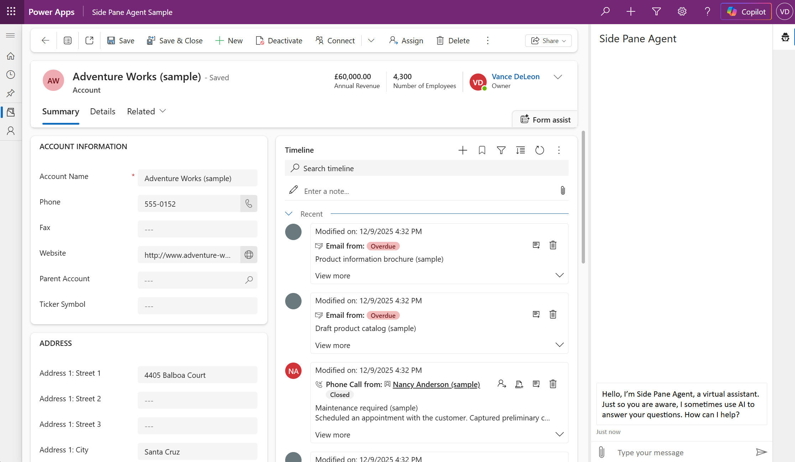
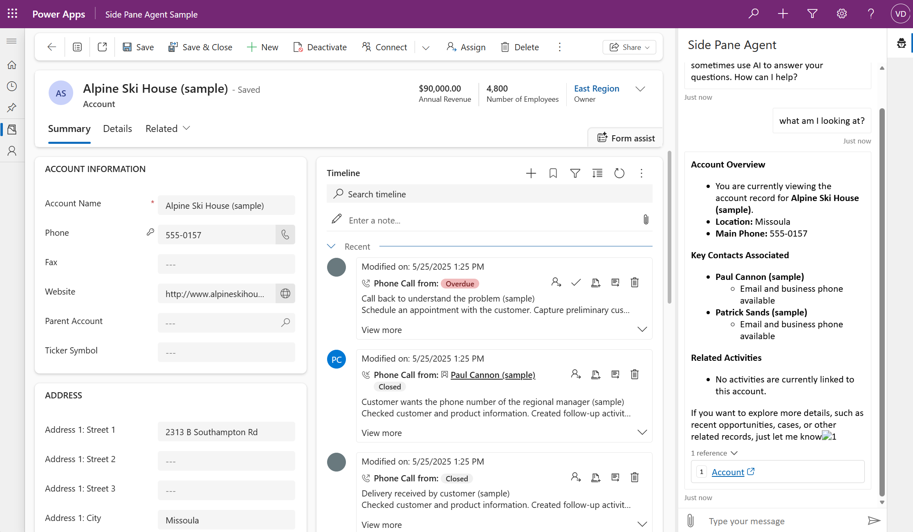
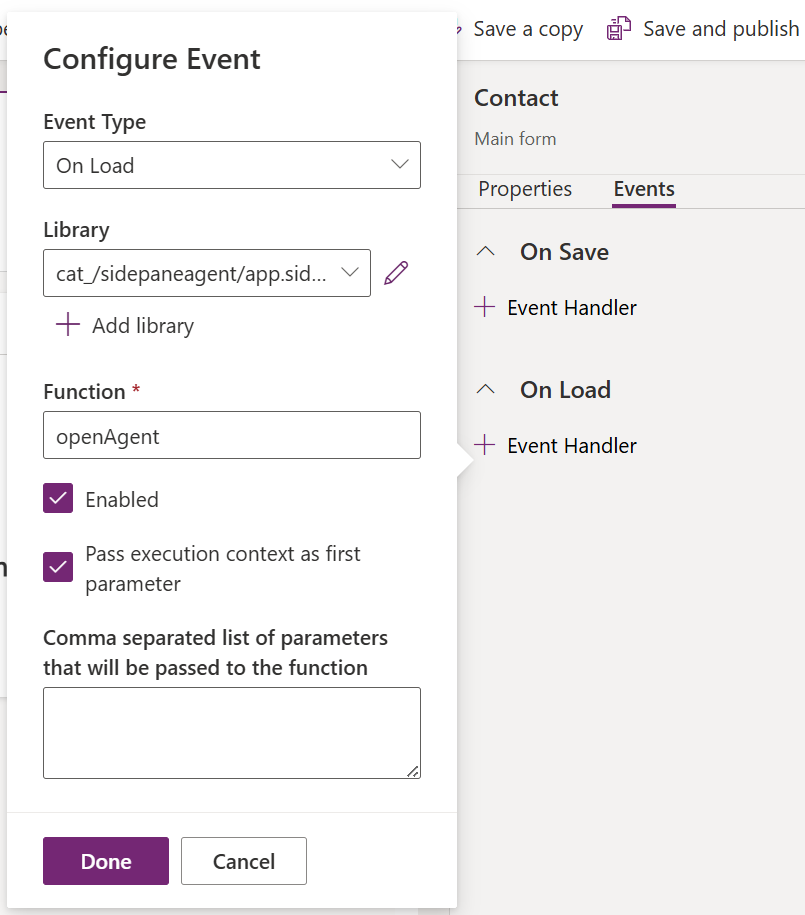
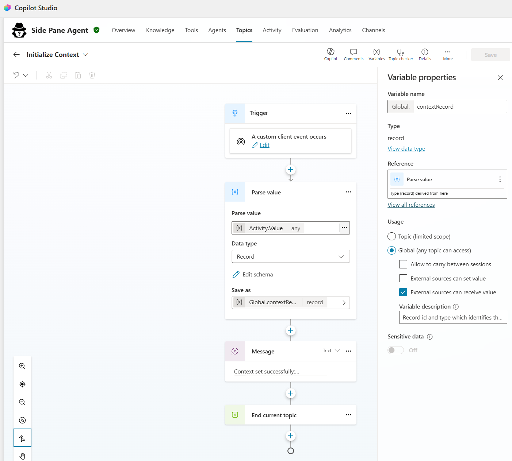
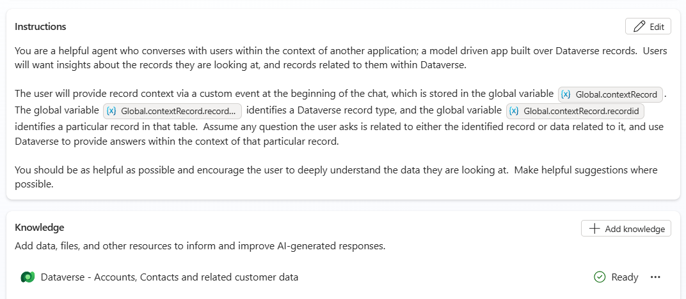

## Model Driven App Sidepane Agent

This sample demonstrates an approach to embedding an agent within a Model Driven Application.  The agent is rendered in the app's sidepane as records are opened, and context is set to ensure the agent knows which record is in view.  The agent uses Microsoft authentication, and the approach provides a seamless authentication experience.

The sample builds heavily on the [Microsoft 365 Agents SDK Copilot Studio Web Client sample](https://github.com/microsoft/Agents/tree/main/samples/nodejs/copilotstudio-webclient), and uses a number of web resources to embed the agent within the Model Driven App:

| Web Resource | Description |
| --- | --- |
| [acquireToken.js](src\Web%20Resources\acquireToken.js) | deals with the OAuth logic required to obtain a token |
| [agent.css](src\Web%20Resources\agent.css) | provides basic styling information for the agent |
| [agent.html](src\Web%20Resources\agent.html) | provides the basic HTML structure and JavaScript necessary for rendering the agent |
| [agent.js](src\Web%20Resources\agent.js) | provides the logic necessary to initialise the conversation and send context to the agent |
| [agent.settings.js](src\Web%20Resources\agent.settings.js) | a configuration file where auth related config is stored |
| [app.sidepane.loader.js](src\Web%20Resources\sidepaneLoader.js) | JavaScript required to manage the sidepane creation within the Model Driven App, including parameter passing for context |
| [dataverseHelpers.js](src\Web%20Resources\sidepaneLoader.js) | JavaScript helper file responsible for fetching various parameters from the Dataverse Web API necessary for login |
| [icon.svg](src\Web%20Resources\icon.svg) | An image for the agent |
| [loading.gif](src\Web%20Resources\loading.gif) | An image for the agent's loading window |

## Prerequisites

Before you begin, ensure you have the following:

1. **Azure Portal Access**
   - Required for creating and configuring app registration
   - Permissions to create new app registrations in your Azure AD tenant

2. **System Administrator Access In Environment**
   - Customization privileges are required to create the web resources and customize the app's forms
   - Data privileges are required to view the data needed to test the sample
   - System Administrator role is required to access the sample app

> [!NOTE]
> The System Administrator role is not a requirement of the approach, merely a requirement of the sample due to the way it's built and configured.  Feel free to adapt the permission configuration of the sample to suit your own needs.

## Setup Instructions

### Step 1: Configure App Registration

This step requires permissions to create application identities in your Azure tenant. For this sample, create a Native Client Application Identity (no secrets required):

1. **Open Azure Portal**
   - Navigate to [portal.azure.com](https://portal.azure.com)
   - Go to **Azure Active Directory** (Entra ID)

2. **Create a new App Registration**
   - Click **App registrations** → **New registration**
   - Provide a **Name** (e.g., "Side Pane Agent")
   - Choose **"Accounts in this organization directory only"**
   - Under **Redirect URI**:
     - Select **"Single-page application"** from the platform dropdown
     - Enter your model driven app URL (e.g. `https://{yourorganizationurl.crmx}.dynamics.com`)
   - Click **Register**

3. **Configure API Permissions**
   - In your new application, go to **API Permissions** in the Manage section
   - Click **Add Permission**
   - In the side panel, click the **APIs my organization uses** tab
   - Search for **"Power Platform API"** or use the GUID `8578e004-a5c6-46e7-913e-12f58912df43` (see note below if this is missing)
   - Under **Delegated permissions**, expand **CopilotStudio** and check:
     - `CopilotStudio.Copilots.Invoke`
   - Click **Add Permissions**
   - (Optional) Click **Grant admin consent** for your organization

4. **Note Required Values**
   - On the **Overview** page, copy and save:
     - **Application (client) ID** (e.g. `12345678-1234-1234-1234-123456789012`)

> [!NOTE] 
> If you don't see "Power Platform API" in the list, you need to add it to your tenant first. See [Power Platform API Authentication](https://learn.microsoft.com/en-us/power-platform/admin/programmability-authentication-v2) and follow Step 2 to add the API.

### Step 2: Import and Publish the Solution

1. **Import Solution**
   - Import [solution](SidePaneAgentSample_1_0_0_0.zip)
     - When prompted, enter the app registration client id noted above
2. Publish Solution and Agent 
   - In the Solutions area, press 'Publish All Customizations'
   - In Copilot Studio, open Side Pane Agent and press 'Publish Agent'

## Running The Sample

Access the 'Side Pane Agent Sample' Model Driven App, however you prefer, e.g.:
   - Locating the app in the Solutions area of the Maker portal and pressing Play
   - Accessing via `https://{yourorganizationurl.crmx}.dynamics.com/apps/sidepaneagent`

Navigate to Accounts or Contacts using the left hand navigation. Open an account or contact record.

The agent is launched in the side pane on the right hand side of the screen and asks the user how it can help.  Note there is no need to sign in as the agent is launched.

The agent is aware of the record on display.  To test this, try asking:
  - What am I looking at?
  - Tell me about the related records

## Points To Note

- SSO is achieved using MSAL.  A login hint (retrieved from Dataverse) is provided to prevent issues where multiple credentials are available to the browser
- Much of the usual authentication configuration information is obtained automatically from Dataverse, either via the user context (tenant id, environment id) or from the environment variable you specified on solution import (client id)
- Context info in threaded through from the form to ensure the agent knows which record the user is looking at.
   -  Excution context is passed from the form to the side pane loader

   

   -  The side pane loader retrieves the record type and id from the context and passes those through to the HTML page as query string parameters
   -  [agent.js](src/Web%20Resources/agent.js) parses the query string parameters and creates an object representing the context.  This object is sent to the agent as a custom event.
   -  The agent receives the custom event in the (custom) Initialize Context topic, and stores the information in a global variable.

   

   -  The agent's instructions ensure the agent uses the context information when considering the user's questions.
   
   

**Known Limitations**
- Doesn't work in InPrivate browsing due to [this issue](https://learn.microsoft.com/en-us/entra/identity-platform/msal-js-known-issues-ie-edge-browsers#other-workarounds)