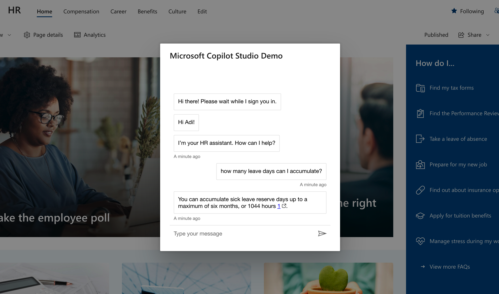

 # SharePoint SSO Component

This code sample demonstrates how to create a SharePoint SPFx component which is a wrapper for a copilot, created with Microsoft Copilot Studio. The SPFx component included in the sample supports SSO, providing seamless authentication for users interacting with the copilot.

> [!IMPORTANT]
> **Copilot Studio agents can now be published directly to SharePoint websites.**  
> To use a Copilot Studio agent in SharePoint, **one** of the following conditions must be met:
> 
> - The SharePoint user has an **M365 Copilot license**, **OR**
> - **Both** of the following are true:
>   - **SharePoint Pay As You Go (PayG)** is enabled in the **Microsoft Admin Center (MAC)** for the user's tenant, **and**
>   - A **billing capability** (either **prepaid messages** or **PayG**) is configured for the agent's environment in the **Power Platform Admin Center (PPAC)**.
> 
> 👉 Learn more: [Add a Copilot Studio bot to SharePoint](https://learn.microsoft.com/en-us/microsoft-copilot-studio/publication-add-bot-to-sharepoint)

## Getting Started

1. Create an app registration in Azure and configure authentication settings for your copilot in Copilot Studio
2. Create an app registration for your SharePoint site
3. Clone this repo and cd into the SharePointSSOComponent folder
4. Install the dependencies and build the component:

    ```shell
    npm install
    gulp bundle --ship
    gulp package-solution --ship
    ```


4. Upload the component to your tenant app catalog and enable on your site

For more detailed instructions, please refer to the [step-by-step setup guide](./SETUP.md).

## The Deployed Component



