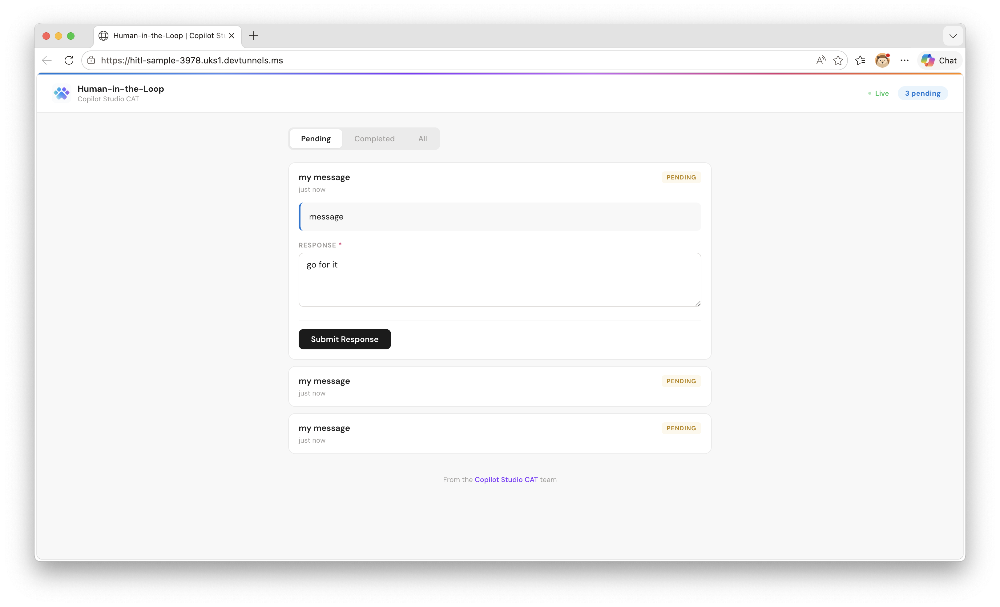
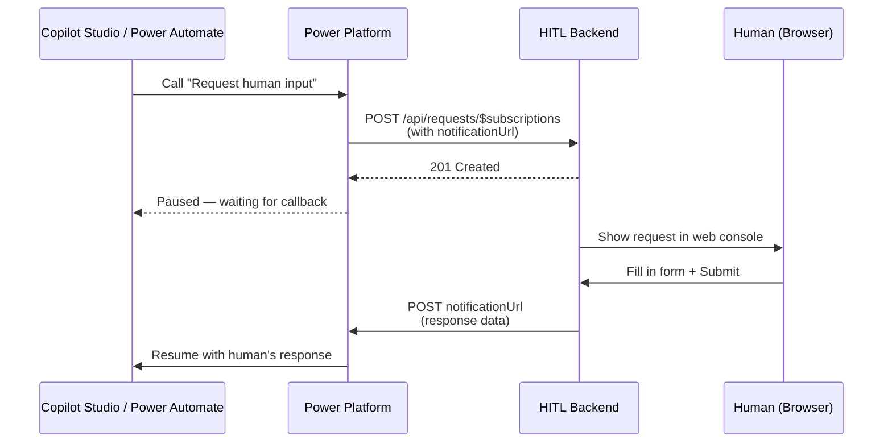

# Human-in-the-Loop Custom Connector

A custom connector that pauses a Copilot Studio agent or Power Automate flow and waits for a human to respond via a web console. When the human submits their response, the agent or flow resumes with the data.



## Overview

This sample demonstrates an undocumented Power Platform connector pattern: using `x-ms-notification-url` **without** `x-ms-trigger` to create a **webhook action** — an action that pauses a flow mid-execution and waits for an external callback, the same pattern used by the Teams "Post adaptive card and wait for a response" action.

The solution includes:
1. **Custom Connector** with the webhook action pattern and an environment variable for the host URL
2. **Node.js Backend** that receives requests, presents them in a web console, and calls back when a human responds
3. **Power Platform Solution** (importable `.zip`) containing the connector and environment variable



## Key Discovery: Webhook Actions

The standard Power Platform documentation only covers webhook **triggers** (`x-ms-trigger: single`), which start new flow runs. This sample uses an undocumented pattern to create webhook **actions** that pause flows:

| | Webhook Trigger | Webhook Action (this sample) |
|---|---|---|
| Annotation | `x-ms-trigger: single` | No `x-ms-trigger` |
| `x-ms-notification-url` | Yes | Yes |
| `x-ms-notification-content` | Yes | Yes |
| Behavior | Starts a **new** flow run | **Pauses** the current flow |
| PA action type | `ApiConnectionNotification` | `OpenApiConnectionWebhook` |

This is the same pattern used internally by the Teams connector's "Post adaptive card and wait for a response" action.

## Prerequisites

- **Node.js 18+**
- **devtunnel CLI** — `brew install devtunnel` ([docs](https://learn.microsoft.com/azure/developer/dev-tunnels/get-started))
- A **Power Platform environment** with Copilot Studio

## Quick Start

### 1. Start the backend

```bash
./setup.sh
```

This installs dependencies, creates a dev tunnel, starts the server, and prints the tunnel host URL.

### 2. Import the solution

1. Go to [make.powerapps.com](https://make.powerapps.com) → Solutions → Import
2. Upload `solution/customHIL_1_0_0_3.zip`
3. When prompted, set the **HitlHostUrl** environment variable to the tunnel host URL from step 1

### 3. Use the connector

**In Copilot Studio:** Add the "Human-in-the-Loop" connector as an action in your agent.

**In Power Automate:** Add the "Request human input and wait for a response" action to your flow. The flow pauses until the human responds.

### 4. Respond

Open the tunnel URL in a browser to see the web console. Pending requests appear automatically. Fill in the form and click Submit — the agent or flow resumes with your response.

## How It Works

### The Webhook Action Pattern

The connector's OpenAPI definition uses three annotations that together create a webhook action:

```yaml
paths:
  /api/requests/$subscriptions:
    x-ms-notification-content:         # Schema of the callback payload
      schema:
        type: object
        properties:
          responseText:
            type: string
          # ...
    post:
      # No x-ms-trigger — this makes it an ACTION, not a trigger
      parameters:
        - name: body
          schema:
            properties:
              notificationUrl:
                type: string
                x-ms-notification-url: true    # Platform injects callback URL here
                x-ms-visibility: internal
              body:
                # ... user-visible fields
      responses:
        '201':
          description: Created
```

When Power Platform calls this action:
1. It generates a callback URL and injects it into `notificationUrl`
2. The backend returns **201 Created** with a `Location` header
3. The flow **pauses** (dehydrates) — no polling, no resources consumed
4. When the backend POSTs to `notificationUrl`, the flow **resumes** with the response data

### Environment Variable for Host URL

The connector uses `@environmentVariables("cat_HitlHostUrl")` for the host, so the URL is set at solution import time — no need to edit the connector after import.

### Server Endpoints

| Method | Path | Purpose |
|--------|------|---------|
| `POST` | `/api/requests/$subscriptions` | Receives request from connector, returns 201 |
| `GET` | `/api/requests?status=pending` | Lists requests for the web console |
| `POST` | `/api/requests/:id/respond` | Human submits response → POSTs to callback URL |
| `DELETE` | `/api/requests/:id` | Webhook unsubscribe (called by platform on cancel) |

## Project Structure

```
human-in-the-loop/
├── server.js                      # Express backend
├── public/index.html              # Web console UI (CAT-branded)
├── connector/
│   ├── apiDefinition.swagger.json # OpenAPI spec (webhook action pattern)
│   └── apiProperties.json         # Connector metadata
├── solution/
│   ├── customHIL_1_0_0_3.zip     # Importable Power Platform solution
│   └── unpacked/                  # Solution unpacked with pac solution unpack
│       ├── Connectors/            # Connector definition + icon
│       ├── environmentvariabledefinitions/
│       └── Other/                 # Solution.xml, Customizations.xml
├── setup.sh                       # Setup script (tunnel + server)
├── test-local.js                  # Local test (no MCS/PA needed)
└── docs/
    └── console.png                # Screenshot
```

## Local Testing (No Power Platform Required)

```bash
# Terminal 1: Start the backend
npm install && npm start

# Terminal 2: Simulate a connector call
node test-local.js

# Browser: Open http://localhost:3978 — fill in the form and submit
```

The test script starts a mock callback server, sends a sample HITL request, waits for you to respond in the browser, and prints the callback data.

## Input Field Types

The connector supports these form field types via the `inputs` array:

| Type | Renders As | Extra Properties |
|------|-----------|-----------------|
| `text` | Multi-line textarea | `placeholder` |
| `number` | Number input | `placeholder` |
| `date` | Date picker | — |
| `time` | Time picker | — |
| `choiceset` | Dropdown or checkboxes | `items[]`, `isMultiSelect` |

All types support `id` (required), `title`, and `isRequired`.

## Production Considerations

This is a sample. For production use, consider:

- **Persistent storage** — replace the in-memory Map with a database
- **Authentication** — add OAuth or API key to the connector and web console
- **Authorization** — validate that the person responding is authorized
- **Notifications** — push alerts when new requests arrive
- **HTTPS hosting** — deploy to Azure App Service, Container Apps, etc.
- **Retry logic** — handle callback failures with retries
