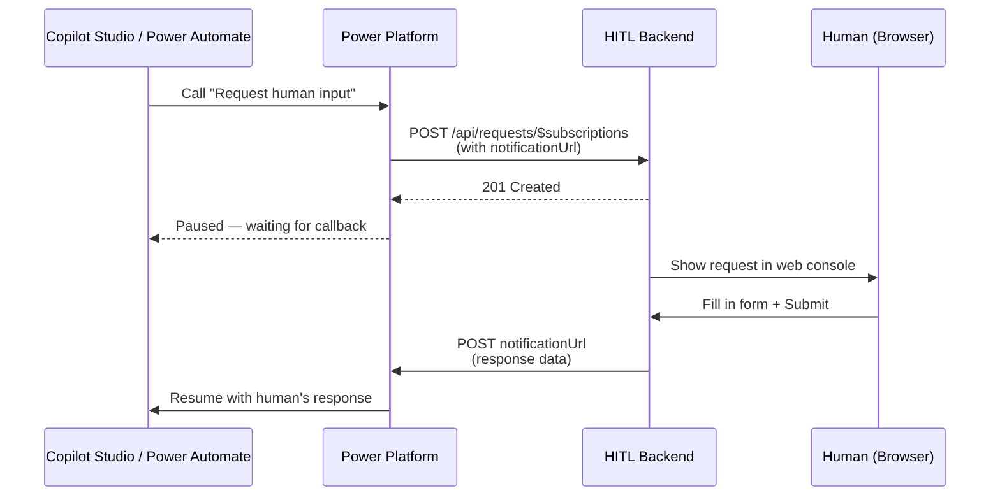
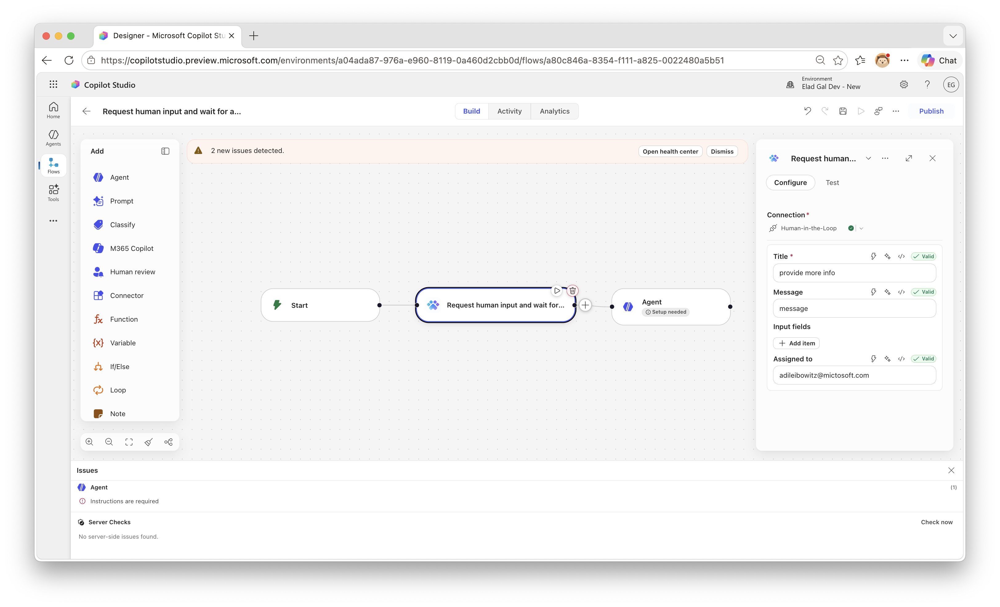

# Human-in-the-Loop Custom Connector

A custom connector that pauses a Copilot Studio agent or Power Automate flow and waits for a human to respond via a web console. When the human submits their response, the agent or flow resumes with the data.


## Overview

This sample shows how to build a custom connector that uses the **webhook action** pattern — the same pattern used by the Teams "Post adaptive card and wait for a response" action. When a flow or agent calls this connector, execution pauses until a human responds through the web console.

The solution includes:
- **Custom Connector** — a Power Platform solution with the connector and an environment variable for the host URL
- **Node.js Backend** — receives requests from the connector, presents them in a web console, and calls back when a human responds



## Prerequisites

- **Node.js 18+**
- **devtunnel CLI** — [Install instructions](https://learn.microsoft.com/azure/developer/dev-tunnels/get-started)
- A **Power Platform environment** with Copilot Studio

## Setup

### Step 1: Start the backend

```bash
node setup.js
```

The script installs dependencies, creates a public dev tunnel, starts the server, and prints the tunnel host URL. Keep it running.

### Step 2: Import the solution

1. Go to [make.powerapps.com](https://make.powerapps.com) → **Solutions** → **Import**
2. Upload `solution/customHIL_1_0_0_3.zip`
3. When prompted, set the **HitlHostUrl** environment variable to the tunnel host URL printed by the script (e.g. `hitl-sample-3978.uks1.devtunnels.ms`)

### Step 3: Create a flow using the connector

1. In Copilot Studio, create a new topic
2. Add the **Human-in-the-Loop** connector as an action
3. Configure the action with a title, message, and optionally assign it to someone



### Step 4: Test it

1. Trigger the agent or flow — it will pause at the "Request human input" step
2. Open the tunnel URL in a browser to see the web console
3. The request appears in the console — fill in the form and click **Submit Response**
4. The agent or flow resumes with the human's response

## How the Webhook Action Pattern Works

The connector uses `x-ms-notification-url` in its OpenAPI definition to create a webhook action. When Power Platform calls the connector:

1. The platform generates a callback URL and injects it into the `notificationUrl` field
2. The backend stores the request and returns **201 Created**
3. The flow **pauses** — it dehydrates and consumes no resources while waiting
4. When the human responds, the backend POSTs to `notificationUrl`
5. The flow **resumes** with the response data from `x-ms-notification-content`

The key part of the OpenAPI definition:

```yaml
/api/requests/$subscriptions:
  x-ms-notification-content:
    description: Human's response
    schema:
      type: object
      properties:
        responseText:
          type: string
  post:
    operationId: RequestHumanInput
    parameters:
      - name: body
        schema:
          properties:
            notificationUrl:
              type: string
              x-ms-notification-url: true
              x-ms-visibility: internal
            body:
              # ... user-visible fields (title, message, inputs)
    responses:
      '201':
        description: Created
```

The `DELETE /api/requests/{id}` endpoint handles webhook unsubscribe when a flow is cancelled.

## Project Structure

```
human-in-the-loop/
├── server.js                      # Express backend
├── public/index.html              # Web console UI
├── connector/
│   ├── apiDefinition.swagger.json # OpenAPI definition
│   └── apiProperties.json         # Connector metadata
├── solution/
│   ├── customHIL_1_0_0_3.zip     # Importable Power Platform solution
│   └── unpacked/                  # Unpacked with pac solution unpack
├── setup.js                       # Setup script (cross-platform)
├── test-local.js                  # Local test harness
└── docs/
    ├── console.png                # Console screenshot
    └── flow.png                   # Flow screenshot
```

## Local Testing (No Power Platform Required)

```bash
# Terminal 1: Start the backend
npm install && npm start

# Terminal 2: Simulate a connector call
node test-local.js

# Browser: Open http://localhost:3978
```

The test script starts a mock callback server, sends a sample request, and waits for you to respond in the browser.

## Production Considerations

This is a sample. For production use, consider:

- **Persistent storage** — replace the in-memory Map with a database
- **Authentication** — add OAuth or API key to the connector and web console
- **Authorization** — validate that the person responding is authorized
- **Notifications** — push alerts when new requests arrive
- **HTTPS hosting** — deploy to Azure App Service, Container Apps, etc.
