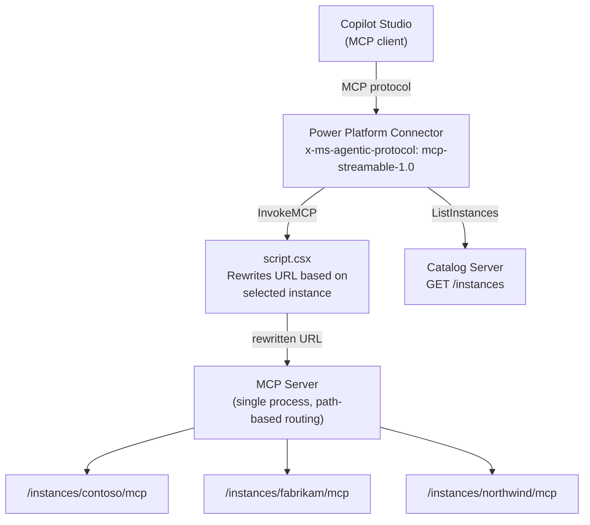

# Dynamic MCP Routing

A Power Platform connector that routes MCP Streamable HTTP traffic to one of several MCP server instances, selected at configuration time via a dropdown. Demonstrates how to use a catalog service, `x-ms-dynamic-values`, `x-ms-agentic-protocol`, and a `script.csx` URL rewriter to give a single connector access to multiple independent MCP servers.

## Architecture



**Three components:**

1. **Catalog server** (`src/catalog/`) — REST endpoint returning a list of MCP server instances with their endpoint URLs. The connector's `ListInstances` operation hits this to populate the instance dropdown.

2. **MCP server** (`src/mcp-server/`) — Single Express server hosting multiple independent MCP servers at `/instances/:id/mcp`. Each instance advertises its own tools (`list_projects`, `get_project_details`) with instance-specific data. Stateless: a fresh `Server` + `StreamableHTTPServerTransport` is created per request.

3. **Power Platform connector** (`connector/`) — Swagger definition with two operations:
   - `ListInstances` (internal, for dropdown) — calls the catalog
   - `InvokeMCP` — annotated with `x-ms-agentic-protocol: mcp-streamable-1.0`, with an `instanceUrl` parameter populated via `x-ms-dynamic-values`
   - `script.csx` rewrites the `InvokeMCP` request URL from the catalog host to the selected instance's MCP endpoint

## How It Works

### 1. Instance Discovery

The connector's `InvokeMCP` parameter uses `x-ms-dynamic-values` to call `ListInstances`, which returns instances with their `mcpUrl`:

```json
[
  { "id": "contoso", "name": "Contoso", "mcpUrl": "https://host/instances/contoso/mcp" },
  { "id": "fabrikam", "name": "Fabrikam", "mcpUrl": "https://host/instances/fabrikam/mcp" }
]
```

The agent builder picks an instance from the dropdown when adding the connector action.

### 2. URL Rewriting

The swagger `host` points at the catalog server. When Copilot Studio calls `InvokeMCP`, `script.csx` intercepts the request, reads the `instanceUrl` query parameter, and rewrites the full URL (scheme, host, port, path) to the selected instance's MCP endpoint:

```csharp
var targetUri = new Uri(instanceUrl);
var builder = new UriBuilder(Context.Request.RequestUri)
{
    Scheme = targetUri.Scheme,
    Host = targetUri.Host,
    Port = targetUri.Port,
    Path = targetUri.AbsolutePath
};
```

### 3. MCP Protocol

Each instance endpoint is a fully independent MCP server. Copilot Studio handles the MCP protocol (`initialize`, `tools/list`, `tools/call`) natively. The mock data includes three fictional organizations with project portfolio data.

## Sample Structure

```
dynamic-mcp-routing-typescript/
├── src/
│   ├── catalog/
│   │   └── index.ts          # Catalog REST server
│   └── mcp-server/
│       ├── index.ts           # Multi-instance MCP server
│       └── data.ts            # Mock instances, projects, details
├── connector/
│   ├── apiDefinition.swagger.json  # Swagger with x-ms-agentic-protocol
│   ├── apiProperties.json          # No connection parameters
│   └── script.csx                  # URL rewriter for dynamic routing
├── scripts/
│   ├── deploy.sh             # One-step deploy for macOS / Linux
│   └── deploy.ps1            # One-step deploy for Windows
├── package.json
├── tsconfig.json
└── README.md
```

## Quick Start

### Prerequisites

- [Node.js 18+](https://nodejs.org/)
- [Dev Tunnels CLI](https://learn.microsoft.com/azure/developer/dev-tunnels/get-started)
- [paconn CLI](https://learn.microsoft.com/connectors/custom-connectors/paconn-cli) (`pip install paconn`)
- A [Power Platform environment](https://admin.powerplatform.microsoft.com/) with Copilot Studio access

### 1. Install and Build

```bash
npm install
npm run build
```

### 2. Start Servers

In two terminals:

```bash
# Terminal 1 — Catalog server (port 3000)
npm run start:catalog

# Terminal 2 — MCP server (port 3001)
npm run start:mcp
```

### 3. Create Dev Tunnels

**Using the CLI:**

```bash
devtunnel host -p 3000 -p 3001 --allow-anonymous
```

This outputs two URLs like:

```
https://abc123-3000.euw.devtunnels.ms   (catalog)
https://abc123-3001.euw.devtunnels.ms   (MCP)
```

Restart the catalog server with the MCP tunnel URL:

```bash
MCP_SERVER_BASE=https://abc123-3001.euw.devtunnels.ms npm run start:catalog
```

### 4. Deploy the Connector

Update `connector/apiDefinition.swagger.json` — set `host` to your catalog tunnel hostname (e.g. `abc123-3000.euw.devtunnels.ms`), then:

```bash
python3 -m paconn login
python3 -m paconn create \
  -e YOUR_ENVIRONMENT_ID \
  -d connector/apiDefinition.swagger.json \
  -p connector/apiProperties.json \
  -x connector/script.csx
```

Or use the one-step deploy script that handles login, servers, tunnel, and connector deployment:

**Bash (macOS / Linux):**

```bash
./scripts/deploy.sh YOUR_ENVIRONMENT_ID [TENANT_ID]
```

**PowerShell (Windows):**

```powershell
.\scripts\deploy.ps1 -EnvironmentId YOUR_ENVIRONMENT_ID [-TenantId TENANT_ID]
```

### 5. Configure Copilot Studio

1. Open your agent in [Copilot Studio](https://copilotstudio.microsoft.com/)
2. Go to **Tools** > **Add tool** > filter by **Model Context Protocol**
3. Search for "Dynamic MCP Connector" and add it
4. Under **Inputs**, select an instance from the **Instance** dropdown (e.g. "Contoso", "Fabrikam", "Northwind")
5. The **Tools** section will populate with the MCP tools for the selected instance — tools won't appear until you pick an instance
6. Click **Save**

## Example Queries

Once the connector is added to an agent:

- "What projects are available?" — calls `list_projects`
- "Show me the details for the ERP rollout" — calls `get_project_details` with `projectId: "erp-rollout"`
- "What are the risks on the supply chain project?" — calls `get_project_details` for Fabrikam

## Development

**Add a new instance:** Add an entry to the `instances` array in `src/mcp-server/data.ts` and `src/catalog/index.ts`, along with its projects and details.

**Add a new tool:** Register additional tools in the `createServer` function in `src/mcp-server/index.ts` using `ListToolsRequestSchema` and `CallToolRequestSchema` handlers.

**Remove dynamic routing:** If you only need a single MCP server, simplify by removing the catalog server and `script.csx`, and point the swagger `host` directly at the MCP server.

## Resources

- [Model Context Protocol](https://modelcontextprotocol.io/)
- [MCP TypeScript SDK](https://github.com/modelcontextprotocol/typescript-sdk)
- [MCP in Copilot Studio](https://learn.microsoft.com/microsoft-copilot-studio/mcp-overview)
- [Dev Tunnels](https://learn.microsoft.com/azure/developer/dev-tunnels/)
- [Custom Connector CLI (paconn)](https://learn.microsoft.com/connectors/custom-connectors/paconn-cli)
- [`x-ms-agentic-protocol`](https://learn.microsoft.com/connectors/custom-connectors/mcp-overview)
