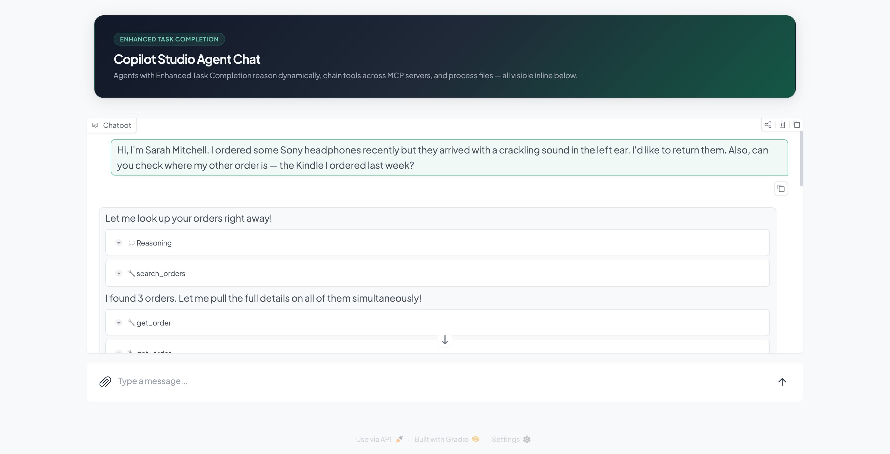
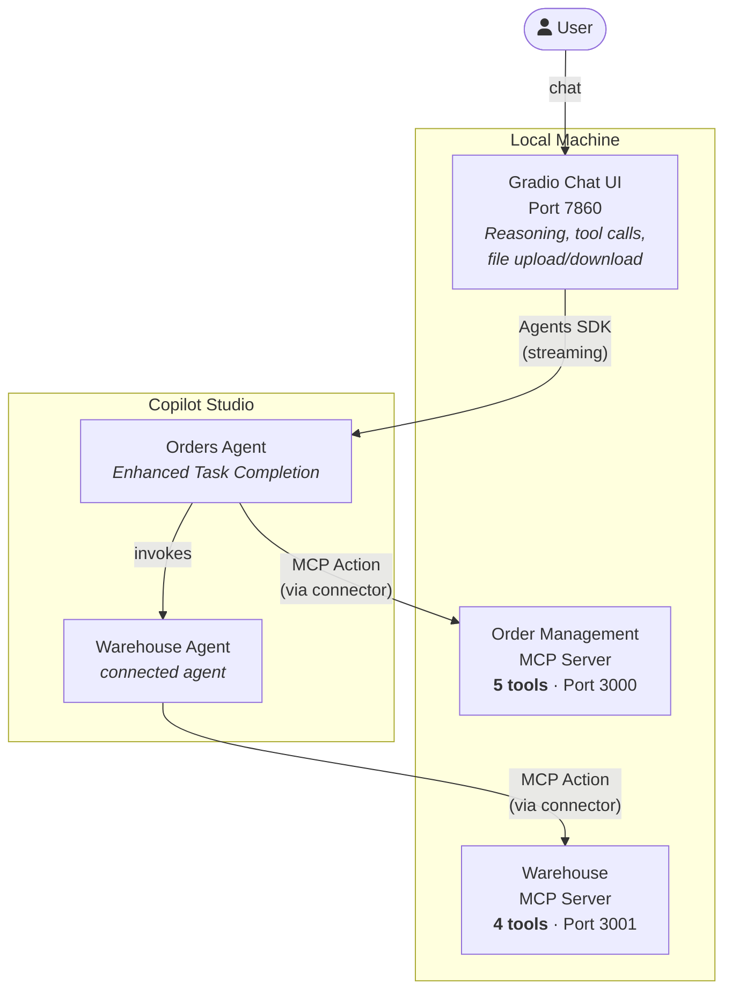

# Order Management with Enhanced Task Completion

{: .warning }
> **Experimental feature.** Enhanced Task Completion is an experimental capability in Copilot Studio. See the [official documentation](https://github.com/microsoft/Agents/blob/main/docs/enhanced-task-completion.md) for current status and limitations.

An end-to-end sample demonstrating Copilot Studio agents with [**Enhanced Task Completion**](https://github.com/microsoft/Agents/blob/main/docs/enhanced-task-completion.md) calling MCP servers for e-commerce order management and warehouse fulfillment, with a **Gradio chat UI** that renders tool calls, reasoning, and file attachments inline.

## What is Enhanced Task Completion?

Enhanced Task Completion shifts Copilot Studio from a "plan-then-execute" model to an adaptive, conversational approach. Instead of selecting all tools upfront, the agent:

- **Reasons before acting** — asks clarifying questions and gathers context before calling tools
- **Orchestrates tools dynamically** — recognizes dependencies between tool outputs, parallelizes independent calls, and adjusts strategy based on intermediate results
- **Interleaves conversation and actions** — fluidly mixes questions, tool calls, and responses across multiple turns
- **Recovers from failures** — retries or finds alternative approaches when tool calls fail

This sample demonstrates all of these capabilities through a realistic e-commerce customer service scenario where the agent chains 9 tools across two MCP servers and a connected agent to answer complex multi-part questions.



## What's Included

### Orders Agent (Copilot Studio)

The primary agent with Enhanced Task Completion enabled. Handles customer inquiries by dynamically chaining tools from the Order Management MCP server. When a question involves inventory or fulfillment, it delegates to the Warehouse Agent as a connected agent.

### Warehouse Agent (Copilot Studio)

A connected agent invoked by the Orders Agent for warehouse and fulfillment queries. Calls tools from the Warehouse MCP server to check stock levels, track fulfillment pipeline stages, find alternative products, and look up restock dates.

### Order Management MCP Server (5 tools)

Node.js [Streamable HTTP](https://modelcontextprotocol.io/specification/2025-03-26/basic/transports#streamable-http) server with interdependent tools for e-commerce order operations:

| Tool | Input | Purpose |
|---|---|---|
| `search_orders` | Customer name/email/order# | Entry point — find orders |
| `get_order` | order_id | Full order details + line items |
| `get_shipment` | order_id | Tracking info (shipped/delivered only) |
| `request_return` | order_id, item_skus[], reason | Initiate a return |
| `get_return_status` | return_id | Check return progress |

### Warehouse MCP Server (4 tools)

Node.js Streamable HTTP server with interdependent tools for warehouse and fulfillment:

| Tool | Input | Purpose |
|---|---|---|
| `check_stock` | SKU | Inventory levels + warehouse location |
| `get_fulfillment_status` | order_id | Pipeline stage (received → shipped) |
| `find_alternatives` | SKU | Similar products in stock |
| `get_restock_date` | SKU | Next inbound shipment date |

### Gradio Chat UI

Python frontend that connects to the Orders Agent via the [Microsoft Agents SDK](https://github.com/microsoft/Agents-for-python) and renders the full Enhanced Task Completion activity protocol inline:

- **Reasoning steps** — agent thinking displayed as collapsible accordions
- **Tool calls** — grouped with parameters, duration, and results
- **Intermediate messages** — agent narration between tool call batches
- **File upload/download** — CSV/text files sent as base64 attachments, agent-generated files offered for download
- **MSAL auth** — interactive login with persisted token cache (sign in once)

### Custom Connectors

Power Platform connector definitions (Swagger + apiProperties) that expose each MCP server as an action in Copilot Studio. The connectors use the `x-ms-agentic-protocol: mcp-streamable-1.0` extension to enable native MCP tool discovery.

## Prerequisites

- Node.js 18+
- Python 3.12+
- [Dev Tunnels CLI](https://learn.microsoft.com/en-us/azure/developer/dev-tunnels/get-started) (`devtunnel`)
- A Power Platform environment with Copilot Studio
- An Entra ID app registration with `CopilotStudio.Copilots.Invoke` permission

## Quick Start

### 1. Install dependencies

```bash
node scripts/setup.mjs
```

### 2. Import agents (first time only)

Import `agents/solution/OrderManagementMCPDemo.zip` into your environment via **make.powerapps.com > Solutions > Import**. After import, create connections for each MCP connector from the **Custom connectors** page (no auth — just click **Create**). See [Importing the Agent Solutions](./agents/IMPORT) for details.

### 3. Start MCP servers + tunnels

```bash
node scripts/start.mjs
```

This starts both MCP servers and creates anonymous dev tunnels. Note the tunnel URLs printed:

```
Order Management MCP endpoint: https://xxxxx-3000.uks1.devtunnels.ms/mcp
Warehouse MCP endpoint: https://xxxxx-3001.uks1.devtunnels.ms/mcp
```

### 4. Update connector URLs

Each time you restart (tunnels get new URLs), update the custom connector hosts:

1. Go to **make.powerapps.com** > **Custom connectors**
2. Find **"orders mcp"** > click **Edit** > update the **Host** field with the order tunnel host (e.g., `xxxxx-3000.uks1.devtunnels.ms`) > click **Update connector**
3. Find **"warehouse server 3"** > click **Edit** > update the **Host** field with the warehouse tunnel host (e.g., `xxxxx-3001.uks1.devtunnels.ms`) > click **Update connector**

No need to republish the agents — the connectors are referenced dynamically.

### 5. Start the chat UI

Configure the `.env` file with your agent details (requires an Entra ID App Registration). See [Chat UI Setup](./SETUP) for step-by-step instructions.

```bash
cp chat-ui/.env.sample chat-ui/.env
# Edit chat-ui/.env — see SETUP.md for details
node scripts/start-ui.mjs
```

Open http://localhost:7860 and try one of these:

**Basic order lookup:**
> Hi, I'm Sarah Mitchell. I ordered some Sony headphones recently but they arrived with a crackling sound in the left ear. I'd like to return them.

**Cross-server (orders + warehouse):**
> I'm James Rivera. My Nintendo Switch order hasn't shipped yet. When can I expect it? If it's not available, what are my options?

**File upload — populate a CSV:**
> Upload `chat-ui/data/demo-orders.csv` and ask: "Fill in all the empty columns for each order and return the completed CSV."

## Architecture


