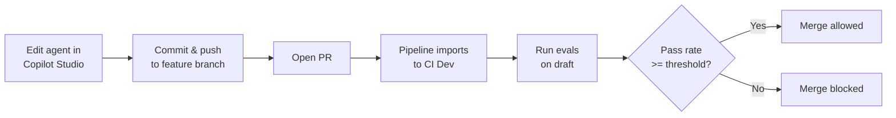
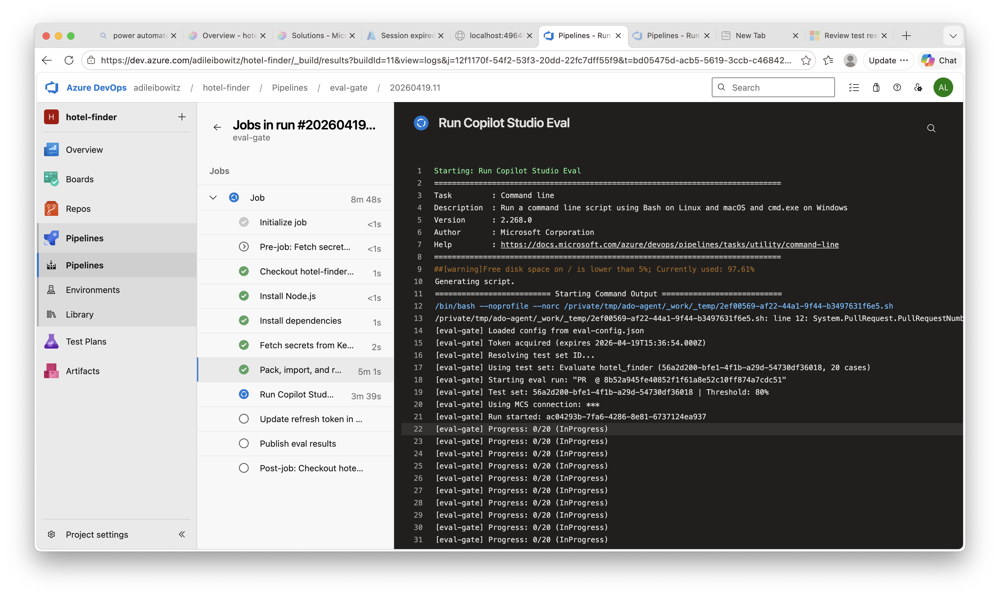
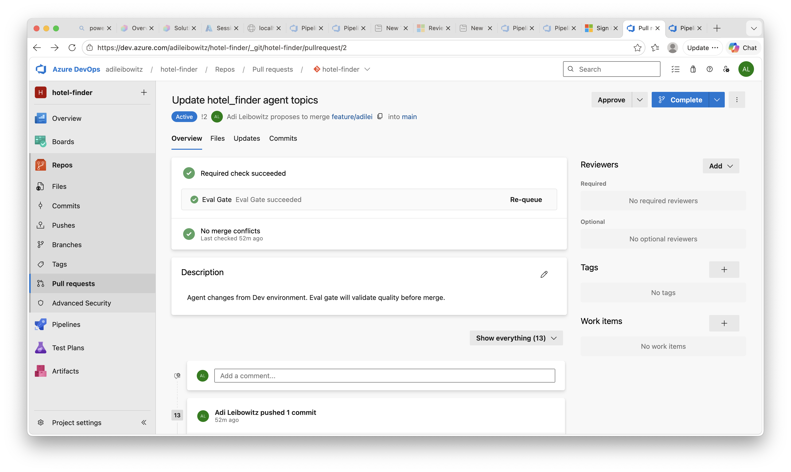
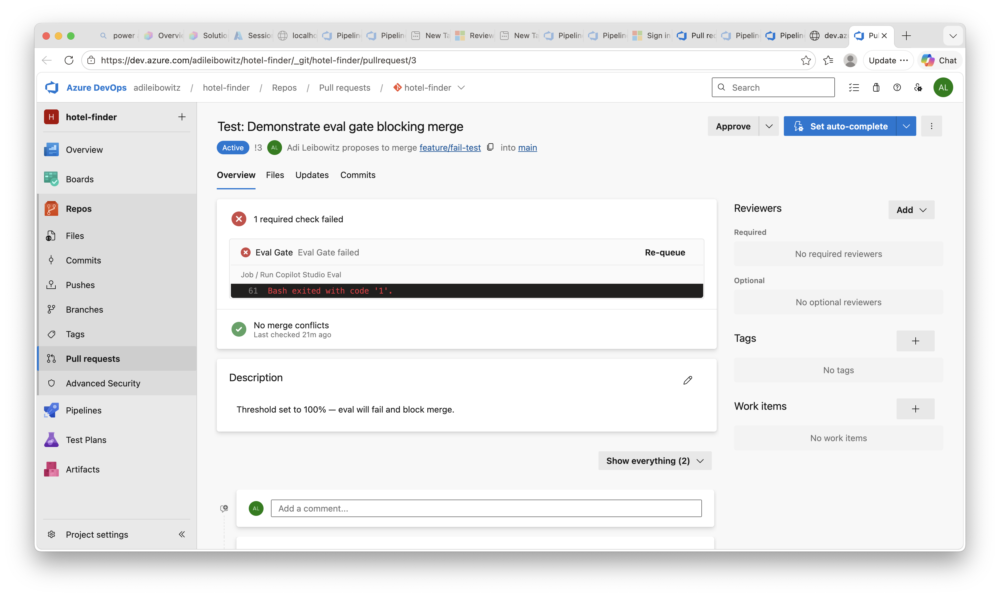
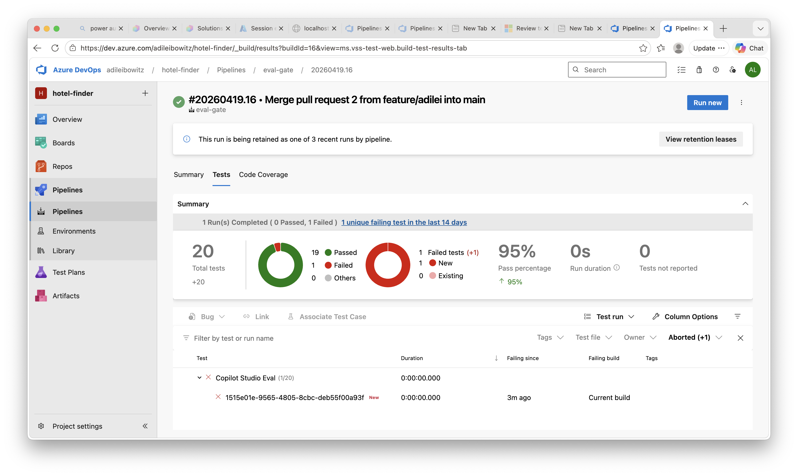

# Eval Gate for Azure DevOps

New
{: .label .label-green }

An Azure DevOps pipeline that uses the [Copilot Studio Evaluation API](https://learn.microsoft.com/en-us/microsoft-copilot-studio/analytics-agent-evaluation-rest-api) as a PR quality gate. When a developer pushes changes to their feature branch and opens a PR, the pipeline automatically:

1. Packs the solution from the PR branch
2. Imports it into a shared CI Dev environment
3. Runs evaluations against the draft agent
4. Blocks or allows the merge based on a configurable pass rate threshold
5. Publishes results to the ADO **Tests** tab

## How It Works



## Pipeline in Action

When a PR is pushed, the pipeline imports the solution, resolves the bot and test set, and runs the evaluation — all visible in the ADO build logs:



## Table of Contents

- [How It Works](#how-it-works)
- [Components](#components)
- [Prerequisites](#prerequisites)
- [Setup](#setup)
  - [Part 1: Power Platform](#part-1-power-platform) — Git integration, CI Dev environment, test set, MCS connection
  - [Part 2: Authentication](#part-2-authentication) — App registration, refresh token
  - [Part 3: Azure Resources](#part-3-azure-resources) — Key Vault, secrets, ARM service principal
  - [Part 4: Azure DevOps](#part-4-azure-devops) — Config, service connection, pipeline, branch policy
- [Running It](#running-it)
- [Local Usage](#local-usage)
- [Known Limitations](#known-limitations)

## Components

| File | Description |
|------|-------------|
| `eval-config.json` | Environment IDs, bot schema name, pass threshold |
| `scripts/eval-gate.mjs` | Node.js script: MSAL auth + PPAPI client + JUnit output. Single dependency: `@azure/msal-node` |
| `pipelines/eval-gate.yml` | ADO pipeline with self-hosted (pac CLI) and hosted (Build Tools) options |

---

## Prerequisites

- **Power Platform**: Dev environment as [Managed Environment](https://learn.microsoft.com/en-us/power-platform/admin/managed-environment-overview), connected to ADO Git via [Dataverse git integration](https://learn.microsoft.com/en-us/power-platform/alm/git-integration/connecting-to-git)
- **Copilot Studio**: Agent with a [test set](https://learn.microsoft.com/en-us/microsoft-copilot-studio/analytics-agent-evaluation-intro) in the Evaluate tab
- **Azure**: Subscription with Key Vault access
- **Azure DevOps**: Project with Git repo, [Power Platform Build Tools](https://marketplace.visualstudio.com/items?itemName=microsoft-IsvExpTools.PowerPlatform-BuildTools) extension
- **Tooling**: [pac CLI](https://learn.microsoft.com/en-us/power-platform/developer/howto/install-cli-net-tool) (requires .NET 10), Node.js 18+, Azure CLI

---

## Setup

### Part 1: Power Platform

#### 1.1 Connect Dev Environment to Git

1. Power Platform Admin Center: enable your Dev environment as **Managed Environment**
2. Copilot Studio → Solutions → **Connect to Git**
3. Choose **Environment binding** → select your ADO org, project, repo
4. Select your **feature branch** (each developer connects to their own)
5. Set Git folder to `src` → **Connect**

{: .important }
> You **must** use `src` as the Git folder — the pipeline is configured to pack from this path. If you use a different folder, update the `--folder` argument in `pipelines/eval-gate.yml`.

{: .tip }
> To commit changes: open a solution → **Source control** (left pane) → review changes → **Commit & push**.

#### 1.2 Create CI Dev Environment

A dedicated environment where the pipeline imports and tests solutions. No git binding needed.

```bash
# Install pac CLI (requires .NET 10 — earlier versions produce a DotnetToolSettings.xml error)
dotnet tool install --global Microsoft.PowerApps.CLI.Tool

# Create the environment
pac admin create --name "CI - MyAgent" --type Developer --region unitedstates

# Create a Service Principal for pipeline access
pac admin create-service-principal --environment <ci-dev-env-url>
```

{: .important }
> Save the **Application ID**, **Client Secret**, and **Environment URL** from the output — you'll need all three. The `create-service-principal` command automatically assigns the System Administrator role to the SPN in the target environment.

#### 1.3 Create a Test Set

1. Open your agent in Copilot Studio → **Evaluate** tab → **New evaluation**
2. Add 10-20 representative test cases covering key scenarios
3. Commit the solution to git — test sets are part of the solution and travel with it on import

{: .note }
> The script auto-discovers the test set after import — it uses the first available test set. If your agent has multiple test sets, set `testSetName` in `eval-config.json` to target a specific one by display name.

#### 1.4 Create MCS Connection (Optional — for Authenticated Eval)

If your agent uses authenticated actions or knowledge sources (e.g., SharePoint connectors), the eval API needs an `mcsConnectionId` to authenticate during the run. See [Manage user profiles and connections](https://learn.microsoft.com/en-us/microsoft-copilot-studio/analytics-agent-evaluation-edit#manage-user-profiles-and-connections).

1. Open [Power Automate](https://make.powerautomate.com) **in the CI Dev environment**
2. Go to **Connections** → create a **Microsoft Copilot Studio** connection
3. Click on the connection → copy the ID from the URL:
   ```
   .../connections/shared_microsoftcopilotstudio/{mcsConnectionId}/details
   ```

{: .warning }
> This connection requires interactive OAuth and cannot be created programmatically. It's a one-time manual step per CI environment. Without it, the pipeline still works but authenticated actions and knowledge sources will return empty or error results during eval.

---

### Part 2: Authentication

#### 2.1 Create Eval API App Registration

The evaluation API requires **delegated** (user-context) permissions:

1. [Azure Portal → App Registrations](https://portal.azure.com/#view/Microsoft_AAD_RegisteredApps/ApplicationsListBlade) → **New registration**
2. Name it (e.g., "Copilot Studio Eval API")
3. Under **API permissions** → **Add a permission** → **APIs my organization uses**:
   - Search **Power Platform API** → delegated: `CopilotStudio.MakerOperations.Read`, `CopilotStudio.MakerOperations.ReadWrite`
   - Search **Dynamics CRM** → delegated: `user_impersonation` (for bot ID resolution)
4. Click **Grant admin consent** for the tenant
5. Under **Authentication** → **Add a platform** → **Mobile and desktop applications** → redirect URI: `http://localhost`
6. **Authentication** → **Advanced settings** → **Allow public client flows**: **Yes**
7. Copy the **Application (client) ID**

#### 2.2 Seed the Refresh Token

```bash
cd scripts && npm install

# Start device code flow — follow the browser prompt
node eval-gate.mjs auth --config ../eval-config.json
```

The token is printed to stdout. Store it in Key Vault (see part 3):

```bash
az keyvault secret set \
  --vault-name <kv-name> \
  --name copilot-studio-eval-refresh-token \
  --value "<paste-token>"
```

Or pipe directly:

```bash
node eval-gate.mjs auth --config ../eval-config.json \
  | az keyvault secret set \
      --vault-name <kv-name> \
      --name copilot-studio-eval-refresh-token \
      --value @-
```

{: .note }
> The pipeline attempts to rotate the refresh token on each run. If MSAL issues a new token, it is written back to Key Vault automatically. MSAL does not always issue a new token on every call, so the existing token may remain. Re-run the `auth` command before the **90-day** expiry to be safe.

---

### Part 3: Azure Resources

#### 3.1 Create Key Vault

```bash
az group create --name rg-copilot-cicd --location eastus

az keyvault create \
  --name <kv-name> \
  --resource-group rg-copilot-cicd \
  --location eastus \
  --enable-rbac-authorization true

# Grant yourself Secrets Officer to seed secrets
az role assignment create \
  --role "Key Vault Secrets Officer" \
  --assignee <your-user-object-id> \
  --scope <key-vault-resource-id>
```

#### 3.2 Store Secrets in Key Vault

The pipeline reads three secrets from Key Vault:

| Secret Name | Value | Source |
|-------------|-------|--------|
| `copilot-studio-eval-refresh-token` | MSAL refresh token | From `node eval-gate.mjs auth` (step 2.2) |
| `copilot-studio-ci-dev-client-secret` | CI Dev SPN client secret | From `pac admin create-service-principal` (step 1.2) |
| `copilot-studio-eval-mcs-connection-id` | MCS connector connection ID | From Power Automate URL (step 1.4, optional) |

```bash
az keyvault secret set --vault-name <kv-name> \
  --name copilot-studio-eval-refresh-token --value "<token>"

az keyvault secret set --vault-name <kv-name> \
  --name copilot-studio-ci-dev-client-secret --value "<secret>"

# Required even if not using authenticated eval — use a placeholder value if skipping step 1.4
az keyvault secret set --vault-name <kv-name> \
  --name copilot-studio-eval-mcs-connection-id --value "${<id-from-step-1.4>:-none}"
```

{: .warning }
> All three secrets must exist in Key Vault. The pipeline's `AzureKeyVault@2` task fails if any named secret is missing. If you're not using authenticated eval (step 1.4), create the `copilot-studio-eval-mcs-connection-id` secret with the value `none`.

#### 3.3 Create ARM Service Connection SPN

Create a Service Principal for the pipeline to access Key Vault:

```bash
az ad sp create-for-rbac \
  --name "copilot-cicd-pipeline" \
  --role "Key Vault Secrets Officer" \
  --scopes /subscriptions/<sub-id>/resourceGroups/<rg>/providers/Microsoft.KeyVault/vaults/<kv-name>
```

Save the **Application ID** and **Password** for step 4.2.

---

### Part 4: Azure DevOps

#### 4.1 Configure eval-config.json

Edit `eval-config.json` in your repo root and fill in the values from previous steps:

```json
{
  "environmentId": "<ci-dev-environment-guid>",
  "environmentUrl": "https://<ci-dev-org>.crm.dynamics.com/",
  "botSchemaName": "<bot-schema-name>",
  "tenantId": "<entra-tenant-guid>",
  "clientId": "<eval-app-registration-client-id>",
  "passThreshold": 0.8
}
```

Commit this file to your repo — the pipeline reads it at runtime.

| Field | Description | Where to find it |
|-------|-------------|-----------------|
| `environmentId` | CI Dev environment GUID | Power Platform Admin Center → Environments |
| `environmentUrl` | CI Dev Dataverse URL (trailing slash) | Same page, or `pac env who` |
| `botSchemaName` | Bot schema name from the solution | `src/bots/<name>/bot.yml` → `@schemaname` |
| `tenantId` | Entra tenant GUID | Azure Portal → Entra ID → Overview |
| `clientId` | Eval API app registration client ID | From step 2.1 |
| `passThreshold` | Pass rate required (0.0-1.0) | Choose your quality bar |

{: .note }
> `agentId` and `testSetId` are resolved dynamically at runtime — you don't set them.

#### 4.2 Create ADO Service Connection

In ADO: Project Settings → Service connections → New → **Azure Resource Manager** → **Service principal (manual)**

| Field | Value |
|-------|-------|
| Name | `AzureRM-KeyVault` |
| Subscription ID | Your Azure subscription ID |
| Service Principal ID | App ID from step 3.3 |
| Service Principal Key | Password from step 3.3 |
| Tenant ID | Your Entra tenant ID |

Enable for all pipelines.

#### 4.3 Update Pipeline Variables

Edit `pipelines/eval-gate.yml` and set:

```yaml
variables:
  AZURE_SERVICE_CONNECTION: '<your-arm-service-connection-name>'
  KEY_VAULT_NAME: '<your-key-vault-name>'
  CI_DEV_ENV_URL: '<your-ci-dev-environment-url>'
  CI_DEV_APP_ID: '<your-ci-dev-spn-app-id>'
  CI_DEV_TENANT_ID: '<your-tenant-id>'
```

Commit and push `eval-config.json` and `pipelines/eval-gate.yml` to your repo before proceeding.

#### 4.4 Create the Pipeline

1. ADO → Pipelines → New pipeline → Azure Repos Git → select your repo
2. Point to `pipelines/eval-gate.yml`
3. Save (don't run yet)
4. Pipeline Settings → set max concurrent runs to **1** (sequential execution)

#### 4.5 Approve Service Connections (First Run Only)

The first time the pipeline runs, ADO will prompt you to **Permit** access to the `AzureRM-KeyVault` service connection. Click **Permit** — this is a one-time approval.

#### 4.6 Configure Branch Policy (Merge Gate)

1. ADO Repos → Branches → `main` → Branch policies
2. **Build validation** → Add → select the eval-gate pipeline
3. Set to **Required** → Trigger: **Automatic**

---

## Running It

Once setup is complete, the eval gate runs automatically:

1. **Make a change** to your agent in Copilot Studio (edit a topic, update instructions, etc.)
2. **Commit & push** from the Solutions → Source control page to your feature branch
3. **Open a PR** targeting `main` in Azure DevOps
4. The **pipeline triggers automatically** on push — it packs the solution, imports it into the CI Dev environment, and runs evaluations against the draft agent
5. **Check the results** in the PR:
   - The **Summary** tab shows the pipeline pass/fail status
   - The **Tests** tab shows individual test case results with metric breakdowns
   - The eval results JSON is available as a **pipeline artifact**
6. If the pass rate meets the threshold, the **merge button is enabled**. Otherwise, the PR is blocked until the agent quality improves.

Subsequent pushes to the same PR branch re-trigger the pipeline — each push gets a fresh eval run.

**PR gate passed** — eval meets the threshold, merge is allowed:



**PR gate failed** — eval below threshold, merge is blocked:



**Tests tab** — individual test case results with pass/fail breakdown:



## Local Usage

Run evals locally against your own Dev environment:

```bash
export EVAL_REFRESH_TOKEN="<your-token>"

# Verify bot ID resolution
node scripts/eval-gate.mjs resolve-bot --config eval-config.json

# List test sets
node scripts/eval-gate.mjs list-testsets --config eval-config.json

# Run eval
node scripts/eval-gate.mjs run \
  --config eval-config.json \
  --run-name "local test" \
  --output results.json \
  --junit-output results.junit.xml

# Override for a different environment
node scripts/eval-gate.mjs run \
  --config eval-config.json \
  --environment-id "<my-dev-env-id>" \
  --agent-id "<my-agent-id>" \
  --threshold 0.9 \
  --run-name "local test"
```

---

## Known Limitations

- **Delegated auth only**: The eval API requires user-context tokens. The pipeline uses a pre-cached refresh token (90-day expiry). There is no app-only authentication path.
- **MCS connection is manual**: The Microsoft Copilot Studio connector connection requires interactive OAuth and cannot be created programmatically. See [step 1.4](#14-create-mcs-connection-optional--for-authenticated-eval) for setup. Without it, authenticated actions and knowledge sources won't work during eval.
- **Single CI environment**: Pipeline runs are serialized (max 1 concurrent). Multiple PRs queue and run one at a time.
- **Self-hosted agent**: The `pac` CLI approach requires a self-hosted agent. The pipeline's `DOTNET_ROOT` path is configured for macOS with Homebrew — adjust it for Linux agents. For Microsoft-hosted agents (Windows/Linux), use the commented-out Power Platform Build Tools section in the pipeline YAML.
- **Errors count as failures**: Evaluation errors (e.g., model timeouts, missing MCS connection) count against the pass threshold. If a run produces unexpectedly low scores, check `eval-results.json` for test cases with `Error` status.
- **Test case names**: The eval API returns test case IDs (GUIDs), not display names. Results in the Tests tab show GUIDs.
