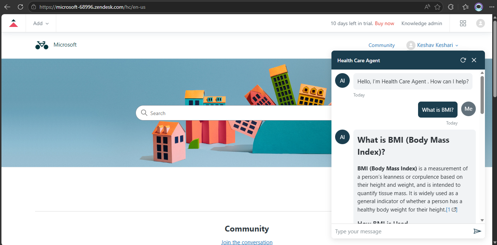
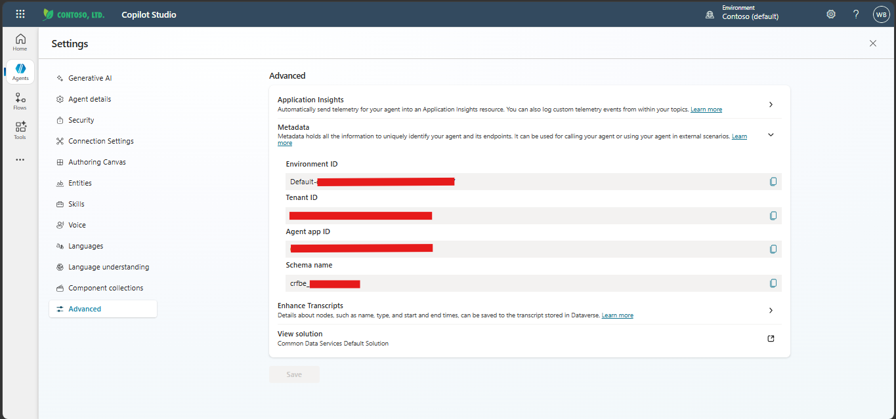

# Zendesk Widget for Copilot Studio

Embed a Microsoft Copilot Studio agent as a floating chat widget in a Zendesk Help Center.



The widget uses [BotFramework WebChat](https://github.com/microsoft/BotFramework-WebChat) for rendering and the [M365 Agents SDK](https://www.npmjs.com/package/@microsoft/agents-copilotstudio-client) to connect to Copilot Studio. It authenticates users via MSAL (popup or silent SSO) and renders a floating chat bubble with a slide-up panel — no iframes.

## Architecture

```
┌──────────────────────────────────────────────────────────┐
│  Zendesk Help Center (Theme)                             │
│                                                          │
│  document_head.hbs:                                      │
│  ┌─────────────┐ ┌───────────────┐                       │
│  │ MSAL Browser│ │ WebChat CDN   │                       │
│  └─────────────┘ └───────────────┘                       │
│                                                          │
│  footer.hbs:                                             │
│  ┌───────────────┐  ┌──────────────────────────────┐     │
│  │copilot-chat.js│  │ CopilotChat.init({config})   │     │
│  │ (theme asset) │  │                              │     │
│  └───────┬───────┘  └──────────────┬───────────────┘     │
│          │                         │                     │
│  ┌───────▼─────────────────────────▼───────────────────┐ │
│  │  Floating Chat Widget                               │ │
│  │  1. User clicks chat bubble                         │ │
│  │  2. MSAL authenticates (silent SSO or popup)        │ │
│  │  3. Agents SDK connects to Copilot Studio           │ │
│  │  4. WebChat renders conversation                    │ │
│  └─────────────────────────────────────────────────────┘ │
└──────────────────────────────────────────────────────────┘
```

## Prerequisites

- A **Zendesk** Help Center with admin access (Guide theme editor)
- A **Microsoft Copilot Studio** agent with authentication set to **"Authenticate with Microsoft"**
- A **Microsoft Entra ID** app registration (SPA) — see [Step 1](#step-1-configure-entra-id-app-registration)
- **Node.js** 18+ (to build the bundle)

---

## Setup Guide

### Step 1: Configure Entra ID App Registration

Create an app registration in the [Azure Portal](https://portal.azure.com):

1. Go to **App registrations** → **New registration**
2. Set:
   - **Name:** `Zendesk Copilot Widget` (or any name)
   - **Account type:** Single tenant
   - **Redirect URI:** Platform = **Single-page application (SPA)**, URI = `http://localhost:5500`
3. On the **Overview** page, note:
   - **Application (client) ID** — this is your `appClientId`
   - **Directory (tenant) ID** — this is your `tenantId`
4. Go to **Authentication** → add a second redirect URI: `https://<your-subdomain>.zendesk.com`
5. Under **Implicit grant and hybrid flows**, check:
   - ✅ **Access tokens**
   - ✅ **ID tokens**
6. Go to **API Permissions** → **Add a permission** → **APIs my organization uses** → search for `Power Platform API`
   - Select **Delegated permissions** → **CopilotStudio** → check `CopilotStudio.Copilots.Invoke`
   - Click **Grant admin consent**

> **Note:** If `Power Platform API` doesn't appear, you need to register the service principal in your tenant first. See [Power Platform API Authentication](https://learn.microsoft.com/power-platform/admin/programmability-authentication-v2#step-2-configure-api-permissions).

### Step 2: Configure Copilot Studio Agent

1. Open [Copilot Studio](https://copilotstudio.microsoft.com) → select your agent
2. Go to **Settings** → **Security** → **Authentication**
3. Select **"Authenticate with Microsoft"**
4. **Publish** the agent

Note the following from your agent's connection string or settings:



Setting → Advance → Metadata
- **Environment ID** (include the `Default-` prefix, e.g., `Default-xxxxxxxx-xxxx-xxxx-xxxx-xxxxxxxxxxxx`)
- **Agent identifier** (schema name, e.g., `crXXX_myAgent`)

### Step 3: Build the Widget Bundle

```bash
npm install
npm run build
```

This produces `dist/copilot-chat.js` (~148 KB), a self-contained IIFE bundle that exposes `window.CopilotChat`.

### Step 4: Open the Zendesk Theme Code Editor

1. Log into Zendesk as an admin
2. Navigate to **Guide** → **Customize design**
   - Direct URL: `https://<subdomain>.zendesk.com/theming`
3. Click **Customize** on your active theme (typically "Copenhagen")
4. Click **Edit code** (bottom-left of the customizer)

You'll see the theme file structure:
```
assets/          ← JS/CSS/image files
templates/
  ├── document_head.hbs
  ├── header.hbs
  ├── footer.hbs
  ├── home_page.hbs
  ├── article_page.hbs
  └── ...
script.js
style.css
```

### Step 5: Upload the Bundle as a Theme Asset

1. In the code editor, look at the **left sidebar** under the file list
2. Click the **"Add"** dropdown (near the top of the file list or next to "Files")
3. Select **"Add asset"** or **"Upload file"**
4. Upload `dist/copilot-chat.js` from your local build

After upload, you should see `copilot-chat.js` listed under the **assets** section.

### Step 6: Edit `document_head.hbs`

Click on `document_head.hbs` in the templates list. Add these lines at the **very end** of the file:

```html
<!-- COPILOT-CHAT-HEAD-START -->
<script src="https://unpkg.com/botframework-webchat@4.18.0/dist/webchat.js"></script>
<script src="https://unpkg.com/@azure/msal-browser@4.13.1/lib/msal-browser.js"></script>
<!-- COPILOT-CHAT-HEAD-END -->
```

This loads the WebChat and MSAL libraries from CDN.

> **Production tip:** For zero CDN dependency, download these two JS files and upload them as theme assets too. Then reference them as `{{asset 'webchat.js'}}` and `{{asset 'msal-browser.js'}}`.

### Step 7: Edit `footer.hbs`

Click on `footer.hbs` in the templates list. Add this block at the **very end** of the file, **after** the closing `</footer>` tag:

```html
<!-- COPILOT-CHAT-FOOTER-START -->
<script src="{{asset 'copilot-chat.js'}}"></script>
<script>
document.addEventListener('DOMContentLoaded', function() {
  if (window.CopilotChat) {
    CopilotChat.init(document.body, {
      environmentId: 'Default-xxxxxxxx-xxxx-xxxx-xxxx-xxxxxxxxxxxx',
      agentIdentifier: 'crXXX_myAgent',
      tenantId: 'xxxxxxxx-xxxx-xxxx-xxxx-xxxxxxxxxxxx',
      appClientId: 'xxxxxxxx-xxxx-xxxx-xxxx-xxxxxxxxxxxx',
      headerTitle: 'Chat with us',
      redirectUri: 'https://your-subdomain.zendesk.com'
    });
  }
});
</script>
<!-- COPILOT-CHAT-FOOTER-END -->
```

**Replace** the placeholder values with your actual agent configuration:

| Placeholder | Replace with |
|-------------|-------------|
| `Default-xxxxxxxx-...` | Your Copilot Studio Environment ID |
| `crXXX_myAgent` | Your agent's schema name |
| `tenantId: 'xxxxxxxx-...'` | Your Entra tenant ID |
| `appClientId: 'xxxxxxxx-...'` | Your Entra app client ID |
| `your-subdomain` | Your Zendesk subdomain |

> **Important:** The `redirectUri` must exactly match one of the redirect URIs registered in your Entra ID app registration.

### Step 8: Save and Publish

1. Click **Save** in the code editor (top-right)
2. Click **Publish** to make the theme live
3. Visit your Help Center: `https://<subdomain>.zendesk.com/hc/en-us`
4. You should see a chat bubble in the bottom-right corner
5. Click it — a sign-in popup appears (first time only), then the agent connects

---

## Local Development

For testing without deploying to Zendesk:

```bash
# Copy sample config
cp test-page/config.sample.js test-page/config.js
# Edit test-page/config.js with your agent settings

# Build and serve
npm run build
npm run serve
```

Open `http://localhost:5500/test-page/` to test the widget locally.

---

## Customization

See [docs/CUSTOMIZATION.md](docs/CUSTOMIZATION.md) for all available config options, WebChat style overrides, and theming details.

---

## Updating the Widget

To update the widget after a code change:

1. Rebuild: `npm run build`
2. In the Zendesk theme editor, delete the old `copilot-chat.js` asset
3. Upload the new `dist/copilot-chat.js`
4. Save and publish the theme

---

## Removing the Widget

To remove the widget from your Help Center:

1. Open the theme code editor
2. Remove the block between `<!-- COPILOT-CHAT-HEAD-START -->` and `<!-- COPILOT-CHAT-HEAD-END -->` from `document_head.hbs`
3. Remove the block between `<!-- COPILOT-CHAT-FOOTER-START -->` and `<!-- COPILOT-CHAT-FOOTER-END -->` from `footer.hbs`
4. Delete the `copilot-chat.js` asset
5. Save and publish

---

## Project Structure

```
Zendesk-Widget/
├── README.md                 ← This file (manual setup guide)
├── package.json
├── esbuild.config.mjs        ← Build config (produces dist/copilot-chat.js)
├── tsconfig.json
├── src/
│   ├── index.ts              ← Entry point — CopilotChat.init()
│   ├── config.ts             ← Config types and defaults
│   ├── auth.ts               ← MSAL authentication (silent SSO / popup)
│   ├── chat.ts               ← WebChat + Agents SDK connection
│   └── bubble.ts             ← Floating bubble and panel UI
├── test-page/
│   ├── index.html            ← Local test page (simulated Help Center)
│   └── config.sample.js
└── docs/
    ├── CUSTOMIZATION.md      ← Config options and styling
    └── images/
```

---

## Content Security Policy (CSP)

If your Zendesk Help Center enforces a strict CSP, ensure the following domains are allowed:

| Directive | Domain |
|-----------|--------|
| `script-src` | `https://unpkg.com` |
| `connect-src` | `https://login.microsoftonline.com` `https://*.botframework.com` `https://default*.environment.api.powerplatform.com` |
| `frame-src` | `https://login.microsoftonline.com` |
| `style-src` | `'unsafe-inline'` (required by WebChat) |

---

## Troubleshooting

| Issue | Cause | Fix |
|-------|-------|-----|
| Chat bubble doesn't appear | Bundle not loaded | Check browser console for 404 on `copilot-chat.js`. Verify the asset was uploaded. |
| `ERR_NAME_NOT_RESOLVED` | DNS can't resolve Power Platform API | Check your network/VPN. Try a different DNS (e.g., 8.8.8.8) or disconnect from corporate VPN. |
| MSAL popup blocked | Browser blocks popups | Allow popups for your Zendesk domain, or ensure users have an active Entra session for silent SSO. |
| `AADSTS50011` redirect URI mismatch | App registration redirect URI doesn't match | Add `https://<subdomain>.zendesk.com` as a SPA redirect URI in the Entra app registration. |
| `Failed to fetch` on token | CORS or network issue | Ensure the Copilot Studio agent is published and auth is set to "Authenticate with Microsoft". |
| Agent responds with "usage limit" | Copilot Studio trial/capacity limit | This is a licensing issue, not a widget issue. Check your Copilot Studio plan. |

---

## References

This widget is adapted from the official Microsoft Copilot Studio embedding samples:

- **Source repository:** [microsoft/CopilotStudioSamples](https://github.com/microsoft/CopilotStudioSamples)
- **ServiceNow widget sample:** [ui/embed/servicenow-widget](https://github.com/microsoft/CopilotStudioSamples/tree/main/ui/embed/servicenow-widget) — the reference implementation this widget is based on
- **M365 Agents SDK:** [@microsoft/agents-copilotstudio-client](https://www.npmjs.com/package/@microsoft/agents-copilotstudio-client) (v1.2.3+)
- **BotFramework WebChat:** [microsoft/BotFramework-WebChat](https://github.com/microsoft/BotFramework-WebChat) (v4.18.0)
- **MSAL Browser:** [@azure/msal-browser](https://www.npmjs.com/package/@azure/msal-browser) (v4.13.1)
- **Copilot Studio Authentication:** [Power Platform API Authentication](https://learn.microsoft.com/power-platform/admin/programmability-authentication-v2)
- **Zendesk Guide Theming:** [Theme code editor](https://support.zendesk.com/hc/en-us/articles/4408828867098)

### Differences from ServiceNow Widget Sample

The core source files that produce `copilot-chat.js` are shared between the ServiceNow and Zendesk versions. The table below summarizes the differences:

| File | Status | Notes |
|------|--------|-------|
| `src/index.ts` | **Identical** | Same entry point, same config validation |
| `src/config.ts` | **Identical** | Same `CopilotChatConfig` interface and defaults |
| `src/bubble.ts` | **Identical** | Same floating bubble/panel UI code |
| `src/chat.ts` | **Identical** | Same WebChat + Agents SDK initialization |
| `src/auth.ts` | **Enhanced** | Adds `timeout: 2000` to `ssoSilent()` call — ensures the browser's user-gesture window (~5s in Chrome) is still valid for the `loginPopup` fallback if SSO fails. The ServiceNow version calls `ssoSilent(loginRequest)` without a timeout. |
| `esbuild.config.mjs` | **Identical** | Same IIFE build config |
| `tsconfig.json` | **Identical** | Same TypeScript settings |
| `package.json` | **Modified** | Different name (`zendesk-copilot-chat`), no deploy script |

**Bottom line:** The built `dist/copilot-chat.js` bundle is functionally equivalent to the ServiceNow version, with one improvement — the SSO timeout in `auth.ts` prevents a stalled silent auth from consuming the browser's user-gesture window, ensuring the popup fallback works reliably.

The only differences are in the **deployment method** (Zendesk theme editor vs. ServiceNow REST API) and the **host integration** (Handlebars templates vs. ServiceNow Widget Dependencies).
